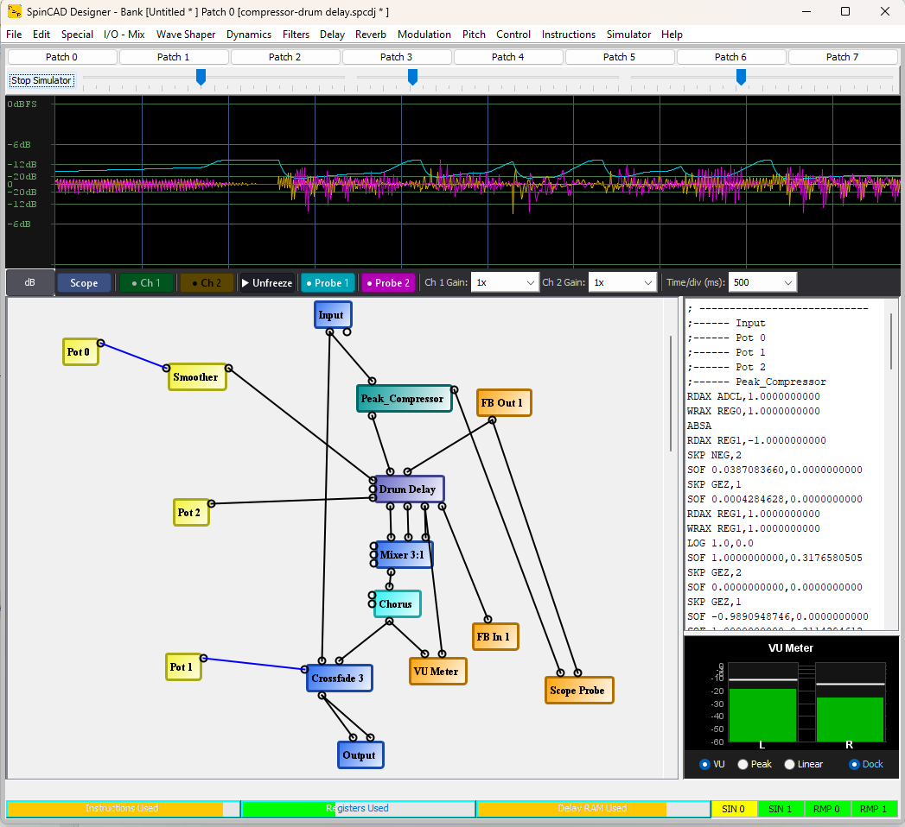

# SpinCAD Designer Documentation

SpinCAD Designer is an open-source Java application for creating and simulating audio patches for the [Spin Semiconductor FV-1](http://www.spinsemi.com/products.html) DSP chip. Drag and drop DSP blocks onto a schematic canvas, wire them together, and SpinCAD generates the Spin ASM assembly code you can load onto the chip.

- **Downloads:** [GitHub Releases](https://github.com/HolyCityAudio/SpinCAD-Designer/releases)
- **Source code:** [HolyCityAudio/SpinCAD-Designer](https://github.com/HolyCityAudio/SpinCAD-Designer)
- **Requirements:** Java 1.8 or later; runs on Windows, macOS, and Linux

## Getting Started

New users should start with [Using SpinCAD Designer](using-spincad.md), which covers the user interface, building your first patch, wiring blocks, and running the built-in simulator.

## Block Reference

A *block* is a single DSP unit -- a filter, a delay, a reverb tank, an LFO, and so on. You build patches by placing blocks on the schematic canvas and connecting their input and output pins. Each block has a control panel where you tune its parameters.

The block reference pages below describe each block's pins, controls, and typical uses:

- [I/O - Pots Blocks](io-pots-blocks.md) -- input, output, and hardware potentiometer blocks
- [Mixers/Gain Blocks](mixers-gain-blocks.md) -- volume, gain, panning, crossfade, and mixer blocks
- [Wave Shaper Blocks](wave-shaper-blocks.md) -- distortion, overdrive, fuzz, and bit-reduction effects
- [Dynamics Blocks](dynamics-blocks.md) -- compressors, limiters, expanders, and noise gates
- [Filter Blocks](filter-blocks.md) -- low-pass, high-pass, and state-variable filters
- [Delay Blocks](delay-blocks.md) -- multi-tap delays, drum echo, BBD emulation, and reverse delay
- [Reverb Blocks](reverb-blocks.md) -- allpass, room, hall, plate, spring, and algorithmic reverbs
- [Modulation Blocks](modulation-blocks.md) -- chorus, flanger, phaser, ring modulator, and servo effects
- [Pitch Blocks](pitch-blocks.md) -- pitch shifters, arpeggiator, and glitch effects
- [Oscillator Blocks](oscillators-blocks.md) -- LFOs and oscillators for modulation sources
- [Control Blocks](control-blocks.md) -- transfer functions for shaping control signals
- [Instructions Blocks](instructions-blocks.md) -- math and utility blocks (abs, exp, log, sqrt, max)

## Further Reading

- [DSP References](DSP-references.md) -- external DSP learning resources
- [Release Notes 0.99-1069](release-notes-0.99-1069.md)
- [Legacy Forum Archive](legacy-archive.md) -- discussion threads saved from the old Holy City Audio phpBB forum
