# Control Blocks Reference

## Introduction to Control Signals

An audio signal in the FV-1 is something that you actually listen to (or could).
A **control signal** is a number which affects some other part of the algorithm,
usually changing at a rate much lower than audio signals. For example, a pot
control delivers a value which can be multiplied with an audio signal to
implement a volume control.

A voltage of 0 is interpreted numerically as 0, whereas a voltage of 3.3 volts
(the supply voltage) is returned as 0.999 (numerically very close to 1.0).

Virtually all control signals operate from **0 to 1**. An exception is the
SIN/COS LFO which naturally puts out a signal from -1.0 to 1.0.

The blocks in this section shape, scale, and transform control signals.
They are found in the **Controls** menu of SpinCAD Designer.

### Block Index

| | | |
|-|-|-|
| [Clip](#clip) | [Envelope Follower](#envelope-follower) | [Half Wave](#half-wave) |
| [Invert](#invert) | [Power](#power) | [Ratio](#ratio) |
| [Root](#root) | [Slicer](#slicer) | [Smoother](#smoother) |
| [Tap Tempo](#tap-tempo) | [Tremolizer](#tremolizer) | [Two Stage](#two-stage) |
| [Vee](#vee) | | |

---

## Clip

**Menu:** Controls > Clip

The Clip block adds an adjustable amount of gain to a control signal with hard
clipping at the 0-1 boundaries. The way to think about this block is: "I want
the incoming control signal to be 0 (or 1) up to a specific point of the pot's
rotation, after which it ramps linearly to 1 (or 0)."

| Pin | Type | Description |
|-----|------|-------------|
| Control Input 1 | Control In | 0-1 control signal |
| Control Output 1 | Control Out | Amplified and clipped signal |

**Parameters:**
| Parameter | Range | Default | Description |
|-----------|-------|---------|-------------|
| Gain | 1-10 | 3 | Amplification factor before clipping |
| Flip | on/off | off | Reverse input direction before clipping |
| Invert | on/off | off | Invert output after clipping |

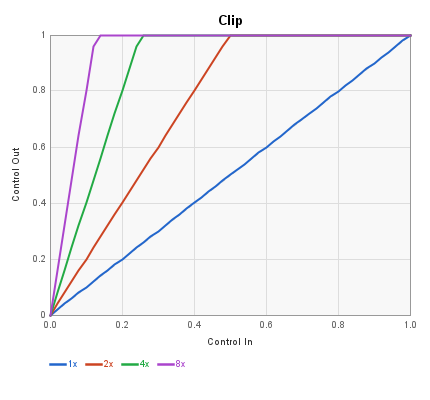

The four combinations of Flip and Invert (shown here at gain=10):

| Flip | Invert | Equation | Description |
|------|--------|----------|-------------|
| off | off | 0 <= x <= 0.1: y = 10x; x > 0.1: y = 1.0 | Ramps up fast then clips high |
| on | off | x <= 0.9: y = 1.0; x > 0.9: y = 10(1-x) | Stays high, drops at the end |
| off | on | x <= 0.1: y = 1 - 10x; x > 0.1: y = 0 | Drops fast from 1, then stays at 0 |
| on | on | x <= 0.9: y = 0; x > 0.9: y = 10(x - 0.9) | Stays low, ramps up at the end |

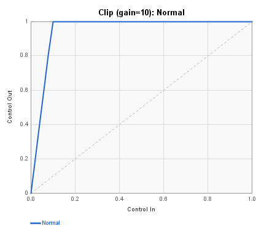
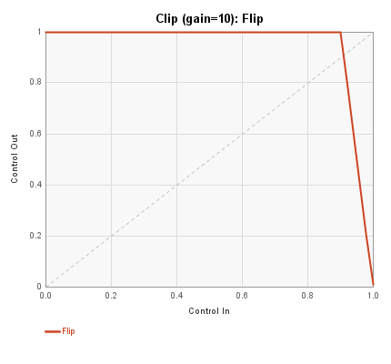
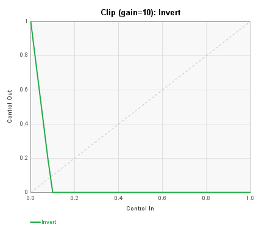
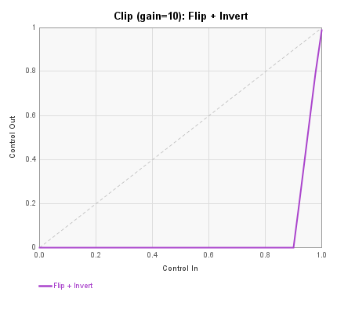

**Typical use:** Smoothly "switch" between settings at either extreme end of
the pot travel. For example, in a delay with infinite feedback hold: over most
of the pot travel (0 to 0.9), the delay input volume is 1.0 and feedback is 0.
At the top of the pot (0.9 to 1.0), the input fades to 0 and feedback goes to
1.0, creating an infinite loop. Using Clip with high gain and Flip, the
transition happens over just the last 10% of pot travel. The delay's
Feedback gain setting (0 dB, i.e. 1.0) and the FB In Gain (1.0) together
give unity loop gain, so the signal in the delay line loops indefinitely.

[Download the example patch: Delay-infinite-fb-demo.spcd](https://github.com/HolyCityAudio/SpinCAD-Designer/raw/master/patches/Delay-infinite-fb-demo.spcd)

---

## Envelope Follower

**Menu:** Controls > Envelope Follower

Detects the amplitude envelope of an audio signal and produces a smoothed
control voltage (0-1) suitable for modulating any parameter. Replaces the
deprecated Envelope and Envelope II blocks with a more flexible design.

| Pin | Type | Description |
|-----|------|-------------|
| Audio Input 1 | Audio In | Signal to detect |
| Side Chain | Audio In | Optional: detect from a different signal |
| Threshold CV | Control In | Optional: modulate threshold externally |
| CV Out | Control Out | Scaled, smoothed control voltage |
| Envelope | Control Out | Raw envelope for monitoring |

**Control panel parameters:**

| Parameter | Range | Default | Description |
|-----------|-------|---------|-------------|
| Detect Mode | Average / RMS / Peak | Average | Envelope detection method |
| Gain | 0-6 (×6 dB steps) | 2 (12 dB) | Input gain before detection |
| Attack | coefficient | 0.001 | Attack filter speed (higher = faster) |
| Release | coefficient | 0.0003 | Release filter speed (higher = faster) |
| Threshold | 0-1 | 0.1 | Envelope level that maps to full CV output |
| Output Min | 0-1 | 0.0 | Minimum CV output |
| Output Max | 0-1 | 1.0 | Maximum CV output |
| Smooth | coefficient | 0.0002 | Output smoothing filter |

**Detection modes:**

- **Average** — rectifies the signal (ABSA) and lowpass filters it. The
  simplest and most efficient mode.
- **RMS** — squares the signal (MULX self) and lowpass filters, giving a
  power-proportional envelope. Better for measuring perceived loudness.
- **Peak** — peak-hold with exponential decay (MAXX-based follower). Tracks
  transients more aggressively.

When the Side Chain input is connected, the envelope is derived from that
signal instead of the main audio input. This is useful for ducking effects
(detect vocals, compress music) or envelope-following a different instrument.

The Threshold parameter sets the input level that maps to full-scale CV
output. Lower thresholds make the follower more sensitive to quiet signals.
When Threshold CV is connected, it multiplies the envelope, allowing dynamic
sensitivity control from a pot or LFO.

**Typical use:** Build an auto-wah by connecting the Envelope Follower's CV
Out to a bandpass filter's frequency input via a Scale/Offset block. The
filter sweeps in response to picking dynamics. Use the Gain and Threshold
controls to set the sensitivity, and Output Min/Max to constrain the
frequency sweep range.

---

## Half Wave

**Menu:** Controls > Half Wave

Half-wave rectifier: passes positive values unchanged, clamps negative values
to zero. Implemented using the FV-1's `SKP GEZ` (skip if greater than or equal
to zero) instruction followed by `CLR` (clear accumulator).

| Pin | Type | Description |
|-----|------|-------------|
| Input | Control In | Control signal (may include negative values) |
| Output | Control Out | max(0, input) |

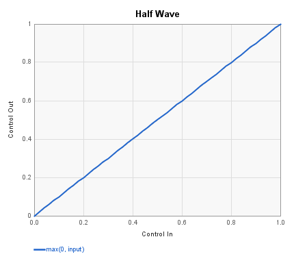

**Transfer function:** output = max(0, input)

Since control signals from pots are typically 0-1, this block acts as a
pass-through for normal pot signals. Its primary use is in signal chains where
a control signal might go negative, for example after subtraction, mixing with
a bipolar LFO, or modulation.

Applied to a full-range sine wave (-1 to +1), the output retains only the
positive half-cycles:

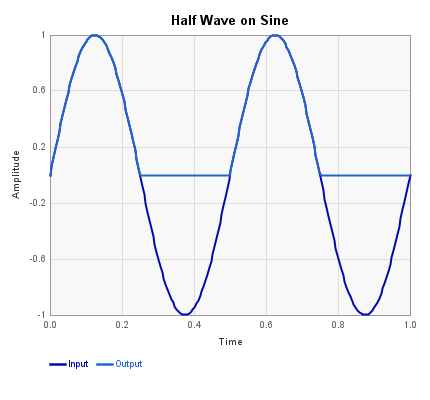

**Typical use:** Clamp the output of a mixer or difference block to prevent
negative control values from causing unexpected behavior in downstream blocks.

---

## Invert

**Menu:** Controls > Invert

This block inverts the range 0 -> 1 to 1 -> 0. There is no control panel.
It implements the FV-1 instruction:

    SOF -0.999, 0.999

which generates an output y from input x:

    y = -x + 1 = 1 - x

(The coefficients are as close to 1.0 as the FV-1's SOF instruction allows:
the multiplier C is S1.14 format and the offset D is S.10 format.)

| Pin | Type | Description |
|-----|------|-------------|
| Control Input 1 | Control In | 0-1 control signal |
| Control Output 1 | Control Out | Inverted signal (1 -> 0) |

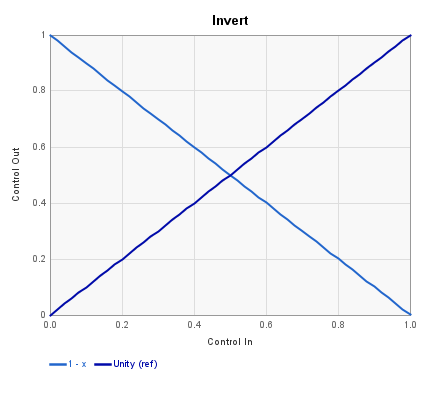

**Transfer function:** output = 1 - input

Note that because the Invert block fades linearly from 0 to 1, at its
midpoint both the original and inverted signals will be 0.5. If used for
crossfading, this results in a perceived level drop of -3 dB due to our ears'
sensitivity being related to the added power of both signals (assuming both
signals are active at the same time, which might not be true). The
**Crossfade** block (under I/O-Mix) merges the Invert block's control signal
inversion with a 2-input mixer to handle this in one step.

**Example application:** Use a **Mixer 4:1** block to mix the dry signal with
various taps from a **ThreeTap** delay. The longest delay (Tap 1) comes
through all the time. Using Pot 2 with an Invert block driving one of the
level inputs, you can blend between just Tap 2, just Tap 3, or some mix of
them as the pot sweeps from one end to the other.

A companion bank file demonstrating these patches is available here:
[Patreon-Controls-01.spbk](https://github.com/HolyCityAudio/SpinCAD-Designer/raw/master/patches/Patreon-Controls-01.spbk).

---

## Power

**Menu:** Controls > Power

The Power block shapes control signals by raising them to an integer power.
For example, if you have a Pot going directly to a volume control, the Power
block lets you convert that linear taper into a more natural-feeling curve.

| Pin | Type | Description |
|-----|------|-------------|
| Control Input 1 | Control In | 0-1 control signal |
| Control Output 1 | Control Out | Shaped output |

**Parameters:**
| Parameter | Range | Default | Description |
|-----------|-------|---------|-------------|
| Power | 1-5 | 3 | Exponent applied to input |
| Invert | on/off | off | Invert input before raising to power |
| Flip | on/off | off | Invert output after raising to power |

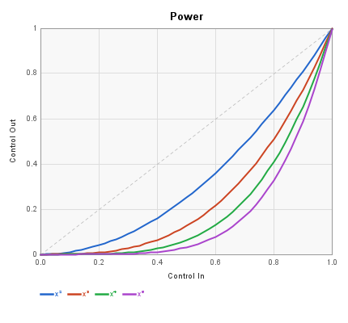

The four combinations of Invert and Flip produce different curve shapes:

| Invert | Flip | Equation | Description |
|--------|------|----------|-------------|
| off | off | y = x^p | Compressed toward zero; most change at high end |
| on | off | y = (1-x)^p | Same shape but input direction reversed |
| off | on | y = 1 - x^p | Output inverted; high at low input, drops at high end |
| on | on | y = 1 - (1-x)^p | S-curve feel; slow start, fast finish |

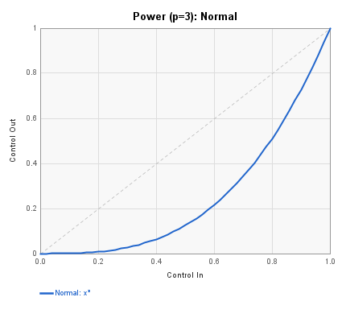
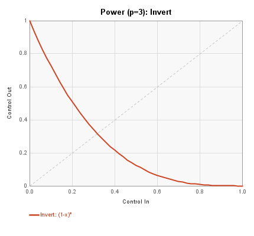
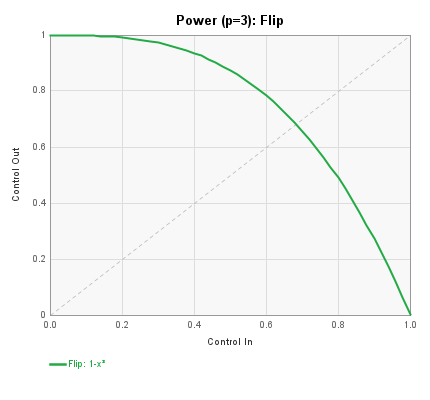
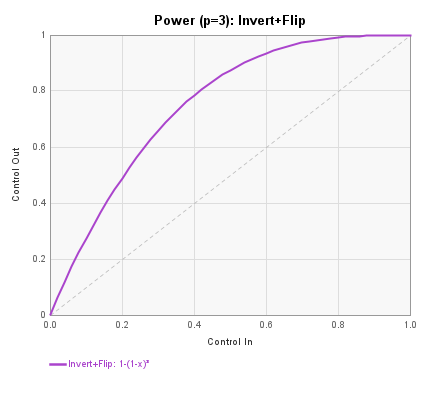

At power=2, a linear pot sweep becomes a quadratic taper. At power=5, most
of the output change happens in the upper quarter of the input range.

A power of 1 is possible but wastes instructions and a register since
the output equals the input.

**Efficiency note:** If you only use the output of the Power block, then
turning Invert on produces the same waveform shape as leaving it off -- the
peaks just line up differently. Since Invert adds an instruction, leave it
off unless you specifically need the input-side phase.

**Typical use:** Convert a linear pot to an audio-taper or logarithmic-feel
response for volume, filter cutoff, or delay feedback controls. Two Power
blocks can be used in conjunction with the straight pot signal to fade 3
signals in one at a time with the rotation of a single pot -- see the
[Multi-Head Drum Tape Delay](https://holy-city-audio.gitbook.io/spincad-designer/patches/multi-head-drum-tape-delay)
article for a worked example.

**Companion:** The [Root](#root) block is the natural companion to Power --
where Power compresses the response toward zero (quadratic, cubic), Root
expands the response away from zero (square root, cube root). Use Power
when you want fine resolution at the top of a pot's travel and Root when
you want fine resolution at the bottom.

---

## Ratio

**Menu:** Controls > Ratio

Sometimes you want a single pot to control two things where one goes up while
the other goes down, and you'd like the values to remain balanced over the
full sweep of the pot.

A classic example is a chorus with independent controls for LFO speed and
width. If you control both directly, the amount of detuning increases with
both LFO frequency *and* width. The Ratio block lets you make them track
together properly so that the amount of detuning remains fixed regardless
of speed.

| Pin | Type | Description |
|-----|------|-------------|
| Input | Control In | 0-1 control signal |
| FullRange | Control Out | Linear scaled output |
| Ratio | Control Out | Inverse proportional output |

**Parameters:**
| Parameter | Range | Default | Description |
|-----------|-------|---------|-------------|
| Ratio | 2-100 | 5 | Compression ratio |

**Transfer function:**

The **FullRange** output is a linear ramp:

    y = (1 + (ratio-1) * x) / ratio

This starts at 1/ratio when x=0 and ramps linearly to 1 when x=1.

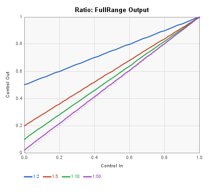

The **Ratio** output is an inverse curve:

    y = 1 / (1 + (ratio-1) * x)

This starts at 1 when x=0 and decreases to 1/ratio when x=1.

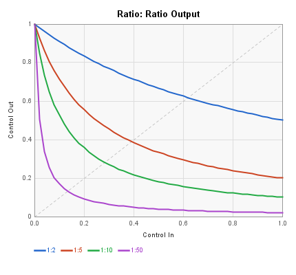

**Why this form:** A naive `1/(ratio * x)` saturates at 1.0 for `x < 1/ratio`
and blows up near zero, which is not what you want. Instead, the block
feeds the linear FullRange output into the `1/(ratio * x)` function. Since
FullRange never drops below `1/ratio`, the inverse stays bounded, and the
curve is "stretched" so that it hits `(0, 1)` on the left and `(1, 1/ratio)`
on the right. Only the 0-to-1 range matters on the FV-1 — signals outside
that range aren't processable.

**Key property:** Multiply these together, and the product is the constant
value 1/ratio across the entire input range. For each ratio setting, the
FullRange curve intersects the y-axis (x=0) at the same value as the Ratio
curve intersects the x=1 line.

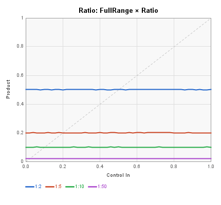

This is implemented on the FV-1 using the LOG and EXP instructions, which
compute the inverse function in the logarithmic domain.

**Typical use:** Control a chorus LFO speed (FullRange) and width (Ratio)
from a single pot. As the speed increases, the width automatically decreases
to maintain consistent perceived detuning. Add a Multiply block with a second
pot to allow independent depth control that still tracks proportionally.

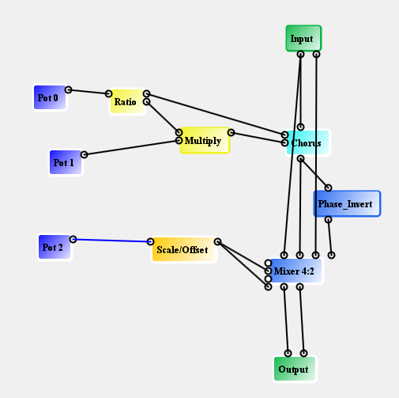

*Pot 0 feeds the Ratio block; FullRange drives the Chorus LFO speed and
the Ratio output is multiplied by Pot 1 before feeding the Chorus width.
This gives a single "rate" knob with width that tracks inversely, plus a
separate depth knob that still respects the tracking.*

---

## Root

**Menu:** Controls > Root

The Root block shapes control signals by raising them to the reciprocal
of an integer power, producing curves like the square root (power=2),
cube root (power=3), and so on. Internally it is implemented as a LOG/EXP
pair: the LOG instruction divides the logarithm by N and the EXP
instruction converts back to linear, effectively computing
`input^(1/N)`.

| Pin | Type | Description |
|-----|------|-------------|
| Control Input 1 | Control In | 0–1 control signal |
| Control Output 1 | Control Out | Shaped output |

**Parameters:**

| Parameter | Range | Default | Description |
|-----------|-------|---------|-------------|
| Root | integer | 2 | Root degree (2 = square root, 3 = cube root, etc.) |
| Invert | on/off | off | Negate and offset input before computing root |
| Flip | on/off | off | Negate and offset output after computing root |

The Invert option transforms the input via `x' = -x + 1.0` before the
root computation. The Flip option applies the same transformation to
the output. These are useful for inverting the shape of the curve.

**Behavior at zero:** Because the Root block uses LOG internally, inputs
at or very near zero produce extreme values (LOG of zero is negative
infinity). The FV-1 saturates this to its minimum value, causing a spike
near zero as shown in the plot. For practical use, ensure inputs stay
above approximately 0.01.

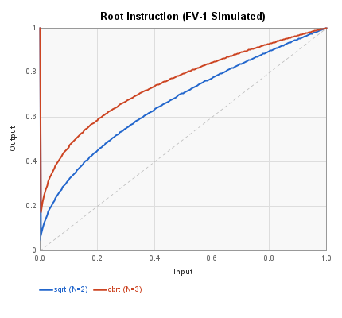

**Typical use:** A square-root curve on a pot gives fine resolution at
the low end of the range -- ideal when the quiet or subtle part of a
parameter is where the interesting behavior lives (e.g. low feedback
amounts, shallow modulation depths, the start of a reverb time sweep).

**Companion:** The [Power](#power) block is the natural companion to Root --
where Root expands the response away from zero, Power compresses the
response toward zero.

---

## Slicer

**Menu:** Controls > Slicer

The Slicer is a binary comparator that converts continuous control signals into
hard on/off switches. The most straightforward application is to get a square
wave from a sine wave.

Set the **Slice Level** at 50%, and the **Slicer Out** goes high when the
**Control In** is below this amount, and low when above. (This may seem
backwards, but that's how it works: output is high when input is *below*
the threshold.)

| Pin | Type | Description |
|-----|------|-------------|
| Control In | Control In | 0-1 control signal to compare |
| Slice Level | Control In | Optional: modulate threshold from another control |
| Slicer Out | Control Out | Binary output |

**Parameters:**
| Parameter | Range | Default | Description |
|-----------|-------|---------|-------------|
| Slice Level | 0.0-0.95 | 0.5 | Comparator threshold |
| Control Range | 0->+1 / -1->+1 | 0->+1 | Output range selection |

**Output modes:**
- **0 -> +1**: output is 0 (low) or ~1.0 (high)
- **-1 -> +1**: output is -1.0 (low) or +1.0 (high)

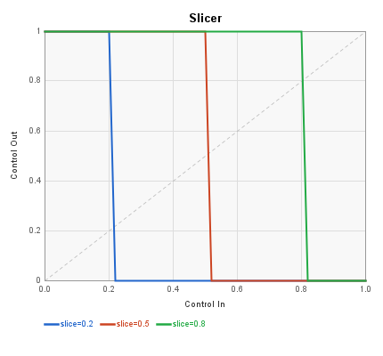

**Pulse Width Modulation:** When a sine wave LFO feeds the Control In, the
Slicer produces a square wave. Varying the Slice Level changes the duty cycle,
creating classic PWM:

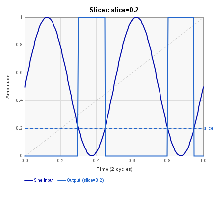
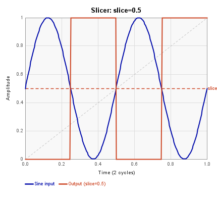
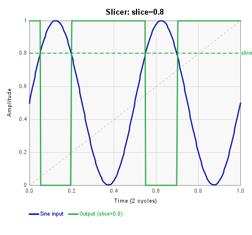

When a Pot is connected to the Slice Level input, varying the pot modulates
the pulse width over its full range. At pot=0, pulses stop entirely (slice
level is zero). To set a minimum pulse width, use a Scale/Offset block between
the pot and the Slice Level input.

**Typical use:** Feed an 8 Hz sine wave into the Slicer to generate a square
wave for tremolo effects. Follow with a **Smoother** block to add exponential
rise/fall times to the transitions, creating a variable-shape tremolo. Combine
with the **Tremolizer** block to control tremolo depth.

Another application: use the Slicer to drive a **Crossfade** block, creating an
instant switch between two effects (e.g., phaser and flanger) at the 50% point
of a pot. Combined with a **Vee** block on the same pot, you can independently
boost feedback for each effect on opposite sides of the crossover point.
[Download the phaser-flanger patch](https://github.com/HolyCityAudio/SpinCAD-Designer/raw/master/patches/phaser-flanger.spcd).

---

## Smoother

**Menu:** Controls > Smoother

The Smoother block adds exponential rise and fall times to sharp transitions.
It is a single-pole lowpass filter operating at very low frequencies,
implemented with one FV-1 instruction (`RDFX`). The control panel displays
the rise time in milliseconds.

| Pin | Type | Description |
|-----|------|-------------|
| Control Input | Control In | Signal to smooth |
| Control Output | Control Out | Smoothed signal |

**Control panel parameters:**

| Parameter | Range | Default | Description |
|-----------|-------|---------|-------------|
| Rise Time | ms (log scale) | ~350 ms | Time for the output to reach ~63% of a step change |

Lower rise time values (faster) let sharp transitions through with minimal
rounding. Higher values (slower) turn square edges into gentle exponential
curves.

**Typical use:** Place after a **Slicer** block to convert the hard square
wave into a variable-shape tremolo envelope. The Smoother's rise time controls
the attack/decay character — fast values give hard chop, slow values give
soft sine-like modulation. Note that very slow settings also reduce the
effective modulation depth, since the filter doesn't have time to reach full
excursion between transitions.

The other major use is smoothing delay time changes. Abrupt delay time jumps
cause the FV-1 to skip its read pointer, producing clicks or pitch pops. A
Smoother makes the pointer drift gradually, producing a smooth pitch bend
instead — like a tape machine spooling up or slowing down.

[Download the slicer-tremolo example patch](https://github.com/HolyCityAudio/SpinCAD-Designer/raw/master/patches/slicer-tremolo.spcd).

---

## Tap Tempo

**Menu:** Controls > Tap Tempo

At the very bottom of the Controls menu. There's one input that reads a
tap signal, and three outputs: Ramp, Latch, and Tap Tempo. The first two
are internal signals brought out for testing; the magic all happens on
the last one.

| Pin | Type | Description |
|-----|------|-------------|
| Control Input | Control In | Tap signal (high/low transitions) |
| Latch | Control Out | Internal latch signal (testing) |
| Ramp | Control Out | Internal ramp signal (testing) |
| Tap Tempo | Control Out | 0-1 value representing the tapped interval |

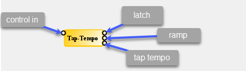

### Origin

This block was submitted by **diystompboxes** forum member "Slacker" who
describes it somewhere in the middle of
[this gigantic thread](https://www.diystompboxes.com/smfforum/index.php?topic=104291.0).
Slacker got to the FV-1 party before I did and came up with some innovative
patches in a pedal he called "Babelfish". One of them includes a tap tempo
delay which is tied to a specific hardware implementation whereby a couple
of resistors are added in series between the wiper of a pot and where it
would normally connect to the FV-1's POT input pin.

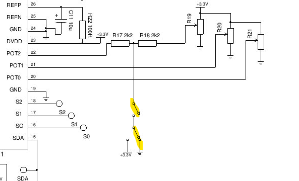

See [this schematic](https://github.com/slackDSP/Babelfish/blob/master/babelfishschem.jpg).

Here is Slacker's original [tap tempo patch](https://github.com/slackDSP/Babelfish/blob/master/bf_taptempodelay.spn)
and the [entire Babelfish project](https://github.com/slackDSP/Babelfish).

### How It Works

The general idea is that you count sample periods between debounced button
pushes, represent this as a fractional number from 0 to 1, and then use
that with the RMPA instruction — having allocated the entire RAM to a
delay — to give you a delay time equal to the tap interval. In the
SpinCAD world, you'd set up a delay (e.g. Triple Tap) and set that to use
all the delay RAM (Delay Time = 1000 msec at 32768 Hz sampling frequency).

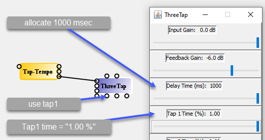

This 0-1 value could also go to the LFO Speed input of any block and
then it would scale that LFO's speed proportionally. Would it match the
tap interval? To make that work you'd need to do a 1/X trick.

### Limitations

I never implemented Slacker's hardware idea, so I actually do not know
if it works. A consulting job I did used the ADCR input for tap detection
since it was a mono-in pedal, but that code didn't end up in SpinCAD.
It's nice to see that the [FXCore chip](http://www.experimentalnoize.com/product_FXCore.php) has a dedicated tap tempo input.

As shown, the delay will jump abruptly from one setting to the next when
it changes. You could add a Smoother to the Tap 1 Delay time input to
introduce some lag to the delay time changes. This will, of course, cause
pitch bending. That behavior is better suited for LFO changes, like the
inertia of a Leslie speaker.

There are delay implementations (for example, in the
[Faust](https://faustdoc.grame.fr/examples/delayEcho/#smoothdelay) libraries) that manage two delay taps internally and fade between them quickly when the control signal for delay time changes — so you can change delay time on the fly without pitch bending. That logic takes a lot of the FV-1's code, which is why it isn't a SpinCAD block yet.

---

## Tremolizer

**Menu:** Controls > Tremolizer

The Tremolizer takes an LFO signal (0 to 1) and converts it into a volume
envelope that *reduces* gain from 1.0. Unlike simply multiplying an LFO by
a width control (which gives you nothing out when the width is zero), the
Tremolizer uses the control signal's value above zero to reduce gain from
unity. So at zero depth, you get full signal; at maximum depth, the LFO
fully chops the signal.

| Pin | Type | Description |
|-----|------|-------------|
| LFO Input | Control In | 0-1 LFO signal |
| LFO Width | Control In | Optional: external width modulation |
| Control Output | Control Out | Volume envelope (1 minus scaled LFO) |

**Parameters:**
| Parameter | Range | Default | Description |
|-----------|-------|---------|-------------|
| Depth | 0.5-1.0 | 0.75 | Maximum depth of volume reduction |

**Transfer function:**

    output = 1 - (depth * input * width)

When the LFO Width pin is not connected:

    output = 1 - (depth * input)

At depth=1.0, the output goes from 1.0 (when LFO=0) down to 0.0 (when LFO=1),
giving "full chop" tremolo. At lower depth values, the output doesn't go as
low, producing a gentler volume modulation.

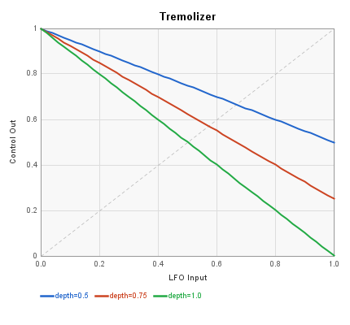

Applied to a 0-1 sine wave LFO, the Tremolizer produces an inverted volume
envelope:

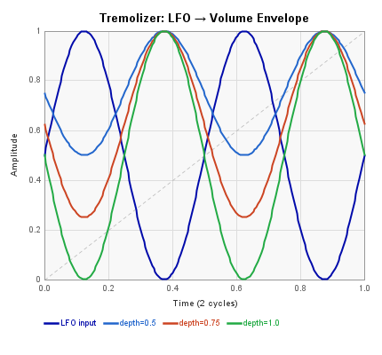

**Typical use:** Build a tremolo patch by connecting a Sine LFO (scaled 0 to 1)
to the Tremolizer's LFO Input, then connect the Tremolizer output to a Volume
control block. Use a Pot on the LFO Width input to control tremolo depth from
the front panel. See [Making a Tremolo Patch](patches/making-a-tremolo-patch.md)
for a full walkthrough.

For a variable-shape tremolo, feed the LFO through a **Slicer** and then a
**Smoother** before the Tremolizer. The Smoother's corner frequency controls
the rise/fall time of the chopped waveform, giving everything from smooth sine
tremolo to hard square-wave chop. Notice that decreasing the Smoother frequency
also reduces the effective chop depth, since the LFO takes longer to reach
full excursion.

### Alternatives

If you use the width parameter input on the LFO block directly, it shrinks
about its midpoint, so with the width all the way down you get a 6 dB drop
in the output level. This is more subtle but closer to typical Fender guitar
amp tremolo sounds.

This midpoint-shrink approach arguably reflects real tremolo behavior
better than a full-chop envelope: any tremolo necessarily reduces the
average signal level, and many standalone tremolo pedals include a
separate gain knob or other compensation to keep the perceived loudness
constant when the effect is engaged.

---

## Two Stage

**Menu:** Controls > Two Stage

Given that the FV-1 only supports 3 control pots, once your patch goes over
the normal amount of complexity, it can be a challenge figuring out how to
control everything. The Two-Stage block takes a single 0-1 input (e.g., from
a pot) and generates two outputs that divide the pot travel in half.

| Pin | Type | Description |
|-----|------|-------------|
| Input | Control In | 0-1 control signal |
| Stage 1 | Control Out | Active in lower half of input (0 to 0.5) |
| Stage 2 | Control Out | Active in upper half of input (0.5 to 1.0) |

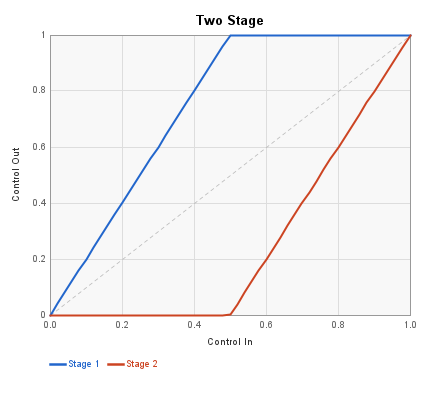

**Transfer function:**

As the input goes from 0 to 0.5:
- Stage 1 goes linearly from 0 to 1.0
- Stage 2 stays at 0

As the input goes from 0.5 to 1.0:
- Stage 1 stays at 1.0
- Stage 2 goes linearly from 0 to 1.0

**Typical use:** Use a single pot to sequence two parameters. For example:
0 to 0.5 turns up the LFO speed, 0.5 to 1.0 turns up the LFO width. You can
add Scale/Offset, Power, or other shaping blocks to either output to fine-tune
the response for a more subtle change in the algorithm.

This is one of those blocks whose best uses may still be undiscovered --
someone usually finds an interesting application that hadn't been considered,
so let me know if you do.

---

## Vee

**Menu:** Controls > Vee

The Vee block splits a single control input into two outputs whose shape
depends on which output pins are connected.

| Pin | Type | Description |
|-----|------|-------------|
| Input | Control In | 0-1 control signal |
| Output 1 | Control Out | See modes below |
| Output 2 | Control Out | See modes below |

### Both outputs connected — complementary half-ramps

When both outputs are wired, each covers half the input range with a linear
ramp and stays clamped at zero for the other half.

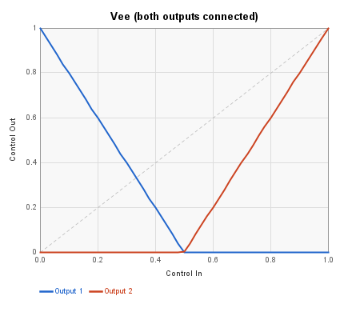

As the input goes from 0 to 0.5:
- Output 1 goes linearly from 1.0 to 0
- Output 2 stays at 0

As the input goes from 0.5 to 1.0:
- Output 1 stays at 0
- Output 2 goes linearly from 0 to 1.0

### Single output connected — full V-shape

When only one output is connected, it covers the full input range as a
symmetric V (or inverted V), implemented with the ABSA instruction.

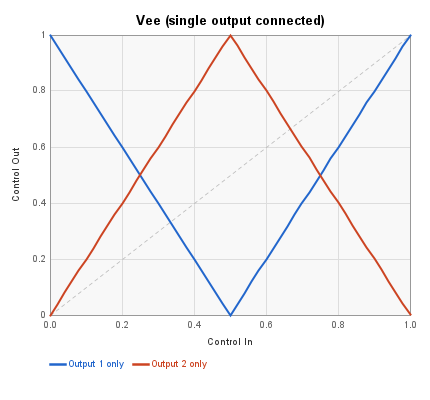

- **Output 1 only:** V-shape — high at edges (1.0), zero at center (0.5)
- **Output 2 only:** Inverted V — zero at edges, high at center (1.0)

**Typical use:** Drive two effects with a single pot so one fades out as the
other fades in, with the crossover point at the pot's midpoint. For example,
pot 2 controls the FX blend through a Vee block: in the middle it is just dry,
all the way left brings in chorus, all the way right brings in flanger. The LFO
speed and width of the two modulation stages can be individually scaled with
separate Scale/Offset blocks.

Patch file demonstrating this:
[vee-control.spcd](https://github.com/HolyCityAudio/SpinCAD-Designer/raw/master/patches/vee-control.spcd).
