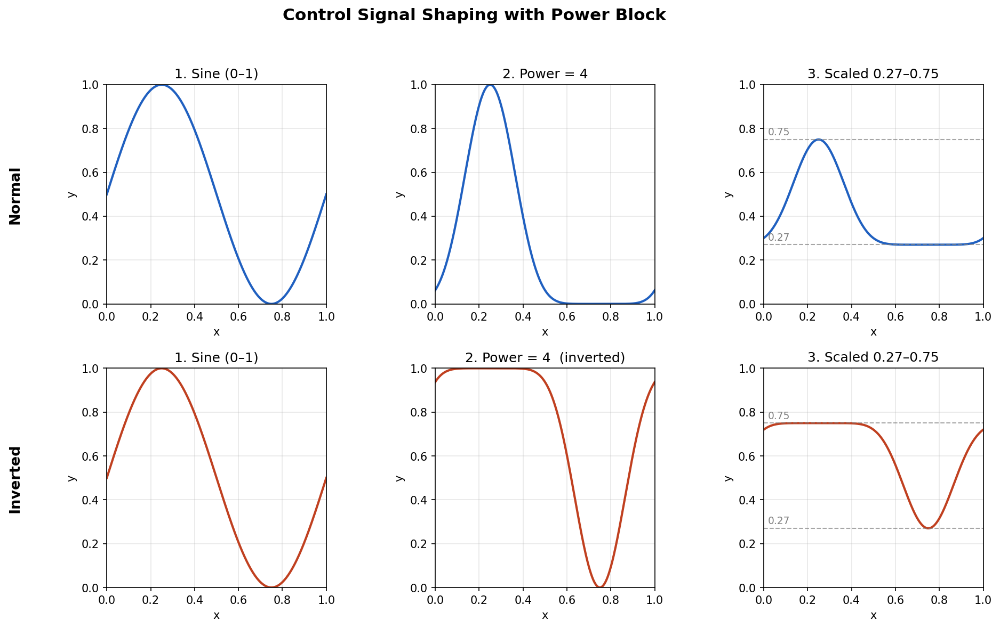

# Using Control Signals in SpinCAD Designer

*A practical guide to taming the 0–1 world of the FV-1*

## Introduction: What Is a Control Signal?

SpinCAD Designer organizes blocks into two categories by convention: audio blocks and control blocks. Audio blocks carry the sound you want to process. Control blocks produce or shape values -- typically in the 0 to 1 range -- that tell other blocks how to behave: how fast a filter sweeps, how deep a chorus goes, how slowly a delay time drifts.

This distinction is purely a UI and organizational convention. Under the hood, the FV-1 has no separate control bus or slower-rate processing path. Every signal -- audio, LFO output, pot reading, envelope result -- is just a number in a register, updated every sample at the chip's full sample rate (32768 Hz by default). A "control signal" is simply a value that happens to change slowly or stay fixed. This also means you can feed control signals into audio paths and vice versa if the math serves your purpose.

Everything in the FV-1's world lives in a −1 to +1 numerical space. The POT inputs output values from 0 to 1 as you turn them, and control signals ride in that same space. The entire art of building expressive patches is about learning to shape, rescale, bend, and route those values so they move the right parameter by the right amount in the right direction.

## Step 1: Decide What You Want to Control

Before placing any control blocks, know what parameter you're targeting and what kind of movement you want.

**What is the destination?** Common targets include filter cutoff frequency, delay time, LFO speed, LFO depth, wet/dry mix, reverb size, and feedback amount.

**Does it need to stay fixed, move periodically, or react to the audio?** A pot sets a static value. An LFO sweeps a filter rhythmically. An envelope follower tracks playing dynamics for a wah-style effect or gated reverb.

For this article the running example is controlling the cutoff frequency of the SVF 2P (state-variable filter) block -- a use case that appears in everything from auto-wah to filter tremolo.

## Step 2: Find the Useful Control Range Using a Pot

The most important first step is understanding what range of the 0–1 space actually sounds good for your target parameter. The answer is almost never "all of it."

1. Temporarily connect a Pot block directly to the control input of the block you want to move -- say, the cutoff input of your filter.
2. Run the simulator with an audio file.
3. Sweep the pot slowly from 0 to 1. Find where the effect becomes useful, where it's sweetest, and where it becomes unusable. The useful window might be something like 0.05 to 0.35 -- below 0.05 the filter is clamped shut, above 0.35 it sounds like bypass.
4. Write those numbers down. These become your "Output Low" and "Output High" in the Scale/Offset block.

**How control inputs work:** The value you set on a block's control panel -- for example, a delay time or filter frequency -- represents the *maximum*. That is the value the block uses when no control signal is attached. When a control signal is connected, the control panel setting is achieved when the control input equals 1, and it scales downward from there toward 0 as the control input approaches 0. In other words, the control input acts as a multiplier on the panel setting.

To constrain the lower end -- for example, to prevent a parameter from going below 35% of its maximum -- place a Scale/Offset block before the control input with Output Low = 0.35 and Output High = 1. The control signal then sweeps from 35% to 100% of the panel setting instead of from 0% to 100%.

Delay blocks are a little unusual: most of them limit internally at 5% of maximum when the delay time control input is 0, so the delay never collapses completely. In practice, the upper limit of a parameter is often set by the control panel of the controlled block, while the lower limit is set by the Scale/Offset block directly before the control input pin.

Many beginners wire a full 0–1 LFO directly into a filter and wonder why it sounds broken at most settings. The target parameter almost always only responds musically over a narrow window, and the control signal spends most of its travel in useless territory.

## Step 3: Map the Range with a Scale/Offset Block

Use the Scale/Offset block to remap the incoming 0–1 signal into the useful window you found above. It corresponds to the FV-1's SOF instruction, expressed in the GUI as "Output Low" and "Output High":

- **Output Low** -- output value when input is 0
- **Output High** -- output value when input is 1

For a useful range of 0.05 to 0.30, set Output Low to 5 and Output High to 30 (on a 0–100 GUI scale). Once baked in, you can swap the Pot source for any other control source -- LFO, envelope, tap tempo -- and the block always constrains the output to the range that sounds good.

> **Pro tip:** Scale/Offset is used in nearly every patch. The Controls menu is alphabetically arranged so it's easy to find. Learn it early, use it everywhere.

## Step 4: Choose Your Control Source

### Pot (Manual Control)

The Pot block reads one of the three hardware pots (POT0, POT1, POT2). After using a pot to explore the range during development, you can leave it in as the final user-facing control -- just run it through a Scale/Offset block to restrict its travel to the useful range.

### LFO (Periodic Modulation)

SpinCAD provides a Sine LFO (using the FV-1's hardware sine generator, two available) and a Ramp LFO. The FV-1's hardware Range register controls the peak amplitude of the sine oscillator but the signal still swings symmetrically around zero -- reducing Range gives a smaller bipolar signal, it does not shift the wave into positive territory. To get a truly unipolar 0–1 signal, use the range option inside SpinCAD's Sine LFO block, which adds the necessary offset.

Understanding the underlying SOF approach is still valuable: `SOF 0.5, 0.5` transforms a raw bipolar −1 to +1 signal into 0 to 1. You'll encounter this when working with other bipolar sources such as the quadrature (cosine) output of the sine generator.

A Scale/Offset block then compresses the 0–1 signal into your useful range. The LFO blocks' Speed and Range inputs can themselves be fed from pots for user-adjustable rate and depth. Note that LFOs run at full sample rate -- they are simply oscillators configured to operate at sub-audio frequencies.

**Use an LFO for:** tremolo, chorus, vibrato, filter sweeps, flanger, phaser, auto-pan.

### Envelope Follower

The Envelope block tracks the amplitude of the audio input and outputs a value that follows loudness. SpinCAD provides both Envelope and Envelope II. The output is in the 0–1 range, compatible with the same Scale/Offset workflow as an LFO.

**Use an envelope for:** auto-wah, dynamic reverb send, envelope-triggered tremolo depth -- any effect where the sound should modulate itself in response to playing dynamics.

### Constant

Outputs a fixed value set at design time. Useful for hardcoding a parameter or biasing a control that combines a constant with a dynamic modulation signal.  Historically this was needed for blocks that didn't have default behavior when pins were not connected, so building the patch would fail.  Its use is most likely an edge case now.

### Other Sources (Slicer, S/H, Ratio, etc.)

SpinCAD also includes a Slicer (rhythmic gate), Tap Tempo, sample-and-hold, and 4-phase sample-and-hold. When using any of these -- as well as the Ratio block -- a Scale/Offset block at the output before the controlled block is usually necessary. These sources produce values that span whatever range their inputs cover, which is rarely the window your target parameter needs. Treat Scale/Offset as a mandatory fixture at the output of any of these blocks.

## Step 5: Shape the Curve

Sometimes the *shape* of the response across the control range matters as much as the range itself. Filter cutoff is perceptually logarithmic -- a linear sweep spends most of its travel in the high-frequency range where differences are subtle, blowing through the interesting midrange too quickly.

### Power Block

Squares the input: `output = input × input`. In the 0–1 range this produces a quadratic curve -- rising slowly at first, then accelerating. The control spends more travel in the lower portion of the range, giving finer resolution where tonal character lives. In the filter-tremolo patch from the SpinCAD repository, the depth pot is squared before use:

```asm
;------ Power
RDAX POT2,1.0000000000
WRAX REG2,1.0000000000
MULX REG2
WRAX REG3,0.0000000000
```

### Invert Block

Flips the signal direction: 0→1 and 1→0. Useful when a parameter must move opposite to its source -- e.g., driving a second filter down while the LFO drives the first one up.

### Two-Stage Block

Piecewise-linear with a configurable knee. Creates dead zones at the bottom of a pot's travel or compresses a wide range of control motion into a narrower output range.

### Vee Block

V-shaped response -- output falls to a minimum at the center of the input range, then rises again. Both extremes of control motion produce "more" effect; the center produces the minimum.

### Log and Exp (Instructions submenu)

True logarithmic and exponential transforms, useful for pitch control or perceptually smooth filter sweeps.

### Smoother Block

A one-pole IIR filter using the RDFX instruction with a small coefficient, causing the output to creep toward the input rather than jump instantly.

If you're driving a parameter with a sine LFO, the signal is already smooth and a Smoother adds little value. It becomes essential with stepped or discontinuous sources -- sample-and-hold, noise, or the Slicer -- which jump abruptly between values and will otherwise produce clicks and zipping. The Smoother turns the staircase into a glide.

The other major use is delay time control. Abrupt changes cause the FV-1 to jump its read pointer, producing a glitch or pitch pop. A Smoother makes the pointer drift gradually, producing a smooth pitch bend. With a slow enough coefficient this sounds like a tape machine spooling up or slowing down -- a useful creative effect in its own right.

## Step 6: Putting It Together -- Power Shaping and Scaling

To see how the pieces combine, consider a sine LFO scaled to 0–1, run through a Power block (power = 4), and then scaled to a useful range of 0.27–0.75.

**Normal (power = 4):**

1. **Sine (0–1)** -- a smooth sine wave filling the full 0–1 range.
2. **Power = 4** -- raises each sample to the 4th power. Values near zero are compressed hard toward zero while 1.0 stays at 1.0. The signal spends most of its time near the bottom of the range with brief, sharp peaks.
3. **Scale to 0.27–0.75** -- the shaped signal now mostly sits near 0.27 with short excursions up to 0.75. This is ideal when you want a control to rest at a baseline and only briefly spike -- for example, a filter that stays warm and occasionally opens.

**Inverted (power = 4):**

1. **Sine (0–1)** -- same starting signal.
2. **Power = 4, inverted** -- the formula `1 − (1 − input)^4` compresses values near 1.0 instead. The signal spends most of its time near the top of the range with brief dips.
3. **Scale to 0.27–0.75** -- the shaped signal now mostly sits near 0.75 with short dips down to 0.27. Use this when you want a control to rest high and briefly duck -- for example, a filter that stays open and momentarily closes.



<!-- TODO: add screenshot of SpinCAD blocks -->

The key insight is that the Power block reshapes *where the signal spends its time* without changing the endpoints. Normal power makes it linger at the low end; inverted power makes it linger at the high end. The Scale/Offset block then maps that shaped signal into whatever output range your destination parameter needs.

## Step 7: Swapping Sources

Once the Scale/Offset chain is verified with a pot, swapping control sources is trivial -- disconnect the pot and connect the new source to the same Scale/Offset input. To convert the above to an auto-wah:

1. Remove the LFO block.
2. Add an Envelope block; connect the audio input to it.
3. Wire the Envelope output to Scale/Offset B's input.
4. Adjust attack and release via pots to taste.

Range restriction, curve bending, and the smoother stay exactly the same. The source and destination are decoupled by the shaping blocks between them.

## Common Pitfalls and Tips

**Don't skip the pot exploration step.** Always find the useful range before wiring up a dynamic source.

**Raw LFO outputs are bipolar.** Use SpinCAD's Sine LFO block range option to shift to 0–1, or apply `SOF 0.5, 0.5` manually when working with raw bipolar sources.

**Control inputs only scale downward.** A value of 1 gives the block's internal maximum; you cannot overdrive past it. Output High should never exceed 1.0 in normalized terms.

**Scale/Offset is mandatory after Slicer, S/H, Ratio, and similar blocks.** Their outputs reflect whatever their inputs cover -- not a pre-scaled useful range.

**Power block for natural-feeling sweeps.** One Power block before Scale/Offset gives filter and delay controls a much more musical, perceptually linear feel.

**Smoother for stepped sources and delay time.** Essential after Slicer, S/H, and noise; prevents glitching on delay time changes; can produce a tape-speed creative effect at slow coefficients.

**Ratio for coupled controls.** Keeps LFO speed and depth in a complementary relationship without extra math blocks. Follow its outputs with Scale/Offset before the controlled blocks.

## Reference: Controls Menu (Alphabetical)

- **Clip** -- hard-limit the signal
- **Envelope / Envelope II** -- audio-driven control
- **Invert** -- flip signal direction
- **Mixer 2:1 / 3:1** -- sum control signals
- **Power** -- square input for curve bending
- **Ratio** -- complementary outputs with constant product
- **Scale/Offset** -- linear range remapping (most used)
- **Slicer** -- rhythmic gating
- **Smoother** -- one-pole IIR lag filter
- **Tap Tempo** -- tempo-derived control
- **Tremolizer** -- amplitude modulation block
- **Two-Stage** -- piecewise-linear knee response
- **Vee** -- V-shaped response

Controls > Instructions submenu: Constant, Exp, Log, Multiply, Root

## Conclusion

The workflow is always the same: find the useful range with a pot, lock it in with Scale/Offset, choose a source, shape the curve, add a Smoother where needed. Once internalized, any effect is buildable -- filter tremolos, auto-wahs, tap-tempo delays, dynamic reverb sends. The blocks are consistent and composable. Understanding what your destination parameter responds to is always just one pot sweep away.

## Resources

- [SpinCAD Designer GitHub](https://github.com/HolyCityAudio/SpinCAD-Designer)
