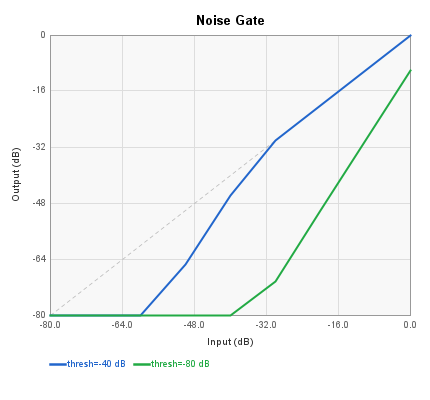
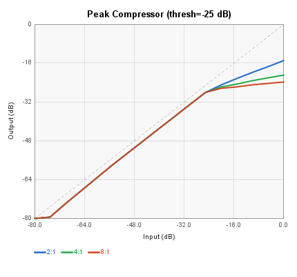
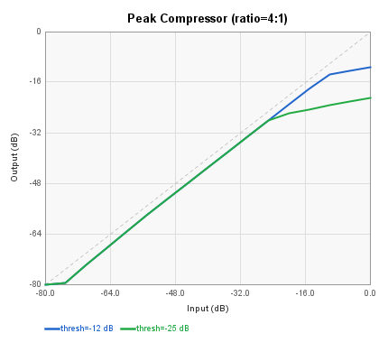
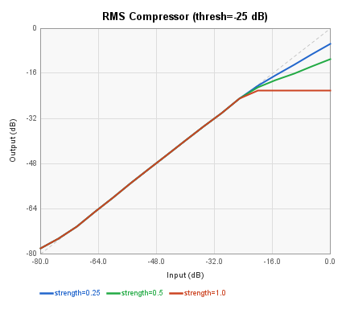
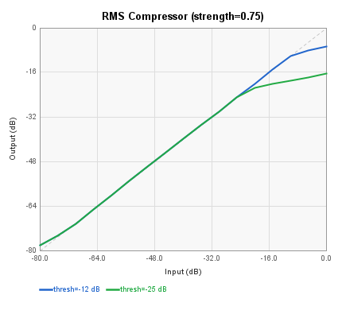
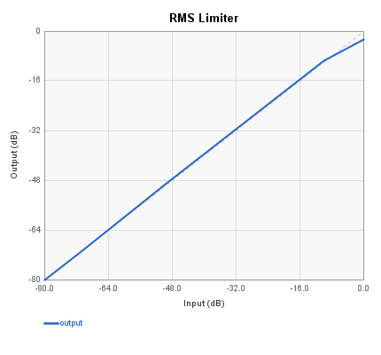
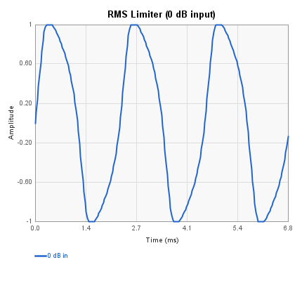
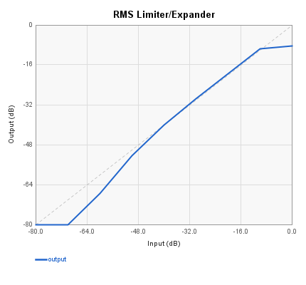
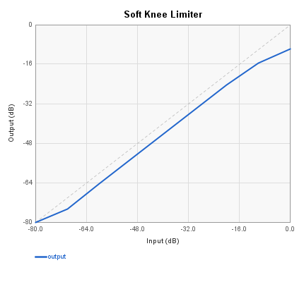

# Dynamics Blocks Reference

These blocks implement dynamics processing: compression, limiting, expansion,
and noise gating. They are found in the **Dynamics** menu of SpinCAD Designer.

All dynamics blocks operate on the FV-1's fixed-point arithmetic, so signals
are clamped to the -1.0 to +0.999 range. The compressor and limiter blocks
use the FV-1's LOG and EXP instructions to compute gain in the logarithmic
domain.

### Block Index

| | | |
|-|-|-|
| [Noise Gate](#noise-gate) | [Peak Compressor](#peak-compressor) | [RMS Compressor](#rms-compressor) |
| [RMS Limiter](#rms-limiter) | [RMS Limiter/Expander](#rms-limiterexpander) | [Soft Knee Limiter](#soft-knee-limiter) |

---

## Noise Gate

**Menu:** Dynamics > Noise Gate

A simple noise gate that silences the output when the input level falls
below an adjustable threshold. The gate uses an envelope follower with
ABSA (absolute value) detection and a single-pole smoothing filter to
track the signal level.

| Pin | Type | Description |
|-----|------|-------------|
| Audio In | Audio In | Input signal |
| Audio Out | Audio Out | Gated output |

**Control panel parameters:**

| Parameter | Range | Default | Description |
|-----------|-------|---------|-------------|
| Threshold | 0.0-1.0 | 0.02 | Gate open threshold (linear amplitude) |

When the input level is above the threshold, the gate opens and passes
audio. When it drops below, the output fades to silence via the envelope
follower's decay time.



Input-vs-output transfer curve at two threshold settings (-40 dB and
-80 dB). Above the threshold, the gate passes audio at unity gain.
Below the threshold, the output drops sharply as the gate closes.

---

## Peak Compressor

**Menu:** Dynamics > Peak Compressor

A peak-detecting compressor with adjustable ratio, threshold, attack/release
times, and makeup gain. The detector tracks the instantaneous peak level
of the input signal using ABSA, and the gain computer operates in the
logarithmic domain via LOG/EXP.

| Pin | Type | Description |
|-----|------|-------------|
| Input | Audio In | Input signal |
| Audio_Output | Audio Out | Compressed output |
| Gain Reduction | Control Out | Current gain reduction amount |

**Control panel parameters:**

| Parameter | Range | Default | Description |
|-----------|-------|---------|-------------|
| Input Gain | linear | 1.0 | Pre-compression input gain |
| Attack Time | 0-1 | 0.01 | Attack coefficient (higher = faster) |
| Release Time | 0-1 | 0.001 | Release coefficient (higher = faster) |
| Ratio | 1:1 and up | 4:1 | Compression ratio |
| Threshold | dB | -25 dB | Compression threshold |
| Makeup Gain | dB | 0 dB | Post-compression gain |
| Trim | linear | 1.0 | Final output trim |

The compressor only reduces gain when the signal exceeds the threshold.
Below threshold, the signal passes unaffected (plus any makeup gain).
The Gain Reduction output can be connected to a VU meter or other
monitoring block.



Input-vs-output transfer curve at threshold=-25 dB for three compression
ratios. Higher ratios produce more gain reduction above the threshold.



Input-vs-output transfer curve at ratio=4:1 for two threshold settings.
The knee point shifts with the threshold.

---

## RMS Compressor

**Menu:** Dynamics > RMS Compressor

An RMS-detecting compressor that responds to the average power of the input
rather than instantaneous peaks. This produces smoother, more musical
compression that follows the perceived loudness of the signal. The RMS
level is computed by squaring the input and low-pass filtering the result.

| Pin | Type | Description |
|-----|------|-------------|
| Input | Audio In | Input signal |
| Audio_Output | Audio Out | Compressed output |
| Gain Reduction | Control Out | Current gain reduction amount |

**Control panel parameters:**

| Parameter | Range | Default | Description |
|-----------|-------|---------|-------------|
| Input Gain | linear | 1.0 | Pre-compression input gain |
| Strength | 0-1 | 0.5 | Compression strength (0 = no compression) |
| Threshold | dB | -25 dB | Compression threshold |
| Attack Time | 0-1 | 0.01 | Attack coefficient (higher = faster) |
| Release Time | 0-1 | 0.001 | Release coefficient (higher = faster) |
| Makeup Gain | dB | 0 dB | Post-compression gain |
| Trim | linear | 1.0 | Final output trim |

The "strength" parameter controls how aggressively the compressor reduces
gain above threshold. At strength=0, no compression occurs. At strength=1,
the compressor applies maximum gain reduction (equivalent to hard limiting
for signals well above threshold).



Input-vs-output transfer curve at threshold=-25 dB for three strength
settings. Higher strength produces more gain reduction above threshold.



Input-vs-output transfer curve at strength=0.75 for two threshold settings.

---

## RMS Limiter

**Menu:** Dynamics > RMS Limiter

An RMS limiter with an external side chain input for keyed limiting. The
side chain allows the gain reduction to be driven by a different signal
than the one being processed -- useful for ducking, de-essing, or
frequency-selective limiting.

| Pin | Type | Description |
|-----|------|-------------|
| Input | Audio In | Signal to be limited |
| Side Chain | Audio In | Signal that drives the detector |
| Output | Audio Out | Limited output |
| RMS | Control Out | RMS level of the detector |
| Square | Control Out | Squared input (pre-filter) |
| Log | Control Out | Log-domain detector signal |
| Avg | Control Out | Averaged (filtered) detector signal |

**Control panel parameters:**

| Parameter | Range | Default | Description |
|-----------|-------|---------|-------------|
| Input Gain | linear | 0.1 | Pre-limiter input gain |

The four diagnostic control outputs (RMS, Square, Log, Avg) expose
intermediate signals from the detector chain, which can be connected to
a VU meter or other monitoring blocks for visualization.

When the Side Chain input is connected, the limiter's gain reduction is
driven by the side chain signal rather than the main input. When only the
Input is connected, the Side Chain defaults to the second ADC channel.



Input-vs-output transfer curve from 0 to -80 dB in 10 dB steps.



Waveform at 0 dB input showing distortion. The 1.5x output scale factor
in the algorithm causes hard clipping when the RMS gain envelope does not
reduce the signal enough to keep the product below 1.0.

---

## RMS Limiter/Expander

**Menu:** Dynamics > RMS Limiter/Expander

A combined RMS limiter and expander that automatically controls the dynamic
range of the input signal. Loud signals are attenuated (limiting) while
quiet signals are boosted (expansion), resulting in a more consistent
output level. This block has no adjustable parameters -- the limiting and
expansion curves are fixed.
This block implements the code from Spin Semiconductor's
[Free DSP Programs](http://spinsemi.com/get_spn.php?spn=rms_lim_exp.spn&prodnum=SPN1001).

| Pin | Type | Description |
|-----|------|-------------|
| Input_Left | Audio In | Input signal |
| Audio_Output | Audio Out | Level-controlled output |

This block uses cascaded SOF instructions to amplify the signal before
computing the expansion envelope, providing sensitivity to low-level
signals. The combination of LOG/EXP for limiting and a second LOG/EXP
stage for expansion creates a two-slope transfer characteristic.



Input-vs-output transfer curve from 0 to -80 dB in 10 dB steps. Note
how the output range is compressed compared to the input: loud signals
are reduced and quiet signals are boosted relative to unity gain.

---

## Soft Knee Limiter

**Menu:** Dynamics > Soft Knee Limiter

A soft knee limiter that gradually increases gain reduction as the signal
approaches and exceeds the threshold, rather than applying a hard
transition. This produces a more transparent and natural-sounding result,
especially on transient-rich material. The block has no user-adjustable
parameters -- the knee shape and threshold are fixed in the algorithm.

| Pin | Type | Description |
|-----|------|-------------|
| Input | Audio In | Input signal |
| Audio_Output | Audio Out | Limited output |

The soft knee characteristic is implemented using LOG with fractional
coefficients and an offset, which creates a gradual gain reduction curve.
A constant offset (`SOF 0, 0.125`) adds a small bias to the RMS detector
to ensure stable behavior at very low signal levels.



Input-vs-output transfer curve from 0 to -80 dB in 10 dB steps. The soft
knee behavior is visible as a gradual change in slope rather than a sharp
break at a fixed threshold.

---

## Generating Updated Plots

The per-block PNG plots above are generated by running:

```
./gradlew test --tests "com.holycityaudio.SpinCAD.DynamicsDocTest"
```

Individual PNGs are written to the `docs/images/` directory.
