# Filter Blocks Reference

These blocks implement various filter topologies for the FV-1: lowpass, highpass,
bandpass, notch, shelving EQ, parametric EQ, comb filters, and resonators.

---

## LPF 1-Pole (RDFX)

A simple 1-pole (6 dB/octave) lowpass filter. The cutoff frequency can be
set from the control panel or modulated via the Frequency control input.

| Pin | Type | Description |
|-----|------|-------------|
| Input | Audio In | Audio signal |
| Frequency | Control In | Cutoff frequency modulation |
| Output | Audio Out | Filtered output |

**Control panel parameters:**

| Parameter | Range | Default | Description |
|-----------|-------|---------|-------------|
| Frequency | 0.0-1.0 | 0.15 | Filter coefficient (higher = higher cutoff) |

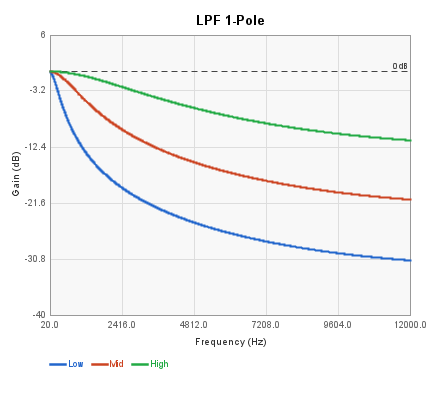

---

## HPF 1-Pole (RDFX)

A simple 1-pole (6 dB/octave) highpass filter. Subtracts the lowpass-filtered
signal from the input to produce a highpass response.

| Pin | Type | Description |
|-----|------|-------------|
| Input | Audio In | Audio signal |
| Frequency | Control In | Cutoff frequency modulation |
| Output | Audio Out | Filtered output |

**Control panel parameters:**

| Parameter | Range | Default | Description |
|-----------|-------|---------|-------------|
| Frequency | 0.0-1.0 | 0.015 | Filter coefficient (higher = higher cutoff) |

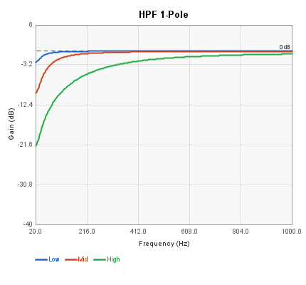

---

## SVF 2-Pole

A 2-pole state-variable filter providing simultaneous lowpass, bandpass, and
highpass outputs. The frequency and Q (resonance) are adjustable.

| Pin | Type | Description |
|-----|------|-------------|
| Audio Input | Audio In | Audio signal |
| Frequency | Control In | Cutoff frequency modulation |
| Lowpass Out | Audio Out | 2-pole lowpass output |
| Bandpass Out | Audio Out | Bandpass output |
| Hipass Out | Audio Out | 2-pole highpass output |

**Control panel parameters:**

| Parameter | Range | Default | Description |
|-----------|-------|---------|-------------|
| Frequency | Hz | 740 | Center/cutoff frequency |
| Q | 0.5-20 | 1.0 | Resonance (higher = sharper peak) |

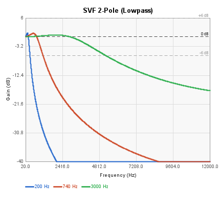

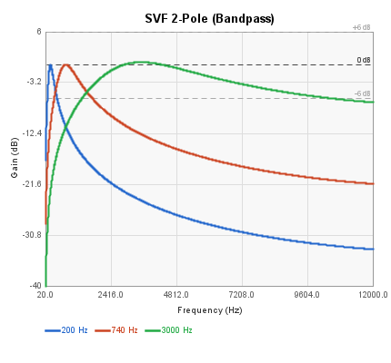

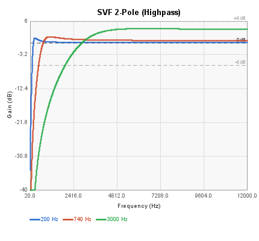

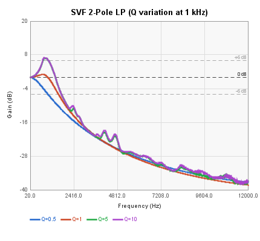

---

## SVF 2-Pole Adjustable

An enhanced 2-pole state-variable filter with four outputs (lowpass, bandpass,
notch, highpass) and Q range control via min/max settings. Both frequency and
Q can be modulated via control inputs.

| Pin | Type | Description |
|-----|------|-------------|
| Input | Audio In | Audio signal |
| Frequency | Control In | Cutoff frequency modulation |
| Q | Control In | Resonance modulation |
| Low Pass Output | Audio Out | 2-pole lowpass output |
| Band Pass Output | Audio Out | Bandpass output |
| Notch Output | Audio Out | Notch (band-reject) output |
| High Pass Output | Audio Out | 2-pole highpass output |

**Control panel parameters:**

| Parameter | Range | Default | Description |
|-----------|-------|---------|-------------|
| Frequency | 0.0-1.0 | 0.15 | Filter coefficient |
| Q Max | 1-100 | 50 | Maximum Q value |
| Q Min | 0.5-10 | 1 | Minimum Q value |

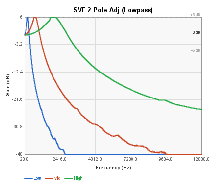

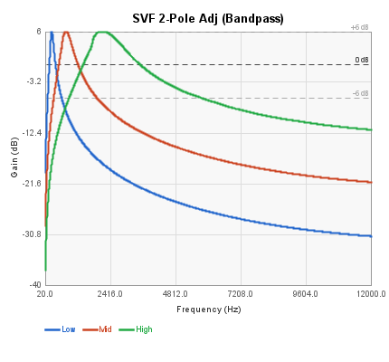

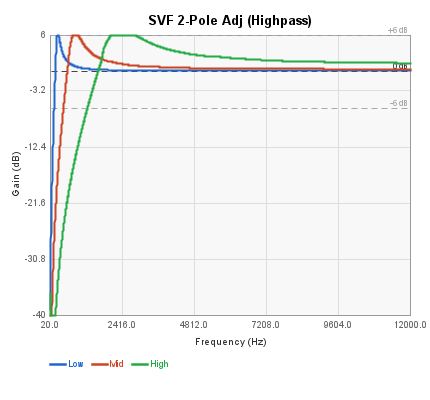

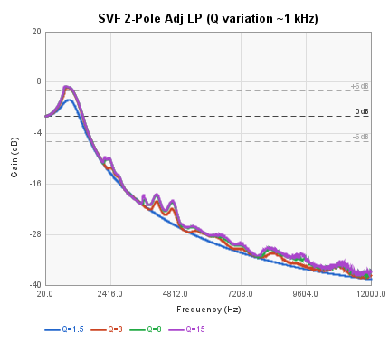

---

## LPF 2/4-Pole

A resonant lowpass filter that can operate in 2-pole (12 dB/octave) or
4-pole (24 dB/octave) mode. In 4-pole mode, two cascaded 2-pole stages
produce a steeper rolloff similar to classic analog synth filters.

| Pin | Type | Description |
|-----|------|-------------|
| Audio Input | Audio In | Audio signal |
| Frequency | Control In | Cutoff frequency modulation |
| Resonance | Control In | Resonance modulation |
| Low Pass | Audio Out | Filtered output |

**Control panel parameters:**

| Parameter | Range | Default | Description |
|-----------|-------|---------|-------------|
| Frequency | Hz | 880 | Cutoff frequency |
| Q | 0.0-1.0 | 0.2 | Resonance amount |
| 4-Pole | on/off | off | Enables 4-pole (24 dB/oct) mode |

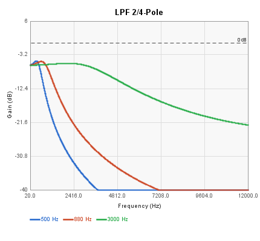

---

## HPF 2/4-Pole

A resonant highpass filter with selectable 2-pole (12 dB/octave) or
4-pole (24 dB/octave) mode. The mirror image of the LPF 2/4-Pole block.

| Pin | Type | Description |
|-----|------|-------------|
| Audio Input | Audio In | Audio signal |
| Frequency | Control In | Cutoff frequency modulation |
| Resonance | Control In | Resonance modulation |
| High Pass | Audio Out | Filtered output |

**Control panel parameters:**

| Parameter | Range | Default | Description |
|-----------|-------|---------|-------------|
| Frequency | Hz | 880 | Cutoff frequency |
| Q | 0.0-1.0 | 0.2 | Resonance amount |
| 4-Pole | on/off | off | Enables 4-pole (24 dB/oct) mode |

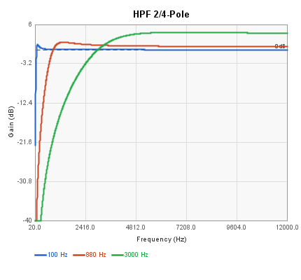

---

## Notch (Band-Reject)

A 2-pole notch filter that rejects a narrow frequency band while passing
all others. Also provides a bandpass output. Q controls the width of the
notch -- higher Q produces a narrower rejection band.

| Pin | Type | Description |
|-----|------|-------------|
| Input | Audio In | Audio signal |
| Frequency | Control In | Center frequency modulation |
| Resonance | Control In | Q modulation |
| Output_Notch | Audio Out | Notch (band-reject) output |
| Output_Bandpass | Audio Out | Bandpass output |

**Control panel parameters:**

| Parameter | Range | Default | Description |
|-----------|-------|---------|-------------|
| Frequency | 0.0-1.0 | 0.15 | Filter coefficient |
| Q Max | 1-100 | 5 | Maximum Q value |
| Q Min | 0.5-10 | 1 | Minimum Q value |

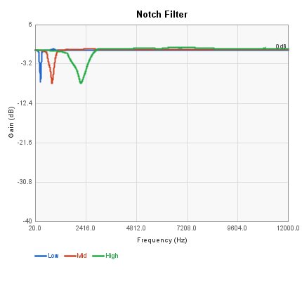

---

## Shelving Lowpass

A shelving lowpass filter that attenuates high frequencies by a controllable
amount while leaving low frequencies untouched. Unlike a standard lowpass,
the shelf parameter controls how much attenuation is applied above the
cutoff rather than rolling off completely.

| Pin | Type | Description |
|-----|------|-------------|
| Input | Audio In | Audio signal |
| Shelf | Control In | Shelf depth modulation |
| Output | Audio Out | Filtered output |

**Control panel parameters:**

| Parameter | Range | Default | Description |
|-----------|-------|---------|-------------|
| Frequency | 0.0-1.0 | 0.15 | Shelf corner frequency coefficient |
| Shelf | 0.0-1.0 | 0.5 | Shelf depth (0 = full cut, 1 = no cut) |

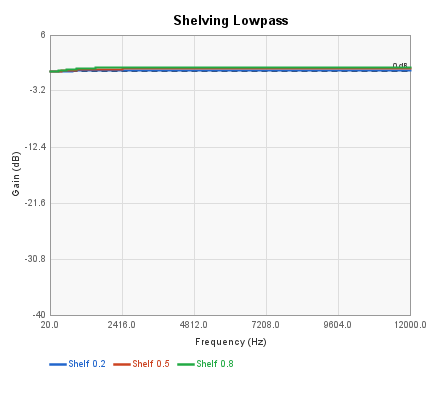

---

## Shelving Highpass

A shelving highpass filter that attenuates low frequencies by a controllable
amount while leaving high frequencies untouched. The complement of the
Shelving Lowpass block.

| Pin | Type | Description |
|-----|------|-------------|
| Input | Audio In | Audio signal |
| Shelf | Control In | Shelf depth modulation |
| Output | Audio Out | Filtered output |

**Control panel parameters:**

| Parameter | Range | Default | Description |
|-----------|-------|---------|-------------|
| Frequency | 0.0-1.0 | 0.15 | Shelf corner frequency coefficient |
| Shelf | 0.0-1.0 | 0.5 | Shelf depth (0 = full cut, 1 = no cut) |

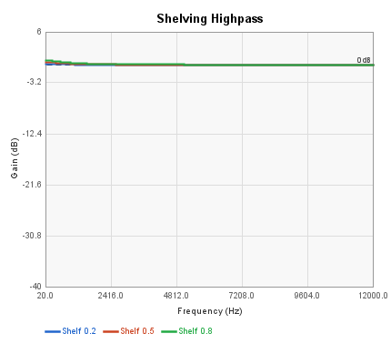

---

## 1-Band EQ

A single-band parametric equalizer with adjustable frequency, Q, and
boost/cut level. Uses a bandpass filter topology to add or subtract
a resonant peak from the input signal.

| Pin | Type | Description |
|-----|------|-------------|
| Audio Input 1 | Audio In | Audio signal |
| Audio Output 1 | Audio Out | Equalized output |

**Control panel parameters:**

| Parameter | Range | Default | Description |
|-----------|-------|---------|-------------|
| Frequency | Hz | 80 | Center frequency of the EQ band |
| Q | 0.5-10 | 1.2 | Bandwidth (higher = narrower) |
| EQ Level | -1.0 to 1.0 | 0 | Boost/cut amount |

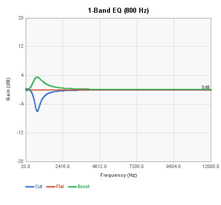

---

## 6-Band EQ

A six-band parametric equalizer with fixed center frequencies at 80, 160,
320, 640, 1280, and 2560 Hz. Each band has independent boost/cut control,
and a global Q parameter sets the bandwidth of all bands.

| Pin | Type | Description |
|-----|------|-------------|
| Audio Input 1 | Audio In | Audio signal |
| Audio Output 1 | Audio Out | Equalized output |

**Control panel parameters:**

| Parameter | Range | Default | Description |
|-----------|-------|---------|-------------|
| Band 1 (80 Hz) | -1.0 to 1.0 | 0 | Boost/cut at 80 Hz |
| Band 2 (160 Hz) | -1.0 to 1.0 | 0 | Boost/cut at 160 Hz |
| Band 3 (320 Hz) | -1.0 to 1.0 | 0 | Boost/cut at 320 Hz |
| Band 4 (640 Hz) | -1.0 to 1.0 | 0 | Boost/cut at 640 Hz |
| Band 5 (1280 Hz) | -1.0 to 1.0 | 0 | Boost/cut at 1280 Hz |
| Band 6 (2560 Hz) | -1.0 to 1.0 | 0 | Boost/cut at 2560 Hz |
| Q | 0.5-10 | 1.2 | Bandwidth for all bands |

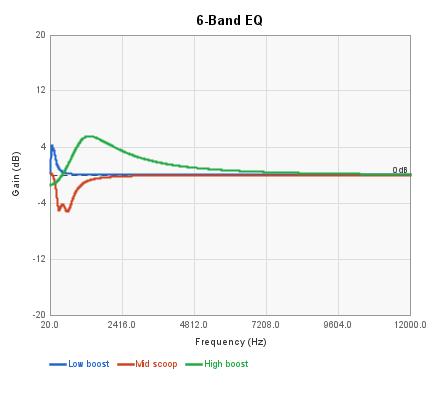

---

## Comb Filter

A feedforward/feedback comb filter implemented using a delay line. Produces
the characteristic series of evenly-spaced peaks and notches in the
frequency response. The delay length sets the fundamental frequency,
feedback controls the resonance, and damping applies lowpass filtering
in the feedback path.

| Pin | Type | Description |
|-----|------|-------------|
| Input | Audio In | Audio signal |
| Feedback | Control In | Feedback amount modulation |
| Output | Audio Out | Filtered output |

**Control panel parameters:**

| Parameter | Range | Default | Description |
|-----------|-------|---------|-------------|
| Gain | 0.0-1.0 | 0.5 | Input gain |
| Delay Length | samples | 1116 | Delay line length (sets comb spacing) |
| Feedback | 0.0-1.0 | 0.7 | Feedback amount |
| Damping | 0.0-1.0 | 0.5 | Lowpass damping in feedback path |

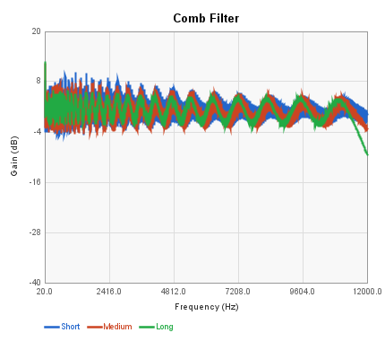

---

## Resonator

A resonant bandpass filter that emphasizes a narrow frequency band. At high
resonance settings, it approaches self-oscillation and can be used for
pitched filtering effects or as a simple sine oscillator.

| Pin | Type | Description |
|-----|------|-------------|
| Input | Audio In | Audio signal |
| Frequency | Control In | Center frequency modulation |
| Resonance | Control In | Resonance modulation |
| Output | Audio Out | Filtered output |

**Control panel parameters:**

| Parameter | Range | Default | Description |
|-----------|-------|---------|-------------|
| Frequency | 0.0-1.0 | 0.2 | Filter coefficient |
| Resonance | 0.0-1.0 | 0.01 | Resonance amount (higher = sharper peak) |

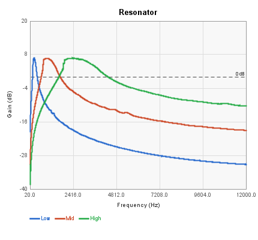
