# Filter Blocks

These blocks implement various filter topologies for the FV-1: lowpass, highpass, bandpass, notch, shelving EQ, parametric EQ, comb filters, and resonators.

> **Sample rate:** All frequency ranges and default values below assume the FV-1's native sample rate of 32,768 Hz. At other sample rates, frequency parameters scale proportionally: multiply by fs/32768. For example, a 1000 Hz cutoff corresponds to approximately 1346 Hz at 44.1 kHz (x 1.346) and 1465 Hz at 48 kHz (x 1.465).

### Block Index

|                                                       |                                                                 |                                                           |
| ----------------------------------------------------- | --------------------------------------------------------------- | --------------------------------------------------------- |
| [1-Band EQ](filter-blocks.md#1-band-eq)               | [6-Band EQ](filter-blocks.md#6-band-eq)                         | [Bassman '59 EQ](filter-blocks.md#bassman-59-eq)          |
| [Comb Filter](filter-blocks.md#comb-filter)           | [HPF 1-Pole (RDFX)](filter-blocks.md#hpf-1-pole-rdfx)           | [HPF 2/4-Pole](filter-blocks.md#hpf-24-pole)              |
| [LPF 1-Pole (RDFX)](filter-blocks.md#lpf-1-pole-rdfx) | [LPF 2/4-Pole](filter-blocks.md#lpf-24-pole)                    | [Notch (Band-Reject)](filter-blocks.md#notch-band-reject) |
| [Resonator](filter-blocks.md#resonator)               | [Shelving Highpass](filter-blocks.md#shelving-highpass)         | [Shelving Lowpass](filter-blocks.md#shelving-lowpass)     |
| [SVF 2-Pole](filter-blocks.md#svf-2-pole)             | [SVF 2-Pole Adjustable](filter-blocks.md#svf-2-pole-adjustable) |                                                           |

***

## 1-Band EQ

A single-band parametric equalizer with adjustable frequency, Q, and boost/cut level. Uses a bandpass filter topology to add or subtract a resonant peak from the input signal.

| Pin            | Type      | Description      |
| -------------- | --------- | ---------------- |
| Audio Input 1  | Audio In  | Audio signal     |
| Audio Output 1 | Audio Out | Equalized output |

**Control panel parameters:**

| Parameter | Range       | Default | Description                     |
| --------- | ----------- | ------- | ------------------------------- |
| Frequency | 20-3200 Hz  | 80      | Center frequency of the EQ band |
| Q         | 0.5-10      | 1.2     | Bandwidth (higher = narrower)   |
| EQ Level  | -1.0 to 1.0 | 0       | Boost/cut amount                |

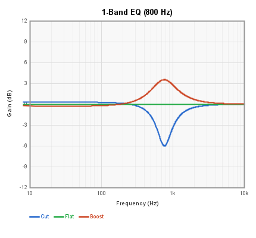

The chart below shows the relationship between the EQ Level control value and the resulting gain at the center frequency (measured at 1 kHz, Q=1.2). This mapping also applies to each band of the 6-Band EQ.

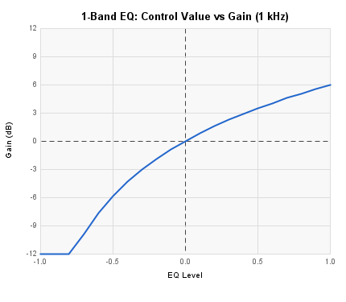

***

## 6-Band EQ

A six-band parametric equalizer with fixed center frequencies at 80, 160, 320, 640, 1280, and 2560 Hz. Each band has independent boost/cut control, and a global Q parameter sets the bandwidth of all bands.

| Pin            | Type      | Description      |
| -------------- | --------- | ---------------- |
| Audio Input 1  | Audio In  | Audio signal     |
| Audio Output 1 | Audio Out | Equalized output |

**Control panel parameters:**

| Parameter        | Range       | Default | Description             |
| ---------------- | ----------- | ------- | ----------------------- |
| Band 1 (80 Hz)   | -1.0 to 1.0 | 0       | Boost/cut at 80 Hz      |
| Band 2 (160 Hz)  | -1.0 to 1.0 | 0       | Boost/cut at 160 Hz     |
| Band 3 (320 Hz)  | -1.0 to 1.0 | 0       | Boost/cut at 320 Hz     |
| Band 4 (640 Hz)  | -1.0 to 1.0 | 0       | Boost/cut at 640 Hz     |
| Band 5 (1280 Hz) | -1.0 to 1.0 | 0       | Boost/cut at 1280 Hz    |
| Band 6 (2560 Hz) | -1.0 to 1.0 | 0       | Boost/cut at 2560 Hz    |
| Q                | 0.5-10      | 1.2     | Bandwidth for all bands |

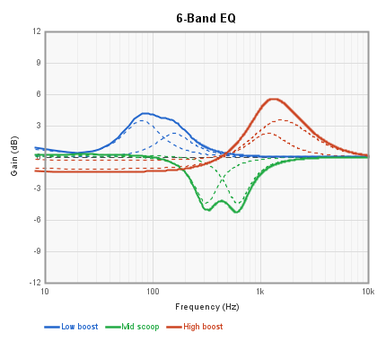

***

## Bassman '59 EQ

An exact digital model of the Fender '59 Bassman tone stack, based on the [Yeh & Smith symbolic circuit analysis (DAFx-06)](https://ccrma.stanford.edu/~dtyeh/papers/yeh06_dafx.pdf). The three controls (Bass, Mid, Treble) interact non-orthogonally, just like the real circuit: changing one control affects the other bands. The filter is a 3rd-order IIR implemented as three parallel 1st-order sections via partial fraction expansion.

In slider-only mode (no CV connected) the block uses \~20 FV-1 instructions. When a CV input is connected, coefficients are interpolated in real-time (\~40-60 instructions depending on how many CVs are connected).

| Pin            | Type       | Description                        |
| -------------- | ---------- | ---------------------------------- |
| Audio Input 1  | Audio In   | Audio signal                       |
| Middle         | Control In | Mid control CV (0-1, top priority) |
| Bass           | Control In | Bass control CV (0-1)              |
| Treble         | Control In | Treble control CV (0-1)            |
| Audio Output 1 | Audio Out  | Filtered output                    |

**Control panel parameters:**

| Parameter | Range   | Default | Description                          |
| --------- | ------- | ------- | ------------------------------------ |
| Bass      | 0.0-1.0 | 0.5     | Low frequency boost/cut              |
| Mid       | 0.0-1.0 | 0.5     | Midrange presence (low = deep scoop) |
| Treble    | 0.0-1.0 | 0.5     | High frequency boost/cut             |

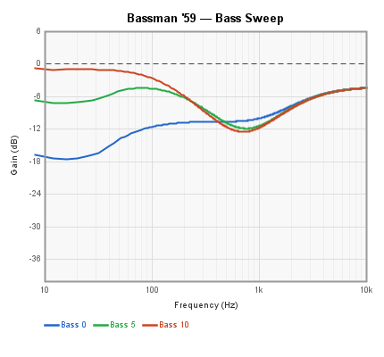

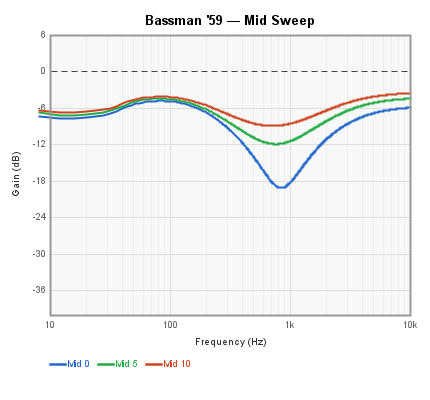

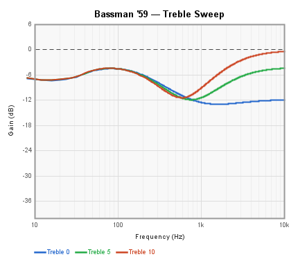

***

## Comb Filter

A feedforward/feedback comb filter implemented using a delay line. Produces the characteristic series of evenly-spaced peaks and notches in the frequency response. The delay length sets the fundamental frequency, feedback controls the resonance, and damping applies lowpass filtering in the feedback path.

| Pin      | Type       | Description                |
| -------- | ---------- | -------------------------- |
| Input    | Audio In   | Audio signal               |
| Feedback | Control In | Feedback amount modulation |
| Output   | Audio Out  | Filtered output            |

**Control panel parameters:**

| Parameter    | Range   | Default | Description                           |
| ------------ | ------- | ------- | ------------------------------------- |
| Gain         | 0.0-1.0 | 0.5     | Input gain                            |
| Delay Length | samples | 1116    | Delay line length (sets comb spacing) |
| Feedback     | 0.0-1.0 | 0.7     | Feedback amount                       |
| Damping      | 0.0-1.0 | 0.5     | Lowpass damping in feedback path      |

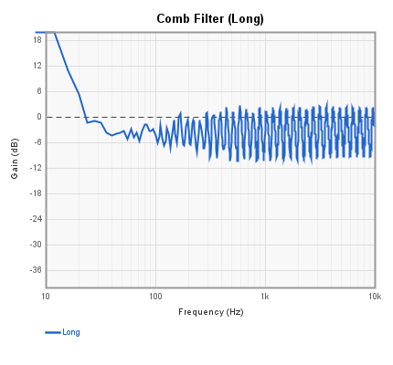

> **DC gain:** This comb filter has significant gain at DC and very low frequencies. A highpass filter in series (e.g. HPF 1-Pole) is recommended to remove the DC offset from the output.

***

## HPF 1-Pole (RDFX)

A simple 1-pole (6 dB/octave) highpass filter. Subtracts the lowpass-filtered signal from the input to produce a highpass response.

| Pin       | Type       | Description                 |
| --------- | ---------- | --------------------------- |
| Input     | Audio In   | Audio signal                |
| Frequency | Control In | Cutoff frequency modulation |
| Output    | Audio Out  | Filtered output             |

**Control panel parameters:**

| Parameter | Range      | Default | Description      |
| --------- | ---------- | ------- | ---------------- |
| Frequency | 20-5000 Hz | 80      | Cutoff frequency |

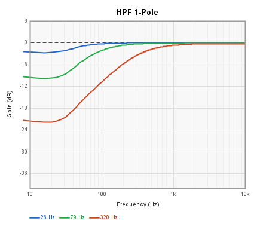

***

## HPF 2/4-Pole

A resonant highpass filter with selectable 2-pole (12 dB/octave) or 4-pole (24 dB/octave) mode. The mirror image of the LPF 2/4-Pole block.

| Pin         | Type       | Description                 |
| ----------- | ---------- | --------------------------- |
| Audio Input | Audio In   | Audio signal                |
| Frequency   | Control In | Cutoff frequency modulation |
| Resonance   | Control In | Q modulation                |
| High Pass   | Audio Out  | Filtered output             |

**Control panel parameters:**

| Parameter | Range  | Default | Description                       |
| --------- | ------ | ------- | --------------------------------- |
| Frequency | Hz     | 880     | Cutoff frequency                  |
| Q         | 1-20   | 5       | Resonance (higher = sharper peak) |
| 4-Pole    | on/off | off     | Enables 4-pole (24 dB/oct) mode   |

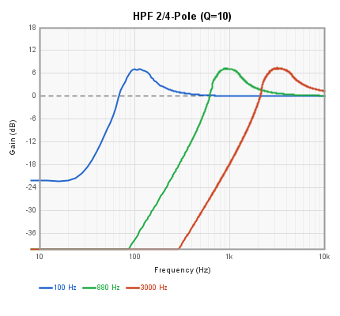

***

## LPF 1-Pole (RDFX)

A simple 1-pole (6 dB/octave) lowpass filter. The cutoff frequency can be set from the control panel or modulated via the Frequency control input.

| Pin       | Type       | Description                 |
| --------- | ---------- | --------------------------- |
| Input     | Audio In   | Audio signal                |
| Frequency | Control In | Cutoff frequency modulation |
| Output    | Audio Out  | Filtered output             |

**Control panel parameters:**

| Parameter | Range      | Default | Description      |
| --------- | ---------- | ------- | ---------------- |
| Frequency | 20-5000 Hz | 850     | Cutoff frequency |

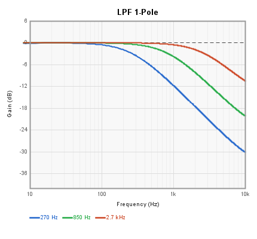

***

## LPF 2/4-Pole

A resonant lowpass filter that can operate in 2-pole (12 dB/octave) or 4-pole (24 dB/octave) mode. In 4-pole mode, two cascaded 2-pole stages produce a steeper rolloff similar to classic analog synth filters.

| Pin         | Type       | Description                 |
| ----------- | ---------- | --------------------------- |
| Audio Input | Audio In   | Audio signal                |
| Frequency   | Control In | Cutoff frequency modulation |
| Resonance   | Control In | Q modulation                |
| Low Pass    | Audio Out  | Filtered output             |

**Control panel parameters:**

| Parameter | Range  | Default | Description                       |
| --------- | ------ | ------- | --------------------------------- |
| Frequency | Hz     | 880     | Cutoff frequency                  |
| Q         | 1-20   | 5       | Resonance (higher = sharper peak) |
| 4-Pole    | on/off | off     | Enables 4-pole (24 dB/oct) mode   |

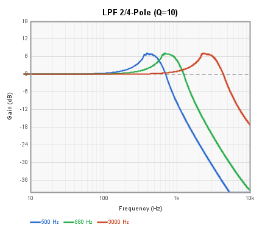

***

## Notch (Band-Reject)

A 2-pole notch filter that rejects a narrow frequency band while passing all others. Also provides a bandpass output. Q controls the width of the notch -- higher Q produces a narrower rejection band.

| Pin              | Type       | Description                 |
| ---------------- | ---------- | --------------------------- |
| Input            | Audio In   | Audio signal                |
| Frequency        | Control In | Center frequency modulation |
| Resonance        | Control In | Q modulation                |
| Output\_Notch    | Audio Out  | Notch (band-reject) output  |
| Output\_Bandpass | Audio Out  | Bandpass output             |

**Control panel parameters:**

| Parameter | Range      | Default | Description      |
| --------- | ---------- | ------- | ---------------- |
| Frequency | 20-5000 Hz | 780     | Center frequency |
| Q Max     | 1-100      | 5       | Maximum Q value  |
| Q Min     | 0.5-10     | 1       | Minimum Q value  |

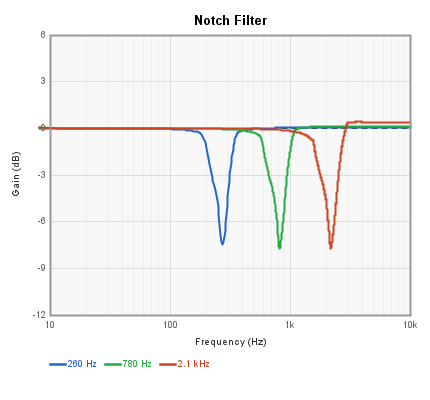

***

## Resonator

A resonant bandpass filter that emphasizes a narrow frequency band. At high Q settings, it approaches self-oscillation and can be used for pitched filtering effects.

| Pin       | Type       | Description                 |
| --------- | ---------- | --------------------------- |
| Input     | Audio In   | Audio signal                |
| Frequency | Control In | Center frequency modulation |
| Resonance | Control In | Q modulation                |
| Output    | Audio Out  | Filtered output             |

**Control panel parameters:**

| Parameter | Range      | Default | Description                       |
| --------- | ---------- | ------- | --------------------------------- |
| Frequency | 50-2500 Hz | 1000    | Center frequency                  |
| Q         | 10-50      | 50      | Resonance (higher = sharper peak) |

Simulated frequency response with fc fixed at 440 Hz, sweeping input sine across 80-2000 Hz for Q = 10, 20, and 50. Peak gain at resonance scales with Q: +20 dB, +26 dB, and +34 dB respectively. Input level is −46 dBFS to keep the Q = 50 peak below clipping.  Watch your input levels!

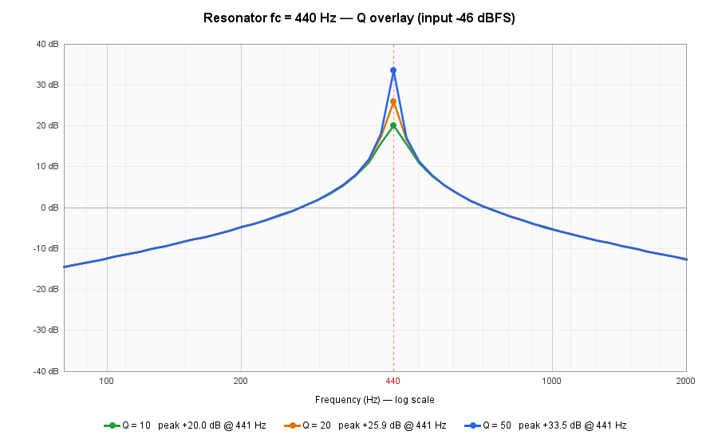

***

## Shelving Highpass

A shelving highpass filter that attenuates low frequencies by a controllable amount while leaving high frequencies untouched. The complement of the Shelving Lowpass block.

| Pin    | Type       | Description            |
| ------ | ---------- | ---------------------- |
| Input  | Audio In   | Audio signal           |
| Shelf  | Control In | Shelf depth modulation |
| Output | Audio Out  | Filtered output        |

**Control panel parameters:**

| Parameter | Range      | Default | Description                            |
| --------- | ---------- | ------- | -------------------------------------- |
| Frequency | 20-2500 Hz | 850     | Shelf corner frequency                 |
| Shelf     | 0.0-1.0    | 0.5     | Shelf depth (0 = full cut, 1 = no cut) |

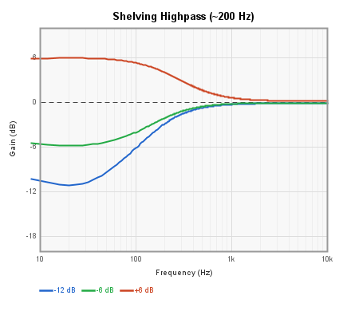

***

## Shelving Lowpass

A shelving lowpass filter that attenuates high frequencies by a controllable amount while leaving low frequencies untouched. Unlike a standard lowpass, the shelf parameter controls how much attenuation is applied above the cutoff rather than rolling off completely.

| Pin    | Type       | Description            |
| ------ | ---------- | ---------------------- |
| Input  | Audio In   | Audio signal           |
| Shelf  | Control In | Shelf depth modulation |
| Output | Audio Out  | Filtered output        |

**Control panel parameters:**

| Parameter | Range      | Default | Description                            |
| --------- | ---------- | ------- | -------------------------------------- |
| Frequency | 20-2500 Hz | 850     | Shelf corner frequency                 |
| Shelf     | 0.0-1.0    | 0.5     | Shelf depth (0 = full cut, 1 = no cut) |

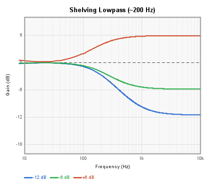

***

## SVF 2-Pole

A 2-pole state-variable filter providing simultaneous lowpass, bandpass, and highpass outputs. The frequency and Q (resonance) are adjustable.

| Pin          | Type       | Description                 |
| ------------ | ---------- | --------------------------- |
| Audio Input  | Audio In   | Audio signal                |
| Frequency    | Control In | Cutoff frequency modulation |
| Lowpass Out  | Audio Out  | 2-pole lowpass output       |
| Bandpass Out | Audio Out  | Bandpass output             |
| Hipass Out   | Audio Out  | 2-pole highpass output      |

**Control panel parameters:**

| Parameter | Range | Default | Description                       |
| --------- | ----- | ------- | --------------------------------- |
| Frequency | Hz    | 740     | Center/cutoff frequency           |
| Q         | 1-10  | 1.0     | Resonance (higher = sharper peak) |

> **Q and internal clipping:** The SVF bandpass signal peaks at approximately Q x input level at the resonant frequency. Because the FV-1 clips all internal signals at +/-1.0, high Q values cause saturation of the internal state and nonlinear behavior. Q values above 10 are not recommended.

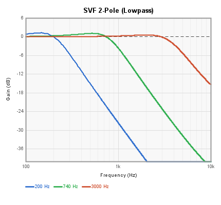

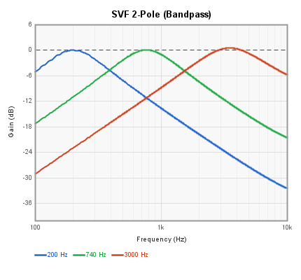

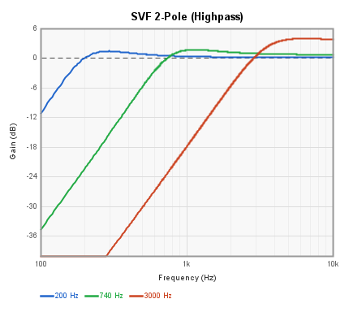

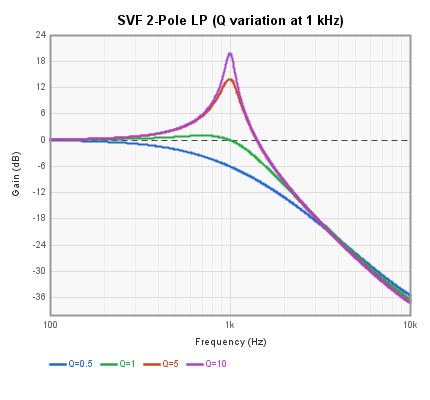

***

## SVF 2-Pole Adjustable

An enhanced 2-pole state-variable filter with four outputs (lowpass, bandpass, notch, highpass) and Q range control via min/max settings. Both frequency and Q can be modulated via control inputs.

| Pin              | Type       | Description                 |
| ---------------- | ---------- | --------------------------- |
| Input            | Audio In   | Audio signal                |
| Frequency        | Control In | Cutoff frequency modulation |
| Q                | Control In | Q modulation                |
| Low Pass Output  | Audio Out  | 2-pole lowpass output       |
| Band Pass Output | Audio Out  | Bandpass output             |
| Notch Output     | Audio Out  | Notch (band-reject) output  |
| High Pass Output | Audio Out  | 2-pole highpass output      |

**Control panel parameters:**

| Parameter | Range      | Default | Description      |
| --------- | ---------- | ------- | ---------------- |
| Frequency | 20-5000 Hz | 780     | Cutoff frequency |
| Q Max     | 1-10       | 10      | Maximum Q value  |
| Q Min     | 1-10       | 1       | Minimum Q value  |

> **Q and internal clipping:** See note under SVF 2-Pole above. The same limitation applies — Q values above 10 cause internal saturation on the FV-1.

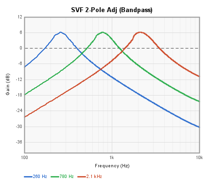

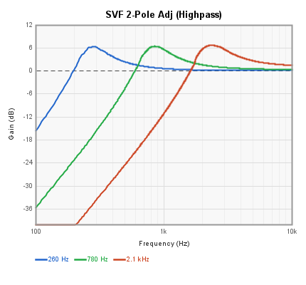

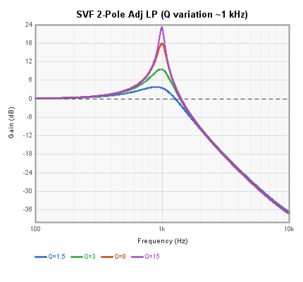
