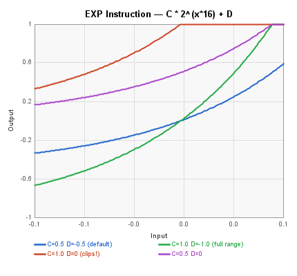
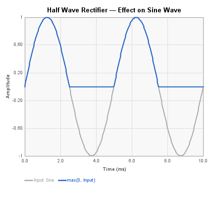
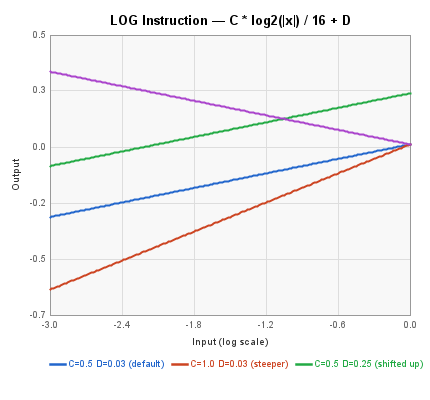
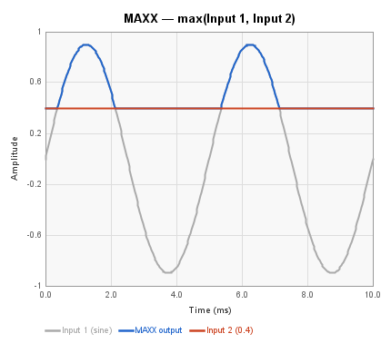
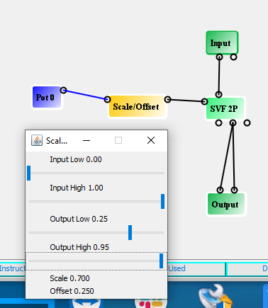
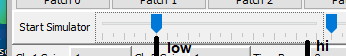
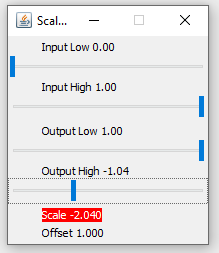
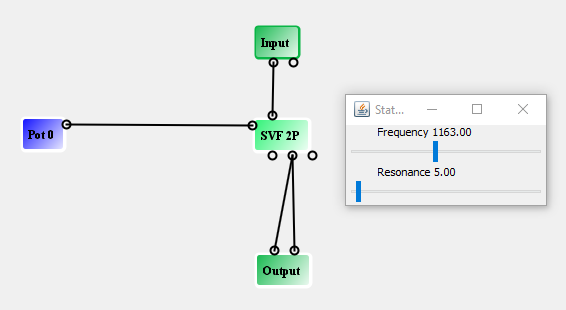

# Instructions Blocks Reference

These blocks perform mathematical operations on control signals using
FV-1 DSP instructions. They are found in the Instructions menu.

### Block Index

| | | |
|-|-|-|
| [Absolute Value](#absolute-value) | [Exp](#exp) | [Half Wave](#half-wave) |
| [Log](#log) | [Maximum](#maximum) | [Scale/Offset](#scale-offset) |

---

## Absolute Value

Computes the absolute value of the input signal, folding negative values
to positive. Uses the FV-1 ABSA instruction. There is no control panel.

| Pin | Type | Description |
|-----|------|-------------|
| Input | Control In | Input signal |
| Output | Control Out | Absolute value of input |

Implements: `output = |input|`

The plot shows a sine wave input and the resulting full-wave rectified
output, with negative half-cycles folded to positive.

---

## Exp

Applies the FV-1 EXP instruction, which performs an anti-log (exponential)
operation. This is useful for converting logarithmic control signals back
to linear, or for creating exponential curves for control voltages.

| Pin | Type | Description |
|-----|------|-------------|
| Input | Control In | Input signal |
| Exp Output | Control Out | Exponential output |

**Control panel parameters:**

| Parameter | Range | Default | Description |
|-----------|-------|---------|-------------|
| Multiplier | -2.0 to 2.0 | 0.5 | Scale factor (C coefficient) |
| Offset | -2.0 to 2.0 | -0.5 | DC offset (D coefficient) |

The FV-1 EXP instruction computes: `output = C * 2^(input * 16) + D`

The useful input range is narrow (approximately -0.1 to +0.07) because
the 2^(x*16) term grows extremely fast. The D parameter must offset C
to keep the output in range. For example, with C=1.0, setting D=-1.0
gives output=0 at x=0 and output=1.0 at x=1/16 — a clean 0-to-1
exponential mapping. Without offset (D=0), C=1.0 already outputs 1.0
at x=0 and clips immediately.

---

## Half Wave

Half-wave rectifier that passes positive values through and clamps
negative values to zero. Uses a conditional skip (SKP GEZ) to clear
the accumulator when the input is negative. There is no control panel.

| Pin | Type | Description |
|-----|------|-------------|
| Input | Control In | Input signal |
| Output | Control Out | Rectified output (negative values become 0) |

Implements: `output = max(input, 0)`

The plot shows a sine wave input and the half-wave rectified output,
where negative half-cycles are clamped to zero.

---

## Log

Applies the FV-1 LOG instruction, which computes a base-2 logarithm of
the absolute value of the accumulator. This is useful for converting
linear signals to logarithmic (dB-like) scales, or for computing
fractional powers when paired with EXP.

| Pin | Type | Description |
|-----|------|-------------|
| Control Input | Control In | Input signal |
| Log Output | Control Out | Logarithmic output |

**Control panel parameters:**

| Parameter | Range | Default | Description |
|-----------|-------|---------|-------------|
| Multiplier | -2.0 to 2.0 | 0.5 | Scale factor (C coefficient) |
| Offset | -2.0 to 2.0 | 0.5 | DC offset (D coefficient, divided by 16 internally) |

The FV-1 LOG instruction computes: `output = C * log2(|input|) / 16 + D`

C controls the slope (steepness) of the log curve — doubling C doubles
the output change per decade of input. D shifts the output vertically.
Negative C inverts the curve. The plot uses a logarithmic input scale
(0.001 to 1.0) showing four C/D combinations.

---

## Maximum

Outputs the larger of two input signals using the FV-1 MAXX instruction,
which compares the absolute value of the accumulator against a register
value. If only one input is connected, the block passes that input
through scaled by the gain parameter.

| Pin | Type | Description |
|-----|------|-------------|
| Input 1 | Control In | First input signal |
| Input 2 | Control In | Second input signal |
| Output | Control Out | Maximum of the two inputs |

**Control panel parameters:**

| Parameter | Range | Default | Description |
|-----------|-------|---------|-------------|
| Gain | 0 to 1.0 | 0.5 | Multiplier applied during the MAXX comparison |

The MAXX instruction compares the accumulator with the register value
scaled by gain, and keeps the larger of the two.

The plot below shows a sine wave at Input 1 and a constant 0.4 at
Input 2. The output follows the sine when it exceeds the threshold,
and holds at 0.4 otherwise.

---

## Scale/Offset

The Scale/Offset instruction is used extensively in SpinCAD. A very
common use is to transform the 0 to 1 range of a Pot to a more limited
range to control an audio circuit block.

It implements the linear formula `output = m * input + b`, where `m` is
the Scale (slope) and `b` is the Offset (y-axis intercept). The FV-1's
ALU clips the output to the range ±1.

Rather than entering `m` and `b` directly, the control panel presents
four sliders that specify an input range and the desired output range.
The derived Scale and Offset values are shown at the bottom of the
panel.

| Pin | Type | Description |
|-----|------|-------------|
| Input | Control In | Input signal |
| Output | Control Out | Scaled and offset signal |

**Control panel parameters:**

| Parameter | Description |
|-----------|-------------|
| Input Low | The low end of the expected input range |
| Input High | The high end of the expected input range |
| Output Low | Desired output value when input is at Input Low |
| Output High | Desired output value when input is at Input High |

*A Pot feeds a Scale/Offset block into the frequency control of an
SVF 2P filter. The Output Low/High sliders restrict the pot's effective
range to 0.25 to 0.95 -- the useful musical range for this filter.*

Each slider has low and high thumbs for the two endpoints:

### Range Limits

The FV-1's SOF instruction can only realize Scale values between
approximately −2.0 and +2.0. If the input and output ranges you request
imply a Scale outside that window, the derived value appears in red and
the mapping cannot be produced exactly.

*Here, mapping an input of 0 to 1 onto an output of 1.00 down to −1.04
would require a Scale of −2.04, which is beyond the instruction's range.
Tighten the input or output range to bring the derived Scale back within
limits.*

### Why Scale/Offset Matters

Consider a wah-style filter built from an SVF 2P connected directly to
a pot:

The pot sweeps the filter over its full 0 to 1 travel, but only a narrow
window sounds musical -- the extremes are either clamped shut or
essentially bypass. Inserting a Scale/Offset block between the pot and
the filter lets you confine the pot's motion to that useful window,
dramatically improving the feel of the control.

**Tip for fine adjustments:** If you find it difficult to set an exact value
by dragging a slider handle with the mouse, click on the handle to select it,
then use the left and right arrow keys to increment the parameter by its
smallest step.
