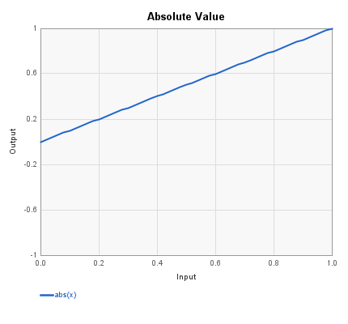
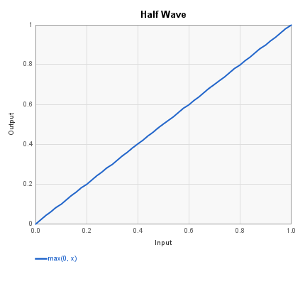
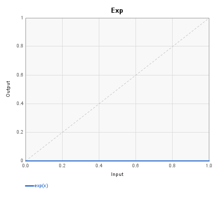
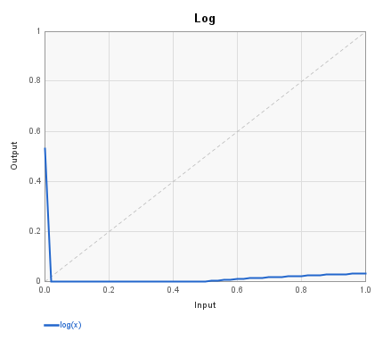
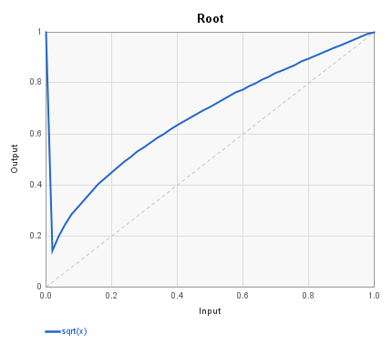
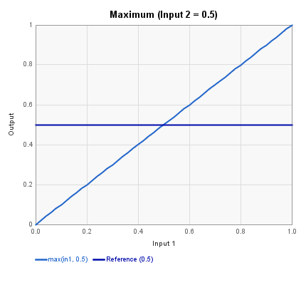

# Instructions Blocks Reference

These blocks perform mathematical operations on control signals using
FV-1 DSP instructions. They are found in the Instructions menu.

---

## Absolute Value

Computes the absolute value of the input signal, folding negative values
to positive. Uses the FV-1 ABSA instruction. There is no control panel.

| Pin | Type | Description |
|-----|------|-------------|
| Input | Control In | Input signal |
| Output | Control Out | Absolute value of input |

Implements: `output = |input|`

---

## Half Wave

Half-wave rectifier that passes positive values through and clamps
negative values to zero. Uses a conditional skip (SKP GEZ) to clear
the accumulator when the input is negative. There is no control panel.

| Pin | Type | Description |
|-----|------|-------------|
| Input | Control In | Input signal |
| Output | Control Out | Rectified output (negative values become 0) |

Implements: `output = max(input, 0)`

---

## Exp

Applies the FV-1 EXP instruction, which performs an anti-log (exponential)
operation. This is useful for converting logarithmic control signals back
to linear, or for creating exponential curves for control voltages.

| Pin | Type | Description |
|-----|------|-------------|
| Input | Control In | Input signal |
| Exp Output | Control Out | Exponential output |

**Control panel parameters:**

| Parameter | Range | Default | Description |
|-----------|-------|---------|-------------|
| Multiplier | -2.0 to 2.0 | 0.5 | Scale factor (C coefficient) |
| Offset | -2.0 to 2.0 | -0.5 | DC offset (D coefficient) |

The FV-1 EXP instruction computes: `output = C * 2^(input * 16) + D`

---

## Log

Applies the FV-1 LOG instruction, which computes a base-2 logarithm of
the absolute value of the accumulator. This is useful for converting
linear signals to logarithmic (dB-like) scales, or for computing
fractional powers when paired with EXP.

| Pin | Type | Description |
|-----|------|-------------|
| Control Input | Control In | Input signal |
| Log Output | Control Out | Logarithmic output |

**Control panel parameters:**

| Parameter | Range | Default | Description |
|-----------|-------|---------|-------------|
| Multiplier | -2.0 to 2.0 | 0.5 | Scale factor (C coefficient) |
| Offset | -2.0 to 2.0 | 0.5 | DC offset (D coefficient, divided by 16 internally) |

The FV-1 LOG instruction computes: `output = C * log2(|input|) + D`

---

## Root

Computes the Nth root of the input signal using a LOG/EXP pair. By
default it computes the square root. The LOG instruction divides the
logarithm by N, and the EXP instruction converts back to linear,
effectively computing `input^(1/N)`.

| Pin | Type | Description |
|-----|------|-------------|
| Control Input 1 | Control In | Input signal |
| Control Output 1 | Control Out | Nth root of input |

**Control panel parameters:**

| Parameter | Range | Default | Description |
|-----------|-------|---------|-------------|
| Root | integer | 2 | Root degree (2 = square root, 3 = cube root, etc.) |
| Invert | on/off | off | Negate and offset input before computing root |
| Flip | on/off | off | Negate and offset output after computing root |

The Invert option transforms the input via `x' = -x + 1.0` before the
root computation. The Flip option applies the same transformation to
the output. These are useful for inverting the shape of the curve.

---

## Maximum

Outputs the larger of two input signals using the FV-1 MAXX instruction,
which compares the absolute value of the accumulator against a register
value. If only one input is connected, the block passes that input
through scaled by the gain parameter.

| Pin | Type | Description |
|-----|------|-------------|
| Input 1 | Control In | First input signal |
| Input 2 | Control In | Second input signal |
| Output | Control Out | Maximum of the two inputs |

**Control panel parameters:**

| Parameter | Range | Default | Description |
|-----------|-------|---------|-------------|
| Gain | 0 to 1.0 | 0.5 | Multiplier applied during the MAXX comparison |

The MAXX instruction compares `|accumulator|` with `|register * gain|`
and keeps the larger value.

