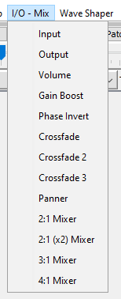
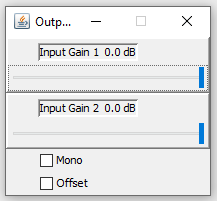
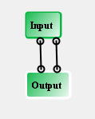

# I/O - Pots Blocks Reference

These blocks provide access to the FV-1's audio converters and hardware
potentiometer inputs.

| Block | Description |
|-------|-------------|
| [Input](#input) | Stereo ADC input |
| [Output](#output) | Stereo DAC output |
| [Pot 0 / 1 / 2](#pot-0--1--2) | Hardware potentiometer inputs |

---

## Input

The Input block provides access to the FV-1's stereo ADC (analog-to-digital
converter). It has no control panel and no adjustable parameters.

| Pin | Type | Description |
|-----|------|-------------|
| Output 1 | Audio Out | Left ADC input (ADCL) |
| Output 2 | Audio Out | Right ADC input (ADCR) |

Not all patches require an Input block, but it is the only way to get
audio into the patch from the ADC. A patch with internal oscillators
feeding the Output block directly is still valid. The Input block is
placed automatically when you create a new patch with Ctrl-N.

---

## Output

The Output block routes audio to the FV-1's stereo DAC (digital-to-analog
converter).

| Pin | Type | Description |
|-----|------|-------------|
| Input 1 | Audio In | Left DAC output (DACL) |
| Input 2 | Audio In | Right DAC output (DACR) |

**Control panel:**

| Parameter | Range | Default | Description |
|-----------|-------|---------|-------------|
| Gain 1 | dB | 0 dB | Left channel output gain |
| Gain 2 | dB | 0 dB | Right channel output gain |
| Mono | on/off | off | Routes both inputs to DACL only |
| DC Offset | on/off | off | Adds 0.02 DC offset (compensates for very early FV-1 revisions; probably not needed) |

Every patch needs exactly one Output block.

A minimal bypass patch wires Input directly to Output:

---

## Pot 0 / 1 / 2

Each Pot block reads one of the FV-1's three hardware potentiometers
(POT0, POT1, POT2) and outputs its value as a control signal. The Pot
blocks are the primary way to give the end user real-time control over
a patch's parameters.

| Pin | Type | Description |
|-----|------|-------------|
| Control Output 1 | Control Out | Pot value (0-1) |

**Control panel parameters:**

| Parameter | Range | Default | Description |
|-----------|-------|---------|-------------|
| Speed Up | on/off | off | Applies a shelving high-pass filter for faster pot response and full-range recovery |
