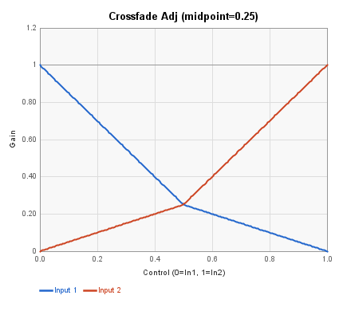
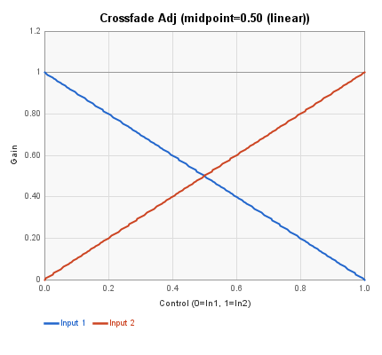
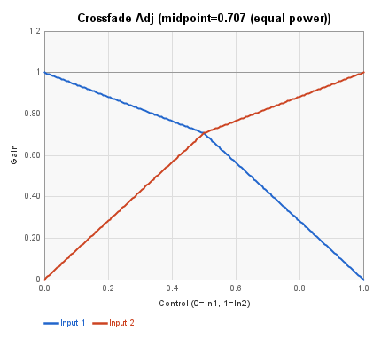
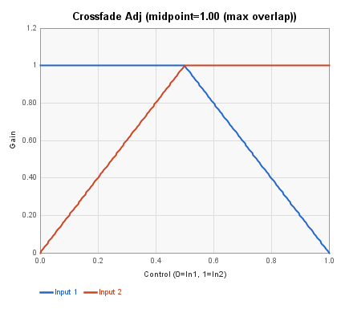

# Mixers/Gain Blocks

These blocks handle audio input/output and signal routing: level control, mixing, crossfading, and panning.

### Block Index

|                                                    |                                                      |                                                  |
| -------------------------------------------------- | ---------------------------------------------------- | ------------------------------------------------ |
| [2:1 Mixer](mixers-gain-blocks.md#21-mixer)        | [2:1 (x2) Mixer](mixers-gain-blocks.md#21-x2-mixer)  | [3:1 Mixer](mixers-gain-blocks.md#31-mixer)      |
| [4:1 Mixer](mixers-gain-blocks.md#41-mixer)        | [Crossfade](mixers-gain-blocks.md#crossfade)         | [Crossfade 2](mixers-gain-blocks.md#crossfade-2) |
| [Crossfade 3](mixers-gain-blocks.md#crossfade-3)   | [Crossfade Adj](mixers-gain-blocks.md#crossfade-adj) | [Gain Boost](mixers-gain-blocks.md#gain-boost)   |
| [Input](mixers-gain-blocks.md#input)               | [Output](mixers-gain-blocks.md#output)               | [Panner](mixers-gain-blocks.md#panner)           |
| [Phase Invert](mixers-gain-blocks.md#phase-invert) | [Volume](mixers-gain-blocks.md#volume)               |                                                  |

***

## 2:1 Mixer

Sums two audio inputs into a single output with independent gain controls.

<figure><figcaption></figcaption></figure>

| Pin     | Type       | Description         |
| ------- | ---------- | ------------------- |
| Input 1 | Audio In   | First audio source  |
| Input 2 | Audio In   | Second audio source |
| Level 1 | Control In | Input 1 level       |
| Level 2 | Control In | Input 2 level       |
| Output  | Audio Out  | Mixed output        |

**Control panel parameters:**

| Parameter | Range | Default | Description  |
| --------- | ----- | ------- | ------------ |
| Gain 1    | dB    | 0 dB    | Input 1 gain |
| Gain 2    | dB    | 0 dB    | Input 2 gain |

When a Level control pin is connected, it multiplies the corresponding input in addition to the panel gain setting.

***

## 2:1 (x2) Mixer

Two independent 2:1 mixers in one block, producing stereo output. Inputs 1a+1b mix to Output 1; inputs 2a+2b mix to Output 2.

<figure><figcaption></figcaption></figure>

| Pin      | Type       | Description             |
| -------- | ---------- | ----------------------- |
| Input 1a | Audio In   | First input, channel 1  |
| Input 1b | Audio In   | Second input, channel 1 |
| Input 2a | Audio In   | First input, channel 2  |
| Input 2b | Audio In   | Second input, channel 2 |
| Level 1a | Control In | Input 1a level          |
| Level 1b | Control In | Input 1b level          |
| Level 2a | Control In | Input 2a level          |
| Level 2b | Control In | Input 2b level          |
| Output1  | Audio Out  | Channel 1 mix           |
| Output2  | Audio Out  | Channel 2 mix           |

**Control panel parameters:**

| Parameter | Range | Default | Description            |
| --------- | ----- | ------- | ---------------------- |
| Gain 1-4  | dB    | 0 dB    | Individual input gains |

***

## 3:1 Mixer

Sums three audio inputs into a single output with independent gain controls.

<figure><figcaption></figcaption></figure>

| Pin     | Type       | Description         |
| ------- | ---------- | ------------------- |
| Input 1 | Audio In   | First audio source  |
| Input 2 | Audio In   | Second audio source |
| Input 3 | Audio In   | Third audio source  |
| Level 1 | Control In | Input 1 level       |
| Level 2 | Control In | Input 2 level       |
| Level 3 | Control In | Input 3 level       |
| Output  | Audio Out  | Mixed output        |

**Control panel parameters:**

| Parameter | Range | Default | Description            |
| --------- | ----- | ------- | ---------------------- |
| Gain 1-3  | dB    | 0 dB    | Individual input gains |

***

## 4:1 Mixer

Sums four audio inputs into a single output with independent gain controls.

<figure><figcaption></figcaption></figure>

| Pin     | Type       | Description         |
| ------- | ---------- | ------------------- |
| Input 1 | Audio In   | First audio source  |
| Input 2 | Audio In   | Second audio source |
| Input 3 | Audio In   | Third audio source  |
| Input 4 | Audio In   | Fourth audio source |
| Level 1 | Control In | Input 1 level       |
| Level 2 | Control In | Input 2 level       |
| Level 3 | Control In | Input 3 level       |
| Level 4 | Control In | Input 4 level       |
| Output  | Audio Out  | Mixed output        |

**Control panel parameters:**

| Parameter | Range | Default | Description            |
| --------- | ----- | ------- | ---------------------- |
| Gain 1-4  | dB    | 0 dB    | Individual input gains |

***

## Crossfade

Crossfades between two audio inputs using a control signal. At 0 you hear only Input 1; at 1 you hear only Input 2.

<figure><figcaption></figcaption></figure>

| Pin          | Type       | Description              |
| ------------ | ---------- | ------------------------ |
| Input 1      | Audio In   | First audio source       |
| Input 2      | Audio In   | Second audio source      |
| Fade         | Control In | Crossfade position (0-1) |
| Audio Output | Audio Out  | Mixed output             |

**Control panel parameters:**

| Parameter | Range | Default | Description  |
| --------- | ----- | ------- | ------------ |
| Gain 1    | dB    | -6 dB   | Input 1 gain |
| Gain 2    | dB    | -6 dB   | Input 2 gain |

This is a linear crossfade. At the midpoint (0.5), both signals are at half amplitude, resulting in a perceived -3 dB dip for uncorrelated signals. Based on [this code](http://spinsemi.com/knowledge_base/coding_examples.html#Cross_fading) at Spin's Knowledge Base. &#x20;

<figure><figcaption></figcaption></figure>

Due to the way it is implemented, if both inputs are at full scale and out of phase, the signal will clip.  It is recommend to keep the input gains at -6 dB to prevent this.

***

## Crossfade 2

Implements a 2-segment gain curve as shown. This results in a +6 dB boost when the control value is 0.5.

<figure><figcaption></figcaption></figure>

| Pin           | Type       | Description              |
| ------------- | ---------- | ------------------------ |
| Audio In 1    | Audio In   | First audio source       |
| Audio In 2    | Audio In   | Second audio source      |
| Control Input | Control In | Crossfade position (0-1) |
| Audio Output  | Audio Out  | Mixed output             |

**Control panel parameters:**

| Parameter | Range | Default | Description  |
| --------- | ----- | ------- | ------------ |
| Gain 1    | dB    | -6 dB   | Input 1 gain |
| Gain 2    | dB    | -6 dB   | Input 2 gain |

**Built-in control processing:** The control input is squared internally to produce the curved crossfade response shown above. This is why the gain peaks at +6 dB at the midpoint.

***

## Crossfade 3

An approximate equal-power crossfade that maintains perceived loudness at the midpoint. This requires the most FV-1 instructions of the three Crossfade variants. Uses a more complex gain curve (0.707 multiplier) to avoid the -3 dB dip of a linear crossfade.

<figure><figcaption></figcaption></figure>

| Pin           | Type       | Description              |
| ------------- | ---------- | ------------------------ |
| Audio In 1    | Audio In   | First audio source       |
| Audio In 2    | Audio In   | Second audio source      |
| Control Input | Control In | Crossfade position (0-1) |
| Audio Output  | Audio Out  | Mixed output             |

**Control panel parameters:**

| Parameter | Range | Default | Description  |
| --------- | ----- | ------- | ------------ |
| Gain 1    | dB    | -6 dB   | Input 1 gain |
| Gain 2    | dB    | -6 dB   | Input 2 gain |

**Built-in control processing:** The control input is squared internally as part of the equal-power crossfade approximation, shaping the gain curve to maintain perceived loudness at the midpoint.

***

## Crossfade Adj

A unified crossfade with an adjustable midpoint parameter that controls how much the two signals overlap at the center of the control range. This single block can reproduce the behavior of Crossfade (linear), Crossfade 2 (max overlap), and Crossfade 3 (equal-power), plus anything in between.

| Pin           | Type       | Description              |
| ------------- | ---------- | ------------------------ |
| Audio In 1    | Audio In   | First audio source       |
| Audio In 2    | Audio In   | Second audio source      |
| Control Input | Control In | Crossfade position (0-1) |
| Audio Output  | Audio Out  | Mixed output             |

**Control panel parameters:**

| Parameter    | Range       | Default | Description                                  |
| ------------ | ----------- | ------- | -------------------------------------------- |
| Midpoint     | 0.25-1.00   | 0.707   | Gain of both signals at the crossfade center |
| Input 1 Gain | -12 to 0 dB | -6 dB   | Input 1 gain                                 |
| Input 2 Gain | -12 to 0 dB | -6 dB   | Input 2 gain                                 |

### Midpoint curves

The midpoint parameter sets the gain level where the two curves cross at control = 0.5. Lower values create a dip at the crossover point; higher values create more overlap.

**Midpoint = 0.25** -- deep dip at center, useful for hard cuts with a brief crossover region.

**Midpoint = 0.50 (linear)** -- equivalent to Crossfade. Both signals at half amplitude at center, resulting in a -6 dB dip for uncorrelated signals.

**Midpoint = 0.707 (equal-power)** -- equivalent to Crossfade 3. Maintains perceived loudness through the crossover. Default setting.

**Midpoint = 1.00 (max overlap)** -- equivalent to Crossfade 2. Both signals reach full gain at center, giving the smoothest transition with no level dip but a potential +6 dB boost at the crossover point with correlated signals.

***

## Gain Boost

Applies a fixed digital gain in 1 dB increments. Hold CTRL before clicking on the slider handle to get 0.1 dB resolution.  Internally optimized to use cascaded `SOF -2.0, 0` instructions for each full 6 dB, with a single SOF for the remainder. Useful for boosting quiet signals before further processing.

<figure><figcaption></figcaption></figure>

| Pin          | Type      | Description     |
| ------------ | --------- | --------------- |
| Audio Input  | Audio In  | Signal to boost |
| Audio Output | Audio Out | Boosted signal  |

**Control panel parameters:**

| Parameter | Range      | Default | Description                                                    |
| --------- | ---------- | ------- | -------------------------------------------------------------- |
| Gain      | 0.11-48 dB | 6 dB    | Gain boost in 1 dB steps.  CRTL-drag to get 0.1 dB resolution. |

Be careful with high gain values as clipping will occur if the signal exceeds the FV-1's -1.0 to +0.999 range.

***

## Panner

Distributes a mono audio input across two stereo outputs based on a control signal. At control value 0 the signal is fully left; at 1 it is fully right.

<figure><figcaption></figcaption></figure>

| Pin      | Type       | Description                        |
| -------- | ---------- | ---------------------------------- |
| Input    | Audio In   | Mono audio signal                  |
| Pan      | Control In | Pan position (0 = left, 1 = right) |
| Output 1 | Audio Out  | Left output                        |
| Output 2 | Audio Out  | Right output                       |

**Control panel parameters:**

| Parameter | Range | Default | Description         |
| --------- | ----- | ------- | ------------------- |
| Gain      | dB    | -6 dB   | Overall output gain |

***

## Phase Invert

Inverts the polarity of an audio signal by multiplying by -1.0. There is no control panel. Useful for correcting phase issues or creating difference signals.

<figure><figcaption></figcaption></figure>

| Pin    | Type      | Description           |
| ------ | --------- | --------------------- |
| Input  | Audio In  | Audio signal          |
| Output | Audio Out | Phase-inverted signal |

Implements: `output = input * -1.0`

***

## Volume

Multiplies an audio signal by a gain value. When the Volume control input is connected, the signal is also multiplied by the control value, making this block useful for VCA-style amplitude modulation.

<figure><figcaption></figcaption></figure>

| Pin    | Type       | Description           |
| ------ | ---------- | --------------------- |
| Input  | Audio In   | Audio signal          |
| Volume | Control In | 0-1 volume multiplier |
| Output | Audio Out  | Scaled audio signal   |

**Control panel parameters:**

| Parameter | Range       | Default | Description                 |
| --------- | ----------- | ------- | --------------------------- |
| Gain      | 0 to -24 dB | 0 dB    | Fixed gain applied to input |

When the Volume control pin is connected, the output is: `output = input * gain * control_value`. When disconnected: `output = input * gain`.
