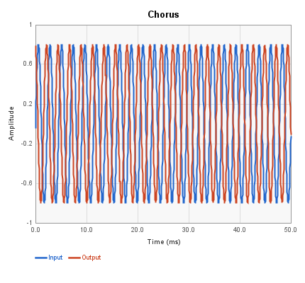
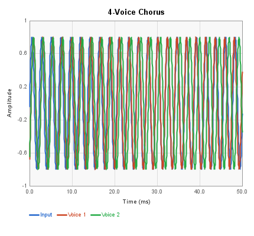
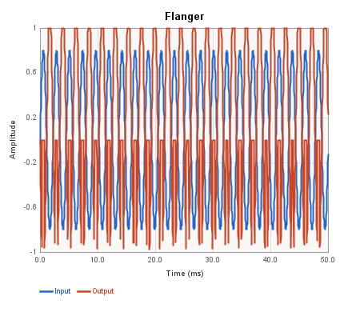
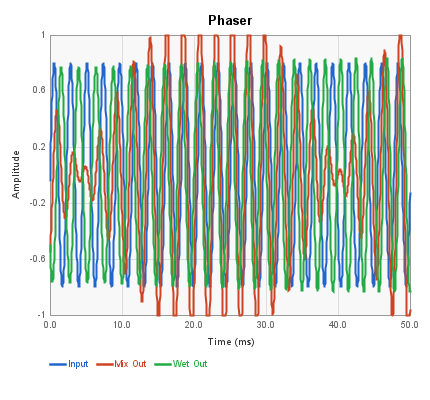
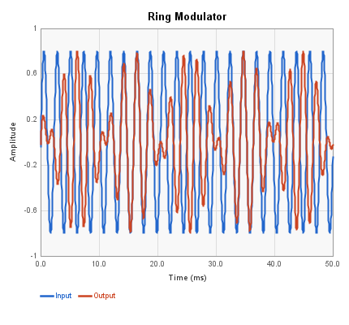
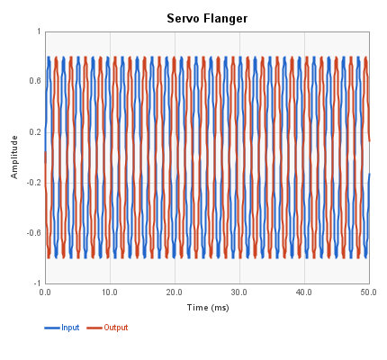

# Modulation Blocks Reference

These blocks implement modulation effects: chorus, flanging, phasing, ring
modulation, and servo-based delay modulation. All use the FV-1's internal
LFO or custom oscillator to modulate delay taps or signal phase.

---

## Chorus

A single-voice chorus effect using an internal sine/cosine LFO to modulate
a delay line tap. Produces a thickening, detuning effect on the input signal.

| Pin | Type | Description |
|-----|------|-------------|
| Input | Audio In | Audio signal |
| Output | Audio Out | Chorused output |
| LFO_Rate | Control In | LFO speed (overrides panel setting) |
| LFO_Width | Control In | LFO depth (overrides panel setting) |

**Control panel parameters:**

| Parameter | Range | Default | Description |
|-----------|-------|---------|-------------|
| Delay Length | samples | 512 | Base delay buffer size |
| Rate | 0-511 | 20 | LFO rate |
| Width | samples | 30 | LFO modulation depth |
| LFO Select | 0/1 | 0 | Selects SIN0 or SIN1 LFO |

---

## 4-Voice Chorus

A four-voice chorus with independent tap positions within a shared delay
buffer. Each voice uses a different center position, creating a rich,
ensemble-like effect. All four voices share the same LFO.

| Pin | Type | Description |
|-----|------|-------------|
| Input | Audio In | Audio signal |
| Voice_1 | Audio Out | First chorus voice |
| Voice_2 | Audio Out | Second chorus voice |
| Voice_3 | Audio Out | Third chorus voice |
| Voice_4 | Audio Out | Fourth chorus voice |
| LFO_Rate | Control In | LFO speed |
| LFO_Width | Control In | LFO depth |

**Control panel parameters:**

| Parameter | Range | Default | Description |
|-----------|-------|---------|-------------|
| Gain | -1.0 to 1.0 | 1.0 | Output gain |
| Delay Length | samples | 512 | Base delay buffer size |
| Tap 1 Center | 0-1 | 0.25 | Voice 1 position in delay buffer |
| Tap 2 Center | 0-1 | 0.33 | Voice 2 position in delay buffer |
| Tap 3 Center | 0-1 | 0.63 | Voice 3 position in delay buffer |
| Tap 4 Center | 0-1 | 0.75 | Voice 4 position in delay buffer |
| Rate | 0-511 | 20 | LFO rate |
| Width | samples | 64 | LFO modulation depth |
| LFO Select | 0/1 | 0 | Selects SIN0 or SIN1 LFO |

---

## Flanger

A classic flanger effect with an internal LFO modulating a short delay line.
Includes a feedback path for more intense, resonant flanging. The Tap output
provides the raw delayed signal before mixing.

| Pin | Type | Description |
|-----|------|-------------|
| Input | Audio In | Audio signal |
| Feedback In | Audio In | External feedback return (optional) |
| Output | Audio Out | Flanged output |
| Tap | Audio Out | Raw modulated delay tap |
| LFO Rate | Control In | LFO speed |
| LFO Width | Control In | LFO depth |
| Feedback Gain | Control In | Feedback amount |

**Control panel parameters:**

| Parameter | Range | Default | Description |
|-----------|-------|---------|-------------|
| Input Gain | 0-1.0 | 1.0 | Input level |
| Feedback Gain | -1.0 to 1.0 | 0.5 | Internal feedback amount |
| Delay Length | samples | 64 | Base delay buffer size |
| Rate | 0-511 | 20 | LFO rate |
| Width | samples | 30 | LFO modulation depth |
| LFO Select | 0/1 | 0 | Selects SIN0 or SIN1 LFO |

---

## Phaser

An all-pass phase shifter with configurable stage count (1-5 stage pairs).
In the default LFO mode, an internal sine LFO sweeps the phase shift
frequency. The Mix Out provides wet+dry combined; the Wet Out provides the
phase-shifted signal alone.

| Pin | Type | Description |
|-----|------|-------------|
| Audio Input | Audio In | Audio signal |
| Mix Out | Audio Out | Wet + dry mix |
| Wet Out | Audio Out | Phase-shifted signal only |
| LFO Speed | Control In | LFO rate |
| LFO Width | Control In | LFO depth |
| Phase | Control In | Direct phase control (manual mode) |

**Control panel parameters:**

| Parameter | Range | Default | Description |
|-----------|-------|---------|-------------|
| Stages | 1-5 | 4 | Number of all-pass stage pairs |
| Control Mode | 0-2 | 0 | 0 = LFO, 1 = external phase, 2 = envelope |
| LFO Rate | 0-1.0 | 0.5 | LFO speed |
| LFO Width | 0-1.0 | 0.5 | LFO depth |

---

## Ring Modulator

Multiplies the input signal by an internal quadrature oscillator, producing
sum and difference frequencies. The Carrier Frequency control input sets the
oscillator speed. Without a carrier control connection, the oscillator runs
at the default LFO coefficient.

| Pin | Type | Description |
|-----|------|-------------|
| Audio Input 1 | Audio In | Audio signal (auto-named) |
| Carrier Frequency | Control In | Oscillator frequency control |
| Audio Output 1 | Audio Out | Ring-modulated output (auto-named) |

**Control panel parameters:**

| Parameter | Range | Default | Description |
|-----------|-------|---------|-------------|
| LFO | 0.001-1.0 | 0.02 | Internal oscillator coefficient |

The oscillator implements a quadrature pair (sine and cosine) using
feedback integration. The maximum frequency is Fs / (2 * pi).

---

## Servo Flanger

A delay-based modulation effect that uses a control voltage to set the delay
time directly (no internal LFO). This allows external envelope followers,
expression pedals, or other control sources to sweep the delay for manual
flanging and chorus effects.

| Pin | Type | Description |
|-----|------|-------------|
| Input | Audio In | Audio signal |
| Feedback In | Audio In | External feedback return (optional) |
| Output | Audio Out | Processed output |
| Tap Output | Audio Out | Raw delay tap output |
| Delay Time | Control In | Delay time control voltage |
| Feedback Gain | Control In | Feedback amount |

**Control panel parameters:**

| Parameter | Range | Default | Description |
|-----------|-------|---------|-------------|
| Input Gain | 0-1.0 | 1.0 | Input level |
| Feedback Gain | -1.0 to 1.0 | 0.5 | Feedback amount |
| Servo Gain | 0-1.0 | 0.25 | Servo tracking speed |
| Frequency | 0-1.0 | 0.25 | Servo filter frequency |
| Tap 1 Ratio | 0-1.0 | 0.025 | Delay tap position ratio |
| Delay Length | samples | 4096 | Delay buffer size |

