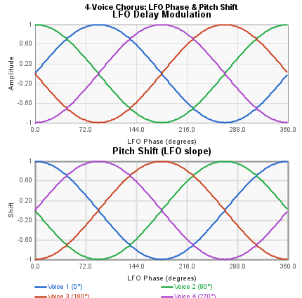
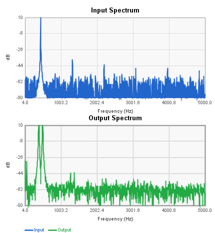

# Modulation Blocks Reference

These blocks implement modulation effects: chorus, flanging, phasing, ring
modulation, and servo-based delay modulation. All use the FV-1's internal
LFO or custom oscillator to modulate delay taps or signal phase.

> **Signal level warning:** When a modulated output is mixed with the dry
> signal (e.g., Phaser Mix Out, or summing a Servo Flanger Tap with its
> Output), the combined signal can reach **2× the input amplitude** at
> moments of full phase alignment. Reduce input gain (e.g., to 0.5) or
> apply post-attenuation to avoid clipping.

---

## Chorus

A single-voice chorus effect using an internal sine/cosine LFO to modulate
a delay line tap. Produces a thickening, detuning effect on the input signal.

The **Delay Length** parameter sets the base delay buffer size. Shorter delay
times (under ~5 ms / ~160 samples) produce flanging-like effects; longer
times (10–30+ ms / 320–1000 samples) produce classic chorus sounds. The
LFO modulates the read position within this delay buffer, creating a
continuously varying pitch shift.

| Pin | Type | Description |
|-----|------|-------------|
| Input | Audio In | Audio signal |
| Output | Audio Out | Chorused output |
| LFO_Rate | Control In | LFO speed (scales panel setting) |
| LFO_Width | Control In | LFO depth (scales panel setting) |

**Control panel parameters:**

| Parameter | Range | Default | Description |
|-----------|-------|---------|-------------|
| Delay Length | 128–2048 samples | 512 (~15.6 ms) | Base delay buffer size |
| Rate | 0–511 (0–20.3 Hz) | 20 (~0.80 Hz) | LFO rate |
| Width | 5–100 % | 30 | LFO modulation depth |
| LFO Select | 0/1 | 0 | Selects SIN0 or SIN1 LFO |

The LFO rate in Hz follows the formula from Spin AN-0001:
**f = Fs × coeff / (2π × 2¹⁷)**, where Fs = 32768 Hz. At the default
coefficient of 20, the LFO runs at approximately 0.80 Hz. The maximum
rate (coefficient 511) is approximately 20.3 Hz.

---

## 4-Voice Chorus

A four-voice chorus with independent tap positions within a shared delay
buffer. Each voice uses a different center position, creating a rich,
ensemble-like effect. All four voices share the same LFO but read from
different phases of the SIN/COS pair (0°, 90°, 180°, 270°).

**LFO phase and pitch shift:** The instantaneous pitch shift of each voice
is proportional to the *slope* (derivative) of the LFO waveform at that
voice's phase offset. When the sine LFO crosses zero, its slope is
steepest, producing maximum pitch shift (up or down). At the LFO peaks
and troughs (90° from zero crossings), the slope is zero and there is no
instantaneous pitch shift — the delay time is changing direction.

| Pin | Type | Description |
|-----|------|-------------|
| Input | Audio In | Audio signal |
| Voice_1 | Audio Out | First chorus voice |
| Voice_2 | Audio Out | Second chorus voice |
| Voice_3 | Audio Out | Third chorus voice |
| Voice_4 | Audio Out | Fourth chorus voice |
| LFO_Rate | Control In | LFO speed (scales panel setting) |
| LFO_Width | Control In | LFO depth (scales panel setting) |

**Control panel parameters:**

| Parameter | Range | Default | Description |
|-----------|-------|---------|-------------|
| Gain | -1.0 to 1.0 | 1.0 | Output gain |
| Delay Length | samples | 512 | Base delay buffer size |
| Tap 1 Center | 0-1 | 0.25 | Voice 1 position in delay buffer |
| Tap 2 Center | 0-1 | 0.33 | Voice 2 position in delay buffer |
| Tap 3 Center | 0-1 | 0.63 | Voice 3 position in delay buffer |
| Tap 4 Center | 0-1 | 0.75 | Voice 4 position in delay buffer |
| Rate | 0-511 | 20 | LFO rate |
| Width | samples | 64 | LFO modulation depth |
| LFO Select | 0/1 | 0 | Selects SIN0 or SIN1 LFO |

---

## Flanger

Structurally similar to the single-voice Chorus but with the addition of
a **feedback path** and a **fixed center tap** for through-zero flanging.
The shorter default delay time (64 samples / ~2 ms vs. 512 for chorus)
is typical for flanging.

**Through-zero flanging:** The Tap output reads from the fixed center of
the delay buffer (`delayl^`, the midpoint). The modulated Output sweeps
around this same center. When the Output's sweep crosses the Tap position,
the two signals are momentarily identical — a "through-zero" crossing.
Mixing the Tap with the Output externally creates a comb filter whose
nulls sweep through zero delay offset, producing the characteristic
jet-engine sweep of through-zero flanging.

The feedback path recirculates the output back into the delay input,
adding resonant peaks to the comb filter. Negative feedback inverts the
comb filter pattern, producing a distinctly different tonal character.

| Pin | Type | Description |
|-----|------|-------------|
| Input | Audio In | Audio signal |
| Feedback In | Audio In | External feedback return (optional) |
| Output | Audio Out | Flanged output |
| Tap | Audio Out | Fixed center delay tap |
| LFO Rate | Control In | LFO speed (scales panel setting) |
| LFO Width | Control In | LFO depth (scales panel setting) |
| Feedback Gain | Control In | Feedback amount |

**Control panel parameters:**

| Parameter | Range | Default | Description |
|-----------|-------|---------|-------------|
| Input Gain | -24–0 dB | 0 dB | Input level |
| Feedback Gain | -24–0 dB | -6 dB | Internal feedback amount |
| Delay Length | 16–512 samples | 64 (~2 ms) | Base delay buffer size |
| Rate | 0–511 (0–20.3 Hz) | 20 (~0.80 Hz) | LFO rate |
| Width | 5–100 % | 30 | LFO modulation depth |
| LFO Select | 0/1 | 0 | Selects SIN0 or SIN1 LFO |

---

## Phaser

An all-pass phase shifter with configurable stage count (1–5 stage pairs).
In the default LFO mode, an internal sine LFO sweeps the phase shift
frequency. The Mix Out provides wet+dry combined; the Wet Out provides the
phase-shifted signal alone.

**Mix overload note:** When the phase-shifted signal is in phase with the
input, the Mix Out amplitude reaches **2× the input level**. Apply post-
attenuation or reduce input gain to avoid clipping when using Mix Out.

| Pin | Type | Description |
|-----|------|-------------|
| Audio Input | Audio In | Audio signal |
| Mix Out | Audio Out | Wet + dry mix (up to 2× input level) |
| Wet Out | Audio Out | Phase-shifted signal only |
| LFO Speed | Control In | LFO rate |
| LFO Width | Control In | LFO depth |
| Phase | Control In | Direct phase control (manual mode) |

**Control panel parameters:**

| Parameter | Range | Default | Description |
|-----------|-------|---------|-------------|
| Stages | 1–5 | 4 | Number of all-pass stage pairs |
| Control Mode | 0–2 | 0 | 0 = LFO, 1 = external phase, 2 = envelope |
| LFO Rate | 0–1.0 | 0.5 | LFO speed |
| LFO Width | 0–1.0 | 0.5 | LFO depth |

---

## Ring Modulator

Multiplies the input signal by an internal quadrature oscillator, producing
sum and difference frequencies. The Carrier Frequency control input sets the
oscillator speed. Without a carrier control connection, the oscillator runs
at the default LFO coefficient.

| Pin | Type | Description |
|-----|------|-------------|
| Audio Input 1 | Audio In | Audio signal (auto-named) |
| Carrier Frequency | Control In | Oscillator frequency control |
| Audio Output 1 | Audio Out | Ring-modulated output (auto-named) |

**Control panel parameters:**

| Parameter | Range | Default | Description |
|-----------|-------|---------|-------------|
| LFO | 0.001-1.0 | 0.02 | Internal oscillator coefficient |

The oscillator implements a quadrature pair (sine and cosine) using
feedback integration. The maximum frequency is Fs / (2 * pi).

---

## Servo Flanger

A delay-based modulation effect that uses a control voltage to set the delay
time directly (no internal LFO). This allows external envelope followers,
expression pedals, or other control sources to sweep the delay for manual
flanging and chorus effects. The ramp LFO servos to match the control input,
and a low-pass filter smooths the delay time to avoid zipper noise.

**Overload when mixing:** As with the Phaser, mixing the Tap Output with
the main Output can produce up to 2× the input amplitude. Use Input Gain
of 0.5 or apply post-attenuation to avoid clipping.

**Frequency response when mixing Tap + Output:** When the Tap is set to
~10 ms (Tap Time Ratio ≈ 0.025 with 4096-sample buffer), mixing it with
the modulated Output creates a comb filter. The first null appears at
1 / (2 × 0.010) = 50 Hz, with subsequent nulls at odd multiples (150 Hz,
250 Hz, etc.). Sweeping the delay time with the control input sweeps these
nulls, producing the flanging effect.

| Pin | Type | Description |
|-----|------|-------------|
| Input | Audio In | Audio signal |
| Feedback In | Audio In | External feedback return (optional) |
| Output | Audio Out | Processed output |
| Tap Output | Audio Out | Fixed delay tap output |
| Delay Time | Control In | Delay time control voltage |
| Feedback Gain | Control In | Feedback amount |

**Control panel parameters:**

| Parameter | Range | Default | Description |
|-----------|-------|---------|-------------|
| Input Gain | -24–0 dB | 0 dB | Input level |
| Feedback Gain | -24–0 dB | -6 dB | Feedback amount |
| Servo Gain | 0–0.49 | 0.25 | Servo tracking speed |
| Low Pass | 500–7500 Hz | ~100 Hz | Servo smoothing filter cutoff |
| Tap Time Ratio | 0.001–0.05 | 0.025 | Delay tap position as fraction of buffer |
| Delay Length | 4096 samples | 4096 (~125 ms) | Delay buffer size (fixed) |

**Delay time vs. control input:** The servo ramp tracks the Delay Time
control input. The delay time is proportional to the control voltage:
a control value of 0 gives minimum delay, and 1.0 sweeps to the full
buffer length. The servo filter smooths transitions — allow at least
100 ms of settling time between control value changes for accurate
delay time measurements.

**Max delay vs. Tap Time Ratio:**

| Tap Time Ratio | Tap Delay (ms) | First Comb Null (Hz) |
|---------------|----------------|---------------------|
| 0.001 | 0.125 | 4000 |
| 0.005 | 0.625 | 800 |
| 0.010 | 1.25 | 400 |
| 0.025 | 3.1 | 161 |
| 0.050 | 6.25 | 80 |

*(Tap delay = Ratio × 4096 / 32768 × 1000 ms; first null = 1 / (2 × delay_sec))*

