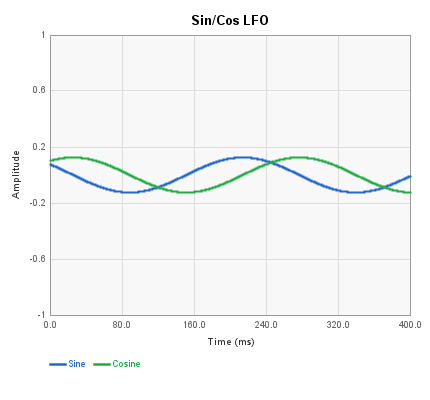
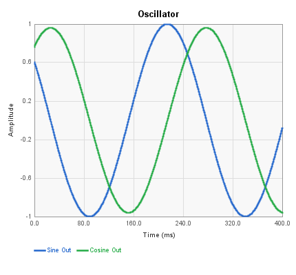
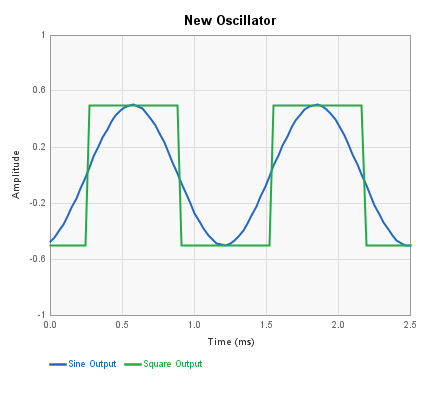

# Oscillator Blocks Reference

These blocks generate low-frequency oscillator (LFO) and oscillator signals
for modulation and control purposes. They use the FV-1's built-in LFO
hardware or software-based oscillator algorithms.

---

## Sin/Cos LFO

Uses one of the FV-1's two hardware SIN/COS LFO generators to produce
sine and cosine control signals. The two outputs are 90 degrees apart
in phase, making this block useful for chorus, vibrato, and other
modulation effects.

| Pin | Type | Description |
|-----|------|-------------|
| Speed | Control In | Modulates LFO rate (scaled by current Rate setting) |
| Width | Control In | Modulates LFO width (scaled by current Width setting) |
| Sine | Control Out | Sine waveform output |
| Cosine | Control Out | Cosine waveform output (90 degrees ahead of sine) |

**Control panel parameters:**

| Parameter | Range | Default | Description |
|-----------|-------|---------|-------------|
| Rate | 0-511 (displayed in Hz) | 1 | LFO frequency |
| Width | 0-32767 | 1 | LFO amplitude/sweep width |
| LFO Select | LFO 0 / LFO 1 | LFO 0 | Which hardware SIN LFO to use |
| Output Range | -1.0 to 1.0 / 0.0 to 1.0 | -1.0 to 1.0 | Output signal range |

The FV-1 has only two SIN/COS LFO units (LFO 0 and LFO 1). If two
Sin/Cos LFO blocks are used, they must be assigned to different LFO units.

---

## Ramp LFO

Uses one of the FV-1's two hardware ramp LFO generators to produce ramp
(sawtooth) and triangle waveforms. Ramp LFOs are typically used for
delay-line modulation in chorus and flanger effects.

| Pin | Type | Description |
|-----|------|-------------|
| Rate | Control In | Modulates LFO rate (scaled by current Rate setting) |
| Tri Width | Control In | Modulates triangle waveform width |
| Ramp LFO | Control Out | Ramp (sawtooth) waveform output |
| Triangle LFO | Control Out | Triangle waveform derived from the ramp |

**Control panel parameters:**

| Parameter | Range | Default | Description |
|-----------|-------|---------|-------------|
| Rate | -16384 to 32767 (displayed as normalized rate) | 1 | LFO frequency (negative values reverse direction) |
| Width | 512 / 1024 / 2048 / 4096 | 512 | Ramp width in delay-memory samples |
| LFO Select | LFO 0 / LFO 1 | LFO 0 | Which hardware ramp LFO to use |

The triangle output is derived from the ramp by folding it with a
scale-and-absolute-value operation. The Width parameter controls both the
ramp sweep range and the triangle shape. If the Triangle LFO output is
not connected, fewer instructions are generated.

---

## Oscillator

A software-based sine/cosine oscillator implemented with a two-integrator
loop. Unlike the hardware LFO blocks, this oscillator can reach audio
frequencies (up to Fs/2pi). The frequency is set by a single coefficient
that controls the integration rate.

| Pin | Type | Description |
|-----|------|-------------|
| LFO Speed | Control In | Multiplies the integration rate for frequency modulation |
| Sine Out | Control Out | Sine waveform output |
| Cosine Out | Control Out | Cosine waveform output (90 degrees offset) |

**Control panel parameters:**

| Parameter | Range | Default | Description |
|-----------|-------|---------|-------------|
| LFO | 0 to ~5000 Hz (logarithmic slider) | ~300 Hz | Oscillator frequency |

When the LFO Speed input is connected, the frequency control signal is
multiplied with the internal rate coefficient, allowing external modulation.
Both outputs produce sinusoidal waveforms phase-shifted by 90 degrees.

---

## New Oscillator

An enhanced software oscillator (labeled "Oscillator II" in the UI) that
adds a square wave output and a width control input. Like the original
Oscillator, it uses a two-integrator loop for sine generation, but also
derives a square wave by thresholding the sine output.

| Pin | Type | Description |
|-----|------|-------------|
| Frequency | Control In | Multiplies the integration rate for frequency modulation |
| Width | Control In | Scales the sine and square wave amplitude |
| Sine Output | Control Out | Sine waveform output |
| Square Output | Control Out | Square waveform derived from the sine |

**Control panel parameters:**

| Parameter | Range | Default | Description |
|-----------|-------|---------|-------------|
| Frequency | 20-5000 Hz (logarithmic slider) | ~2200 Hz | Oscillator frequency |

The square wave output is generated by testing the sign of the sine
waveform: positive half-cycles produce +0.5, negative half-cycles produce
-0.5. When the Width input is connected, both the sine and square outputs
are scaled by the width control value. The Square Output is only generated
(and instructions are only spent) when the pin is connected.

---

## LFO Value

Reads the current value of any of the FV-1's hardware LFO outputs and
makes it available as a control signal. This is useful when you need to
tap into an LFO that was configured by another block (such as a chorus
or flanger that uses a ramp LFO internally).

| Pin | Type | Description |
|-----|------|-------------|
| Output | Control Out | Current value of the selected LFO |

**Control panel parameters:**

| Parameter | Options | Default | Description |
|-----------|---------|---------|-------------|
| LFO Select | Sin 0, Cos 0, Sin 1, Cos 1, Ramp 0, Ramp 1 | Sin 0 | Which hardware LFO output to read |

This block has no input pins. It simply reads the instantaneous value
of the chosen LFO using the CHO RDAL instruction. The LFO must be
initialized elsewhere in the patch (by a Sin/Cos LFO block, a Ramp LFO
block, or any effect block that configures an LFO). If the Output pin
is not connected, no instructions are generated.

