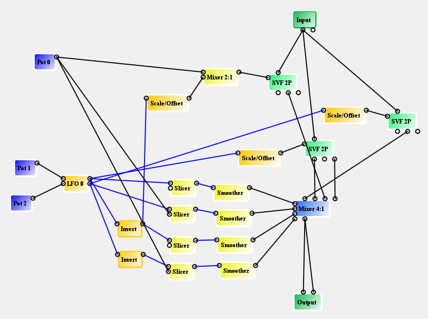
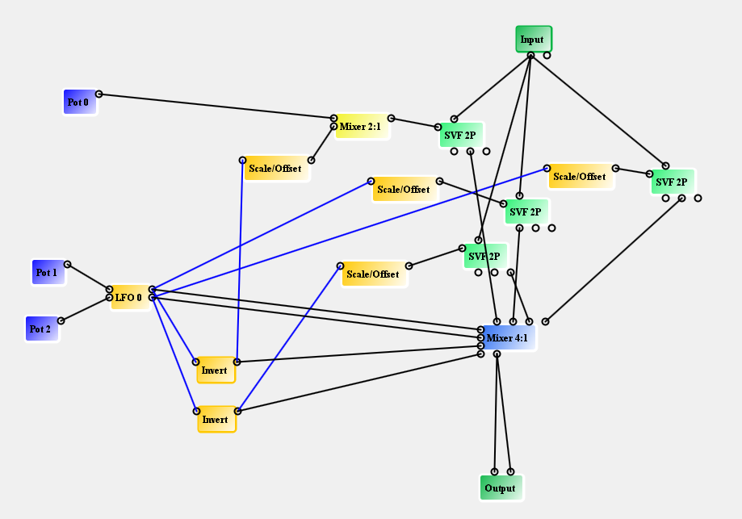
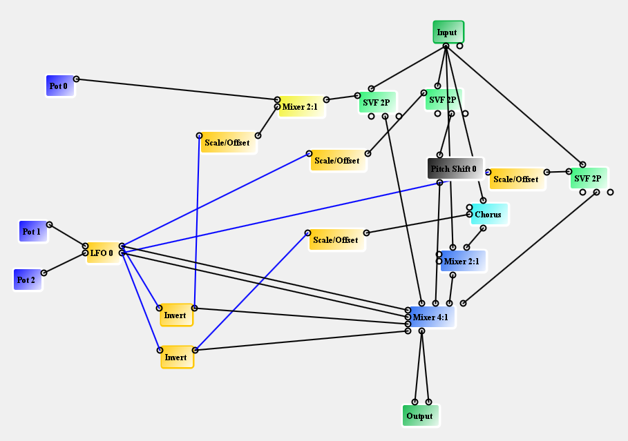
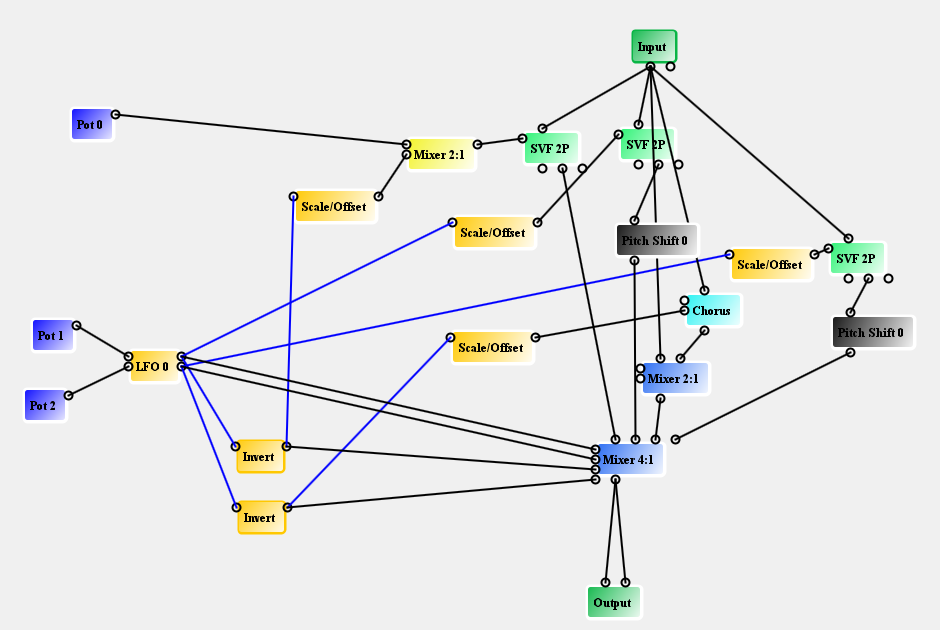

# 4-Phase LFO Driven Mixer

I came up with something that I don't think I'd tried before, based slightly
on Patreon supporter Mark Davis' mention of the Shepard function. This is
somewhat reduced from what I would have liked due to running out of
instructions. But it's still pretty unusual as modulations go.

[4-phase-filters-001.spcd](https://github.com/HolyCityAudio/SpinCAD-Designer/raw/master/patches/4-phase-filters-001.spcd)

Can you figure out what is going on?

I also created another patch
[4-phase-filters-002.spcd](https://github.com/HolyCityAudio/SpinCAD-Designer/raw/master/patches/4-phase-filters-002.spcd)
that leaves off the slicers and smoothers so that I can use another
independent filter.

What is going on is that the sine waves are using the 4 mixer channels to
fade the various filters in and out. At the same time, the filters' center
frequencies are being varied. But those two control signals may come from
a different phase of the LFO for each of the 4 filters. You could also
connect all of the filter control inputs to a single phase, or anything in
between.

**Boy this patch just keeps on giving, I tell you**

I replaced a filter with a chorus whose width varies along with one of the
LFOs and added a pitch shift of a fifth up (7 semitones) on another one of
the phases. This is a very unusual sound and I am not sure I've heard
anything like it.
[4-phase-filters-pitch-chorus.spcd](https://github.com/HolyCityAudio/SpinCAD-Designer/raw/master/patches/4-phase-filters-pitch-chorus.spcd).
Try also using an interval of 12 semitones (1 octave) in the pitch shift
block.

#### More patches based on this concept

[4-phase-filters-2-pitch-chorus.spcd](https://github.com/HolyCityAudio/SpinCAD-Designer/raw/master/patches/4-phase-filters-2-pitch-chorus.spcd)

Quick, make a million dollars on a new pedal!
