# Multi-Head "Drum/Tape" Delay

One of the things I love about the FV-1 is how many different things you can
do in the realm of "ambience". It can make some pretty good sounding reverbs.
Delays are like falling off a log.

One DIY FV-1 project I found early on in my FV-1 quest was "Piet's Echotapper"
which was dedicated to recreating all the wonderful multi-head drum/tape
delays as used by the Shadows (and others) in the 60's. An [SKRM module](http://experimentalnoize.com/product_SKRM-C8_Modules.php)
was available from Spin while they were still selling those. I bought one!

The Echotapper was a well documented DIY project, but it struck me as odd to
be so dedicated to a specific type of sound, never mind limiting yourself to
mimicking actual products from the real world!

Much of this work wound up in the StanleyFX
"[Blue Nebula](http://www.stanleyfx.co.uk/bluenebula.html)".

I'm fairly sure that some of these programs use a "[pot skip](http://spinsemi.com/knowledge_base/coding_examples.html#POT_skip_routines)"
structure, which allows you to turn individual playback "heads" (aka delay
line taps) on and off depending on the pot position. I am considering making
a "multi-head delay" block which would differ from the existing delay blocks
in SpinCAD Designer by the addition of the ability to bring heads in and out
with a control pot. Nothing in SpinCAD Designer currently uses a pot skip
structure.

So that's a great idea, and doesn't seem too hard. I'll use it as a
"how-to-add-a-new-block" tutorial. But in the meantime, how would I do that?
So here's what I did. Here's a link to the
[SpinCAD file](https://github.com/HolyCityAudio/SpinCAD-Designer/raw/master/patches/drum-delay.spcd).

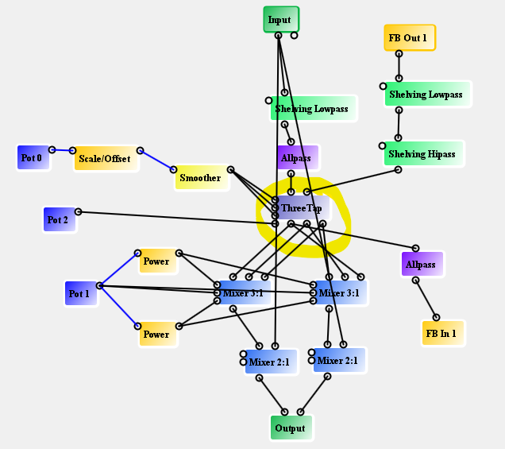

### Three-tap delay

The heart of this, as so many things I do, is the
[Three-Tap Delay](../delay-blocks.md#triple-tap).

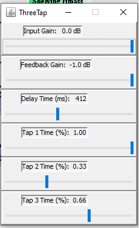

Longer delay times didn't sound that great. Note that here, I have the taps
set to a 1:2:3 ratio. I think most drum/tape delays don't do that, but you'd
have to do some research to figure all that out. The great thing is that you
are not constrained by either physics or history here!

The lower end of the delay range is set by the circled parameter in the
[Scale/Offset](../instructions-blocks.md#scaleoffset) block. Multiply this by
the delay Time in the Three-Tap block to get the total delay when the pot is
at zero. The scaled and smoothed pot value is sent to all three delay tap
time inputs so that they track together, allowing you to change the "size"
of the delay. You may find that a more constrained range of values suits
your taste. Make it happen!

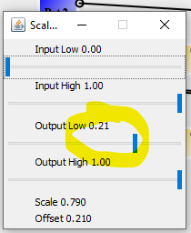

### Delay time smoother

The [Smoother](../control-blocks.md) is set by ear to give some pitch bend
when you change the delay time, which is totally optional. I like it so I
put it in all the time.

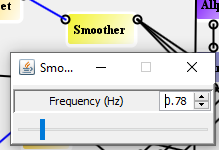

### All-pass filters for smearing

I put [all-pass blocks](../filter-blocks.md) in the input to the delay and in
the feedback loop to "smear" the sound. All-passes turn clicks into "puffs"
for lack of a better word.

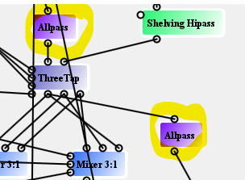

I'm also working on a video where I show you what happens in a reverb
algorithm if you set all all-pass coefficients to 0. It's pretty interesting!
The point here is that you should also try this without the all-pass blocks
to hear the difference. I've linked a
["click" simulator wave file](https://github.com/HolyCityAudio/SpinCAD-Designer/raw/master/patches/click.wav)
you can use.

### Multiple control curves from a single pot

Next, I show how I manage to use a pot to bring in the heads "one at a time"
or close to it.

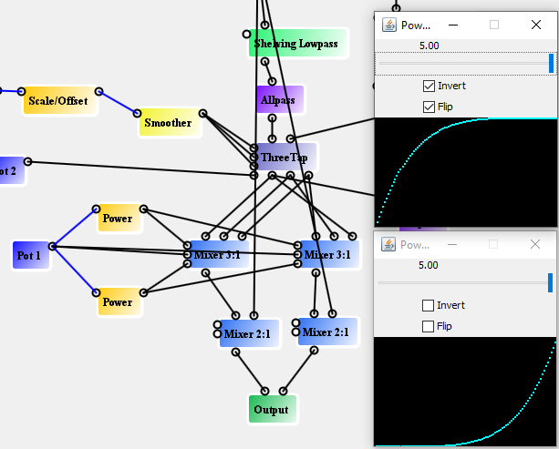

I use the [Power](../control-blocks.md#power) block (under "Controls") to
warp control signals one way or the other. The top Power block which goes to
input 1 gain on both the mixers is set to "5", "Invert", and "Flip". The
actual function is `y = 1 - (1 - x)^5`. This comes in faster than the pot
signal, so the taps attached to input 1 on the 2 mixers will come in first.

The pot signal goes directly to input 2 of the delay mixers, so that is a
straight line from 0 to 1 and therefore no need for a power block.

Finally, the lower Power block is set to "5" only so implements `y = x^5`.
This goes to input gain 3 of both mixer blocks. Notice that I did not attach
the delay taps to the mixers in the same order. So this means that the taps
will come in on left and right with different blends.

The balance between the tap levels on both sides are further controlled by
the mixer Input Gain settings.

There's no explicit "mix" control here. With the "heads" pot (#1) all the
way at 0, the mixer gains are all set at 0. At 25%, you clearly hear one
head. At 50%, two, at 75% all three. When it is at 1.0 (well OK, it's a
little less than 1.0), then all the heads are turned up as far as they
will go. You can also have more elaborate control schemes where certain
heads fade out as others come in, but I wanted to just keep it
straightforward here.

### Shelving filters

I used [Shelving filters](../filter-blocks.md) on the input and in the
feedback loop just for the sake of trying those out. My high frequency
hearing is pretty bad so I can't always tell what those things sound like.

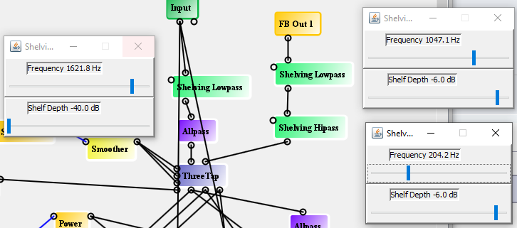

The feedback is tapped off the longest delay tap, but that is also not a
necessary constraint. Try taking the feedback from the shorter delay taps
and see what happens.

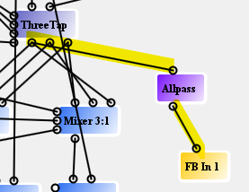

### Put a cube distortion in the feedback path

Another interesting thing to try is to drop in a
[Cube](../wave-shaper-blocks.md#cube) distortion (from the "Wave Shaper"
menu) between FB Out and the Shelving Lowpass.

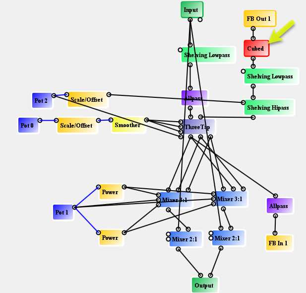

The Cube distortion is a mild soft clipper. Now with high levels of feedback
(pot 2) you start getting an overloaded sound through the delay. Note that
this positioning means your first echo is always clean! To use a single
distortion block that affected both the input and the feedback, you'd have
to add another 2:1 mixer before the Three-Tap delay and take the feedback
into that rather than using the built-in path of the delay block. Here's the
[SpinCAD patch](https://github.com/HolyCityAudio/SpinCAD-Designer/raw/master/patches/three-head-delay-with-cubed.spcd).

Fine tune the maximum gain in the loop using the control panel of "FB In 1".

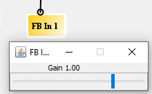

Another thing I like doing with delays is more aggressively cutting out low
end from the feedback loop. Combined with some distortion, this begins to
have a surreal effect as the sonic integrity deteriorates. I compare it to
the visual of a guy looking at a bunch of reflections in a funhouse mirror,
but he's getting older in each successive one. I didn't really aggressively
cut out low end in the supplied patch, but adjusting the shelf (deeper) and
frequency (higher) in the shelving highpass will get you there.

### Put a limiter in the feedback path

You can also experiment with putting a limiter in the delay feedback loop
which can keep oscillations going for a really long time. I won't say it's
impossible to distort but it's worth further experimentation. Also try the
other limiters under the [Dynamics](../dynamics-blocks.md) section.

Here's the
[SpinCAD patch](https://github.com/HolyCityAudio/SpinCAD-Designer/raw/master/patches/three-head-delay-with-limiter.spcd).

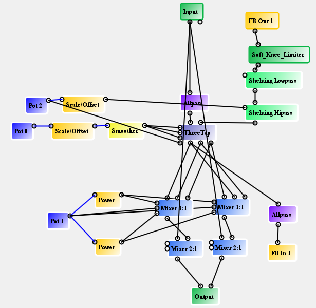
