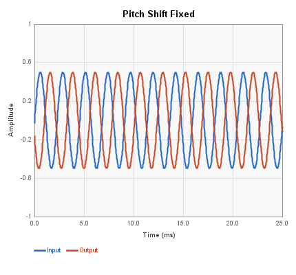
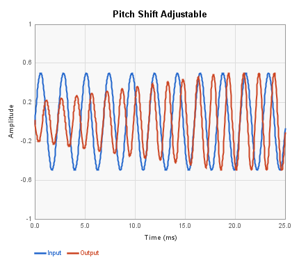
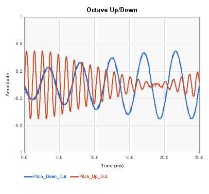
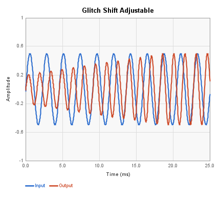
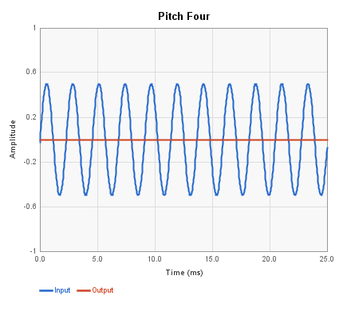
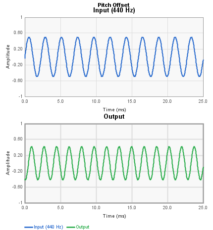
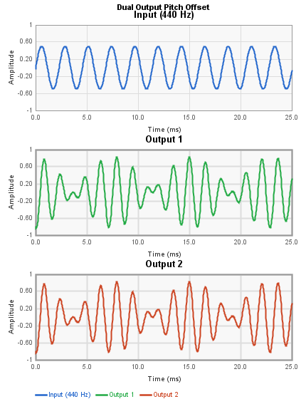
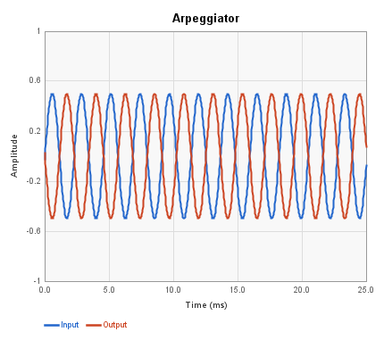

# Pitch Blocks Reference

These blocks implement pitch shifting effects using the FV-1's ramp LFO and
delay memory. Techniques include standard pitch shifting, glitch shifting,
frequency offset via Hilbert transform, and arpeggiator-style stepped patterns.

---

## Pitch Shift Fixed

A fixed pitch shift using the FV-1's ramp LFO. The shift amount and LFO
parameters are set from the control panel. This block uses the classic
delay-line pitch shifting technique where a ramp LFO sweeps a read pointer
through a delay buffer to create the pitch change.

| Pin | Type | Description |
|-----|------|-------------|
| Audio In | Audio In | Input signal |
| Pitch Out | Audio Out | Pitch-shifted output |

**Control panel parameters:**

| Parameter | Range | Default | Description |
|-----------|-------|---------|-------------|
| Freq | LFO rate | 0 | Pitch shift amount (ramp rate) |
| Amp | buffer size | 512 | Delay buffer size (512/1024/2048/4096) |
| LFO Sel | 0-1 | 0 | Select RMP0 or RMP1 |

---

## Pitch Shift Adjustable

An adjustable pitch shifter with a control input for real-time pitch
modulation. The base pitch coefficient sets the shift amount and the
control input can modulate it further based on the control range setting.

| Pin | Type | Description |
|-----|------|-------------|
| Input | Audio In | Input signal |
| Pitch Out | Audio Out | Pitch-shifted output |
| Pitch Control | Control In | Pitch modulation (0-1) |

**Control panel parameters:**

| Parameter | Range | Default | Description |
|-----------|-------|---------|-------------|
| pitchCoeff | coefficient | 8192 | Base pitch shift coefficient |
| controlRange | coefficient | 0 | Modulation depth from control input |
| lfoSel | 0-1 | 0 | Select RMP0 or RMP1 |
| lfoWidth | samples | 0 | Ramp LFO width setting |

When the Pitch Control pin is disconnected, the block uses only the
fixed pitchCoeff value.

---

## Octave Up/Down

Produces two simultaneous outputs: one pitched down by one octave and one
pitched up by one octave. Uses two ramp LFOs (RMP0 and RMP1) with fixed
rate settings. There is no control panel.

| Pin | Type | Description |
|-----|------|-------------|
| Input | Audio In | Input signal |
| Pitch_Down_Out | Audio Out | One octave down |
| Pitch_Up_Out | Audio Out | One octave up |

---

## Glitch Shift Adjustable

A "glitch" pitch shifter that uses a single ramp LFO without crossfading,
producing intentional discontinuities (glitches) at the ramp reset point.
This creates a lo-fi, textured pitch effect. The pitch amount is
controllable via the Pitch Control input.

| Pin | Type | Description |
|-----|------|-------------|
| Input | Audio In | Input signal |
| Glitch Out | Audio Out | Glitched pitch output |
| Pitch Control | Control In | Pitch modulation (0-1) |

**Control panel parameters:**

| Parameter | Range | Default | Description |
|-----------|-------|---------|-------------|
| pitchCoeff | coefficient | 8192 | Base pitch shift coefficient |
| lfoSel | 0-1 | 0 | Select RMP0 or RMP1 |
| lfoWidth | samples | 0 | Ramp LFO width setting |

---

## Pitch Four

Selects between four preset pitch shift values using a control input.
The control voltage is divided into four zones, each mapping to one of
the four pitch presets (default: -12, -7, +7, +12 semitones).

| Pin | Type | Description |
|-----|------|-------------|
| Input | Audio In | Input signal |
| Pitch_Out | Audio Out | Pitch-shifted output |
| Pitch_Select | Control In | Selects which of four pitches (0-1) |

**Control panel parameters:**

| Parameter | Range | Default | Description |
|-----------|-------|---------|-------------|
| pitch1 | semitones | -12 | First pitch preset |
| pitch2 | semitones | -7 | Second pitch preset |
| pitch3 | semitones | +7 | Third pitch preset |
| pitch4 | semitones | +12 | Fourth pitch preset |
| lfoSel | 0-1 | 0 | Select RMP0 or RMP1 |

---

## Pitch Offset

A frequency offset (pitch offset) block using a Hilbert-transform approach.
Unlike standard pitch shifting which multiplies frequency, this block adds
a fixed frequency offset to all harmonics. A 440 Hz input with a +100 Hz
offset becomes 540 Hz, not 550 Hz as a ratio-based shifter would produce.

The offset amount is set by the Pitch_Offset control input.

| Pin | Type | Description |
|-----|------|-------------|
| Input_Left | Audio In | Input signal |
| Output | Audio Out | Frequency-offset output |
| Pitch_Offset | Control In | Offset amount (0-1) |

No control panel parameters. All control comes from the Pitch_Offset pin.

---

## Dual Output Pitch Offset

A dual-output version of the Pitch Offset block. Each output has its own
independent frequency offset controlled by separate control inputs. Useful
for creating detuned stereo effects or dual-voice pitch shifting.

| Pin | Type | Description |
|-----|------|-------------|
| Input | Audio In | Input signal |
| Output 1 | Audio Out | First frequency-offset output |
| Output 2 | Audio Out | Second frequency-offset output |
| Offset 1 | Control In | Offset amount for Output 1 (0-1) |
| Offset 2 | Control In | Offset amount for Output 2 (0-1) |

No control panel parameters. All control comes from the Offset pins.

---

## Arpeggiator

A stepped pitch shifter that cycles through a sequence of semitone intervals,
triggered by a control input. When the trigger crosses the threshold, the
block advances to the next step in the pattern. The pattern can ascend,
descend, or ping-pong depending on the Slope setting.

This is a hand-written block (not code-generated) with a full control panel
for editing the step sequence.

| Pin | Type | Description |
|-----|------|-------------|
| Audio In | Audio In | Input signal |
| Trigger | Control In | Step advance trigger |
| Pitch Out | Audio Out | Arpeggiated pitch output |

**Control panel parameters:**

| Parameter | Range | Default | Description |
|-----------|-------|---------|-------------|
| Threshold | 0-1 | 0.25 | Trigger level for step advance |
| Num Steps | 3-12 | 8 | Number of steps in the pattern |
| Slope | pos/neg/both | positive | Pattern direction |
| Semitone 1-12 | -12 to +19 | varies | Semitone offset per step |
| LFO Sel | 0-1 | 0 | Select RMP0 or RMP1 |

Default pattern: 0, +4, +7, +12, +7, +4, 0, -12 (major arpeggio up and back).

