# Reverb Blocks Reference

These blocks implement various reverb algorithms for the FV-1, ranging from
simple allpass chains to full plate and hall reverbs. Each plot shows the
impulse response envelope at three reverb-time settings (short, medium, long)
with control pins disconnected.

---

## Adjustable Reverb

A configurable reverb with input allpass diffusers and delay loops with
low-pass and high-pass filtering in the feedback path. LFO modulation
can be applied to the delay taps for chorus-like movement.

| Pin | Type | Description |
|-----|------|-------------|
| Input | Audio In | Mono audio input |
| Output_Left | Audio Out | Left reverb output |
| Output_Right | Audio Out | Right reverb output |
| Reverb_Time | Control In | Reverb decay time |
| Filter | Control In | Filter frequency |

**Control panel parameters:**

| Parameter | Range | Default | Description |
|-----------|-------|---------|-------------|
| Gain | 0-1 | 0.5 | Input gain |
| Input AP Coeff | 0-1 | 0.5 | Input allpass coefficient |
| Num Delay Loops | 1-4 | 3 | Number of feedback delay loops |
| Loop AP Coeff | 0-1 | 0.6 | Loop allpass coefficient (controls decay) |
| LF Filter | 0-1 | 0.4 | Low-frequency filter coefficient |
| HF Filter | 0-1 | 0.01 | High-frequency filter coefficient |

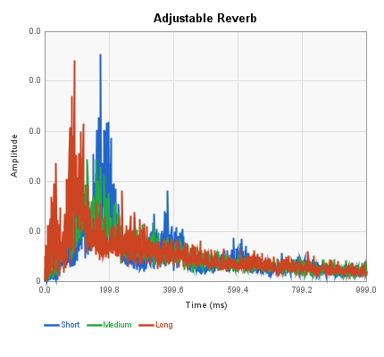

---

## Allpass

A chain of up to four allpass filters with configurable delay lengths.
Produces a diffused, smeared version of the input without explicit
feedback loops. Useful as a building block or for subtle ambience.

| Pin | Type | Description |
|-----|------|-------------|
| Input | Audio In | Audio input |
| Output | Audio Out | Diffused output |

**Control panel parameters:**

| Parameter | Range | Default | Description |
|-----------|-------|---------|-------------|
| Gain | 0-1 | 0.5 | Input gain |
| AP1 Length | samples | 125 | First allpass delay length |
| AP2 Length | samples | 250 | Second allpass delay length |
| AP3 Length | samples | 750 | Third allpass delay length |
| AP4 Length | samples | 1500 | Fourth allpass delay length |
| AP Coeff | 0-1 | 0.5 | Allpass coefficient |

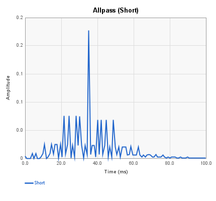
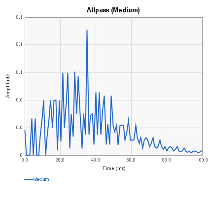
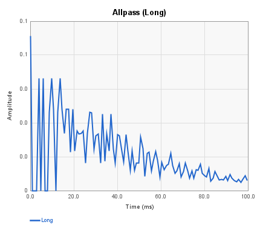

---

## Ambience

Based on the Spin Semiconductor P16_V_Ambience program. Uses multi-tapped
delay lines with allpass diffusion and exponential decay to create early
reflections. Produces a short, natural-sounding room ambience rather than
a long reverb tail.

| Pin | Type | Description |
|-----|------|-------------|
| Audio Input | Audio In | Mono audio input |
| Audio Output L | Audio Out | Left ambience output |
| Audio Output R | Audio Out | Right ambience output |
| Tone | Control In | Brightness (0 = dark, 1 = bright) |
| Decay | Control In | Decay time (0 = short, 1 = long) |

**Control panel parameters:**

| Parameter | Range | Default | Description |
|-----------|-------|---------|-------------|
| Tone | 0-1 | 0.5 | Tone control |
| Decay | 0-1 | 0.5 | Decay amount |
| Filter Freq | 2000-8000 Hz | 4000 | Low-pass filter corner frequency |

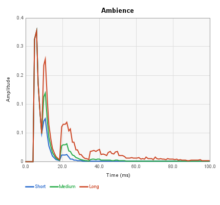

---

## Chirp Reverb

A cascaded allpass chain with geometrically increasing delay lengths
(controlled by a stretch factor). Produces a characteristic chirped or
dispersed impulse response where different frequencies arrive at
different times.

| Pin | Type | Description |
|-----|------|-------------|
| Input | Audio In | Audio input |
| Output | Audio Out | Chirped output |

**Control panel parameters:**

| Parameter | Range | Default | Description |
|-----------|-------|---------|-------------|
| Gain | 0-1 | 0.5 | Input gain |
| Num APs | 1-4 | 4 | Number of allpass stages |
| Stretch | 1-8 | 4 | Geometric stretch factor for delay lengths |
| AP Coeff | 0-1 | 0.5 | Allpass coefficient |

Each AP coefficient setting produces a distinct impulse response and
frequency dispersion pattern. At AP=0 the impulse passes through
unchanged. As |AP| increases, different frequency bands spread over
time — this is the characteristic "chirp" sound.

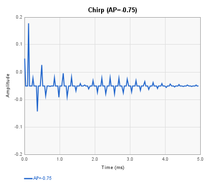

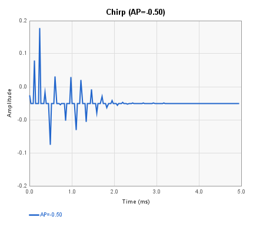
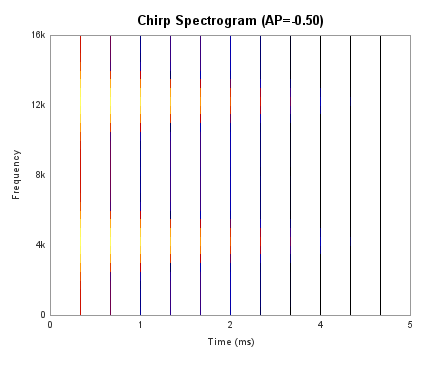

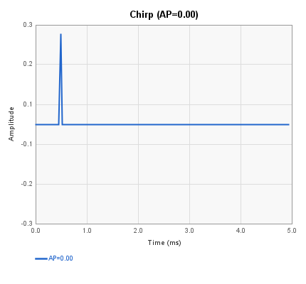
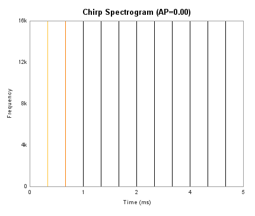

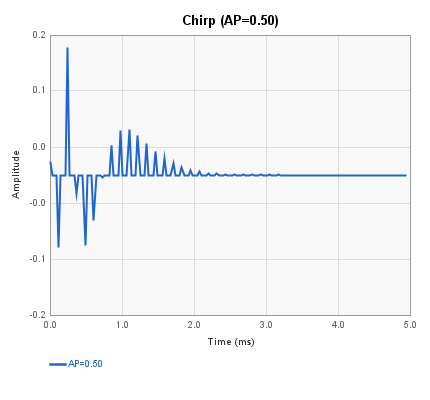
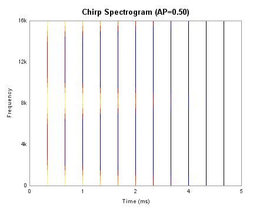

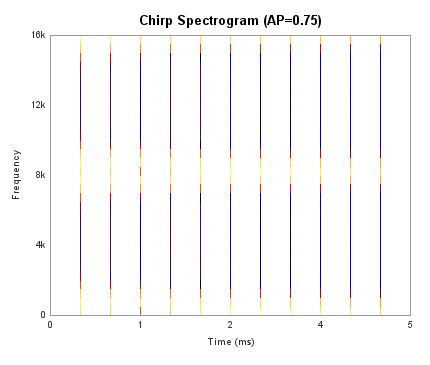

---

## Freeverb

An FV-1 implementation of the Freeverb algorithm (Jezar). Uses eight
parallel comb filters summed into four cascaded allpass filters, with
separate left and right output paths for stereo spread.

| Pin | Type | Description |
|-----|------|-------------|
| Input_L | Audio In | Left audio input |
| Input_R | Audio In | Right audio input |
| OutputL | Audio Out | Left reverb output |
| OutputR | Audio Out | Right reverb output |
| Reverb_Time | Control In | Reverb decay time |

**Control panel parameters:**

| Parameter | Range | Default | Description |
|-----------|-------|---------|-------------|
| Gain | 0-1 | 0.5 | Input gain |
| Reverb Time | 0-1 | 0.42 | Comb filter feedback (decay time) |
| Damping | 0-1 | 0.5 | High-frequency damping in feedback |

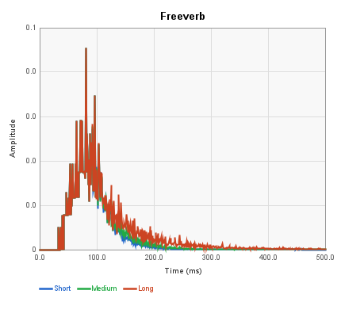

---

## Hall Reverb

A hall-style reverb with pre-delay, allpass diffusion, and cross-coupled
delay loops with low-pass filtering for HF decay. The pre-delay separates
the direct sound from the reverb onset, simulating a large acoustic space.

| Pin | Type | Description |
|-----|------|-------------|
| Input | Audio In | Mono audio input |
| OutputL | Audio Out | Left reverb output |
| OutputR | Audio Out | Right reverb output |
| Pre_Delay | Control In | Pre-delay time |
| Reverb_Time | Control In | Reverb decay time |
| HF_Loss | Control In | High-frequency loss |

**Control panel parameters:**

| Parameter | Range | Default | Description |
|-----------|-------|---------|-------------|
| Gain | 0-1 | 0.5 | Input gain |
| Reverb Time | 0-1 | 0.5 | Feedback coefficient (decay time) |
| HF Damping | 0-1 | 0.02 | High-frequency damping |
| Input AP | 0-1 | 0.5 | Input allpass / pre-delay coefficient |
| Delay AP | 0-1 | 0.5 | Delay loop allpass coefficient |

**Pre-delay effect:**

---

## Dattorro Plate Reverb

An implementation of the Jon Dattorro plate reverb from "Effect Design"
(JAES, 1997). Features four input diffusers feeding a cross-coupled
modulated tank with multi-tap stereo output. Produces a dense, smooth
plate-style reverb.

| Pin | Type | Description |
|-----|------|-------------|
| Audio Input L | Audio In | Left audio input |
| Audio Input R | Audio In | Right audio input |
| Audio Output L | Audio Out | Left reverb output |
| Audio Output R | Audio Out | Right reverb output |
| Reverb Time | Control In | Decay time |
| HF Loss | Control In | High-frequency damping |

**Control panel parameters:**

| Parameter | Range | Default | Description |
|-----------|-------|---------|-------------|
| Gain | -24 to 0 dB | -6 dB | Input gain |
| Decay | 0.1-0.95 | 0.5 | Tank decay coefficient |
| Damping | 0-0.95 | 0.5 | HF damping in tank |
| Bandwidth | 0.1-0.7 | 0.32 | Input bandwidth filter |

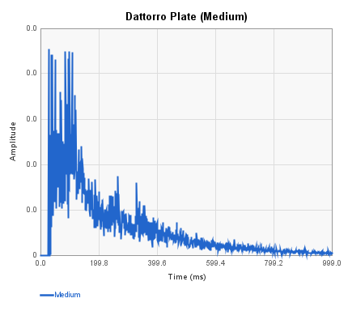
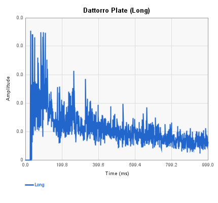

---

## Reverb Designer

A highly configurable reverb with selectable topology (two-loop, Dattorro,
or ring FDN), size presets, optional shimmer, LFO modulation, and
pre-delay. Control inputs can be assigned to any parameter. This is the
most flexible reverb block available.

| Pin | Type | Description |
|-----|------|-------------|
| Audio In | Audio In | Left/mono audio input |
| Audio In 2 | Audio In | Right audio input |
| Out L | Audio Out | Left reverb output |
| Out R | Audio Out | Right reverb output |
| Ctrl 1 | Control In | Assignable control 1 |
| Ctrl 2 | Control In | Assignable control 2 |
| Ctrl 3 | Control In | Assignable control 3 |
| Ctrl 4 | Control In | Assignable control 4 |

**Control panel parameters:**

| Parameter | Range | Default | Description |
|-----------|-------|---------|-------------|
| Topology | Two-Loop / Dattorro / Ring FDN | Dattorro | Reverb algorithm |
| Size | Small / Medium / Large | Medium | Delay memory size preset |
| Reverb Time | 0-1 | 0.5 | Decay time |
| HF Damping | 0-1 | 0.3 | High-frequency damping |
| LF Damping | 0-1 | 0.1 | Low-frequency damping |
| Dry/Wet | 0-1 | 0.5 | Mix ratio |
| Shimmer | Off / Input / Input+Feedback | Off | Pitch-shifted feedback |
| LFO Depth | None / Subtle / Wide | Subtle | Modulation depth |
| Pre-Delay | on/off | off | Enable pre-delay |

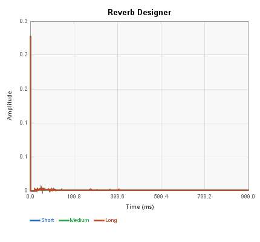

---

## ROM Reverb 1

A stereo reverb based on the FV-1 ROM programs. Uses input allpass
diffusers, multiple delay loops with allpass feedback, and separate
low-frequency and high-frequency response controls.

| Pin | Type | Description |
|-----|------|-------------|
| Input_Left | Audio In | Left audio input |
| Input_Right | Audio In | Right audio input |
| Output_Left | Audio Out | Left reverb output |
| Output_Right | Audio Out | Right reverb output |
| Reverb_Time | Control In | Reverb decay time |
| Low_Freq | Control In | Low-frequency response |
| High_Freq | Control In | High-frequency response |

**Control panel parameters:**

| Parameter | Range | Default | Description |
|-----------|-------|---------|-------------|
| Gain | 0-1 | 0.5 | Input gain |
| Input AP | 0-1 | 0.5 | Input allpass coefficient |
| Num Delays | 1-4 | 3 | Number of delay loops |
| Delay AP | 0-1 | 0.6 | Delay allpass coefficient |
| LF Filter | 0-1 | 0.4 | Low-frequency filter |
| HF Filter | 0-1 | 0.01 | High-frequency filter |

---

## ROM Reverb 2

A mono-output reverb with configurable delay lengths and memory scaling.
Uses a denser topology with four allpass-delay pairs and separate
low/high frequency response controls.

| Pin | Type | Description |
|-----|------|-------------|
| Input | Audio In | Mono audio input |
| Output | Audio Out | Mono reverb output |
| Reverb Time | Control In | Maximum reverb time |
| LF Response | Control In | Low-frequency response |
| HF Response | Control In | High-frequency response |

**Control panel parameters:**

| Parameter | Range | Default | Description |
|-----------|-------|---------|-------------|
| Gain | 0-1 | 0.5 | Input gain |
| Rev Time Max | 0-1 | 0.6 | Maximum reverb time coefficient |
| Input AP | 0-1 | 0.6 | Input allpass coefficient |
| Delay AP 1 | 0-1 | 0.6 | First delay allpass coefficient |
| Delay AP 2 | 0-1 | 0.5 | Second delay allpass coefficient |
| LF Filter | 0-1 | 0.4 | Low-frequency filter |
| HF Filter | 0-1 | 0.01 | High-frequency filter |

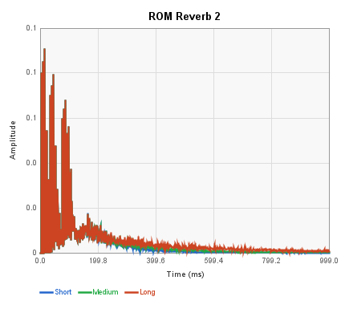

---

## Room Reverb

A room-style reverb with pre-delay. Similar architecture to the Hall
Reverb but with shorter delay lengths and different allpass tuning to
simulate a smaller acoustic space.

| Pin | Type | Description |
|-----|------|-------------|
| Input | Audio In | Mono audio input |
| OutputL | Audio Out | Left reverb output |
| OutputR | Audio Out | Right reverb output |
| Pre_Delay | Control In | Pre-delay time |
| Reverb_Time | Control In | Reverb decay time |
| HF_Loss | Control In | High-frequency loss |

**Control panel parameters:**

| Parameter | Range | Default | Description |
|-----------|-------|---------|-------------|
| Gain | 0-1 | 0.5 | Input gain |
| Reverb Time | 0-1 | 0.5 | Feedback coefficient (decay time) |
| HF Damping | 0-1 | 0.02 | High-frequency damping |
| Input AP | 0-1 | 0.5 | Input allpass / pre-delay coefficient |
| Delay AP | 0-1 | 0.5 | Delay loop allpass coefficient |

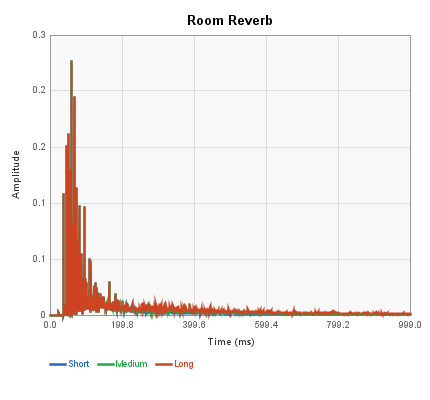

**Pre-delay effect:**

---

## Min Reverb

A minimal reverb based on the Spin Semiconductor "minimum reverb"
example. Uses four input allpass diffusers feeding two cross-coupled
delay loops. Small code footprint but limited control -- reverb time
is set via the control input pin only.

| Pin | Type | Description |
|-----|------|-------------|
| Audio Input 1 | Audio In | Audio input (auto-named) |
| Audio Output 1 | Audio Out | Audio output (auto-named) |
| Reverb Time | Control In | Reverb decay time |

No control panel parameters (reverb time is controlled exclusively by
the control input pin).

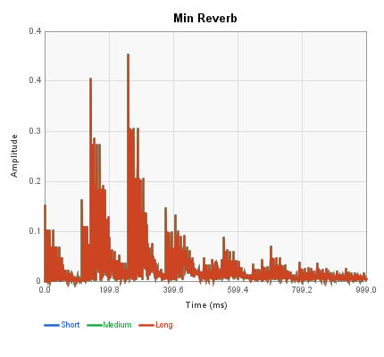

---

## Small Reverb (Stereo)

A stereo version of the minimum reverb with configurable allpass and
delay lengths. Provides more control than Min Reverb while keeping a
moderate instruction count.

| Pin | Type | Description |
|-----|------|-------------|
| Input_Left | Audio In | Left audio input |
| Input_Right | Audio In | Right audio input |
| Output_Left | Audio Out | Left reverb output |
| Output_Right | Audio Out | Right reverb output |
| Reverb_Time | Control In | Reverb decay time |

**Control panel parameters:**

| Parameter | Range | Default | Description |
|-----------|-------|---------|-------------|
| Gain | 0-1 | 0.5 | Input gain |
| Input AP | 0-1 | 0.5 | Input allpass coefficient |
| Loop AP | 0-1 | 0.6 | Loop allpass coefficient (controls decay) |
| AP/Delay lengths | samples | various | Individual allpass and delay lengths |

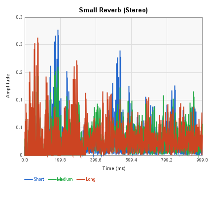

---

## Spring Reverb

Simulates a mechanical spring reverb tank. Uses short allpass chains
with negative coefficients to create the characteristic spring "boing"
and metallic coloration.

| Pin | Type | Description |
|-----|------|-------------|
| Input_L | Audio In | Left audio input |
| Input_R | Audio In | Right audio input |
| OutputL | Audio Out | Left reverb output |
| OutputR | Audio Out | Right reverb output |
| Reverb_Time | Control In | Reverb decay time |
| Damping | Control In | High-frequency damping |

**Control panel parameters:**

| Parameter | Range | Default | Description |
|-----------|-------|---------|-------------|
| Gain | 0-1 | 0.5 | Input gain |
| Reverb Time | 0-1 | 0.85 | Feedback coefficient (decay time) |
| Damping | 0-1 | 0.55 | Spring resonance / damping |

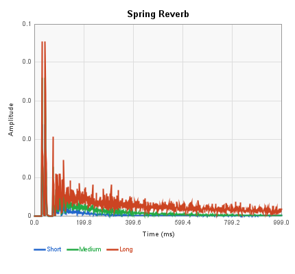
