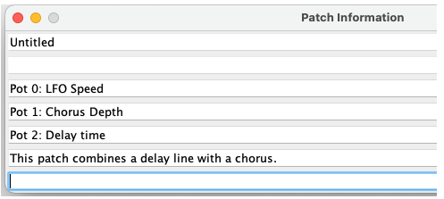

# Using SpinCAD Designer

## Getting Started

### Video Tutorial

A video walkthrough of SpinCAD Designer is available on YouTube: [SpinCAD Designer Tutorial](https://www.youtube.com/watch?v=fPKpGW04NrA)

> **Note:** This video shows an older version of the designer. Some menus and features have changed since it was recorded, but the core workflow remains the same.

### Installation

Visit the [SpinCAD Designer GitHub page](https://github.com/HolyCityAudio/SpinCAD-Designer) and install the SpinCAD JAR file following the instructions in the README.

### Audio Files for the Simulator

Before you start designing patches, you'll need audio files in the correct format for the simulator. SpinCAD Designer works with **32,768 kHz, 16-bit stereo WAV files** normalized to -6 dB.

Two sample files are provided in the repository:

* **Clean guitar loop** (`spincad-guitar-loop-32-khz.wav`)
* **Drum beat** (`spincad-drum-beat-32-khz.wav`)

***

## The User Interface

### Menu Bar

<figure><figcaption></figcaption></figure>

#### File

The File menu handles patch and bank operations.

**Patch operations:**

* **New Patch** (Ctrl+N) -- create a new empty patch
* **Open Patch** (Ctrl+O) -- load a saved patch file
* **Open Hex** (Ctrl+H) -- open a hex file
* **Save Patch** (Ctrl+S) -- save the current patch
* **Save Patch As** (Ctrl+A) -- save the current patch with a new name
* **Patch Information** (Ctrl+I) -- document your patch with title, description, and notes (included as comments when exporting to Spin ASM).  The top line shows the SPCD(J) saved file name, or "Untitled" if you haven't saved it yet.

<figure><figcaption></figcaption></figure>

**ASM export:**

* **Save Patch as ASM** -- export the current patch as a Spin ASM source file
* **Copy ASM to Clipboard** -- copy the generated Spin ASM code for pasting into the Spin IDE

**Bank operations:**

* **New Bank** (Alt+N) -- create a new bank
* **Open Bank** (Alt+O) -- load a saved bank file
* **Save Bank** (Alt+S) -- save the current bank
* **Save Bank As** (Alt+A) -- save the bank with a new name
* **Bank Information** (Alt+I) -- document the bank

**Export:**

* **Export Bank to Hex** -- export the entire bank to a HEX file for EEPROM programming (via CH341, PICKit2 or similar device)
* **Export Bank to Spin Project** -- export for use with the Spin Development Board

**Other:**

* **Preferences...** -- application settings
* **Exit** -- close SpinCAD Designer

#### Edit

Typical editing commands with keyboard shortcuts. ^ means the **CTRL** key on Windows and the **command** key on MacOS.

<figure><figcaption></figcaption></figure>

* **Copy** (Ctrl+C)
* **Paste** (Ctrl+V)
* **Cut** (Ctrl+X)
* **Undo** (Ctrl+Z)

#### Special

* **Feedback Loop** -- drops a pair of feedback input and output blocks into your patch for creating feedback loops
* **Scope Probe** -- adds a scope probe block for signal visualization
* **VU Meter** -- adds a VU meter block for level monitoring

#### Block Menus

The block menus are organized into categories. Select a block from any menu and click on the patch display to place it.

* **I/O - Pots** -- Input, Output, Pot 0, Pot 1, Pot 2
* **Mixers/Gain** -- mixers (2:1, 3:1, 4:1), crossfades, gain boost, panner, phase invert, volume
* **Wave Shaper** -- aliaser, cube, distortion, noise, octave fuzz, overdrive, quantizer, T/X
* **Dynamics** -- noise gate, compressors (peak, RMS), limiters, expander
* **Filters** -- 1-pole and 2-pole filters, EQ, comb filter, notch, resonator, shelving filters
* **Delay** -- multi-tap delays, drum delay, oil can, reverse, stutter, single delay, and more
* **Reverb** -- allpass, ambience, chirp, freeverb, hall, plate, room, spring, and reverb designer
* **Modulation** -- chorus, flanger, phaser, ring modulator, servo flanger
* **Pitch** -- pitch shifters, arpeggiator, glitch shift, octave up/down
* **Oscillators** -- LFOs, oscillators, sin/cos LFO, ramp LFO, tremolizer
* **Control** -- envelope follower, sample/hold, smoother, tap tempo, pattern generator, and other control-signal processing blocks
* **Instructions** -- math and utility blocks (absolute value, constant, exp, log, max, multiply, root, scale/offset)

#### Simulator

* **Simulator Options...** -- configure simulator settings

#### Help

* **Help** -- opens the [SpinCAD Designer documentation](https://holy-city-audio.gitbook.io/spincad-designer)
* **About** -- version and credits

### Patch Selector

<figure><figcaption></figcaption></figure>

SpinCAD Designer lets you work on 8 patches at once in a "Bank." Click on a patch number (0 through 7) to select the patch you want to work on. These correspond to patches 0-7 on the FV-1 once the program is loaded into an EEPROM.

### Simulator Control Bar

<figure><figcaption></figcaption></figure>

The **Start Simulation** button begins simulation of the current patch. The three sliders to the right correspond to Pot 0, Pot 1, and Pot 2 as used in your FV-1 code.

### Scope Feature Control Bar

The scope can be used to visualize signals in your patch.  By default, the Output Block inputs are automatically connected.  You can visualise internal signals in your patch by connecting them to a scope probe block (added via **Special > Scope Probe**).

### Patch Display Panel

The patch display panel is the main work area. This is where you place blocks, connect them, and adjust their parameters.

### Resource Allocation Toolbar

<figure><figcaption></figcaption></figure>

Displays how much of the FV-1's resources your patch is using:

* **Instructions** -- 128 total
* **Registers** -- 32 total
* **Delay RAM** -- 32,768 samples total
* **LFOs** -- 2 Sin/Cos, 2 Ramp

Indicators turn red when you are approaching or exceeding resource limits.  Hover over one of the resource bars to show a tooltip with the exact count.

***

## Creating a Patch

### Adding Blocks

All patches need at least an **Input** block and an **Output** block (from the **I/O - Pots** menu). Most patches will also use pot blocks from the same menu for real-time control.

To add a block: select it from one of the block menus, move your cursor to the desired position on the patch display, and click to drop it.

### Pin Tooltips

Hovering the mouse over a block's pin displays a **tooltip showing the pin name**. This tells you what signal each pin expects or provides.

### Making Connections

To connect two blocks:

1. Click on a pin (either an input or an output)
2. Drag a line to a pin on another block
3. Click to complete the connection

Connections can be made in either direction -- output to input or input to output.

**Connection rules:**

* Output pins can have multiple connections going out
* Input pins can only have one connection coming in

### Right-Click Pin Menu

<figure><figcaption></figcaption></figure>

Right-clicking on an input pin opens a popup menu with two options:

* **Delete Wire** -- removes the connection to this pin
*   **Mute This Pin** -- silences the signal at this input without removing the wire. When muted:

    * The pin turns **black** and the wire turns **red** to indicate the muted state
    * The signal is treated as if the pin were muted during code generation
    * The wire remains in place so you can easily unmute it later

    Mute is useful for **debugging and A/B testing** -- you can quickly hear what a patch sounds like with and without a particular connection, without having to delete and recreate wires. For example, mute the feedback input on a delay to hear the dry delay taps, or mute a modulation source to isolate its effect.

    > **Note:** Mute changes take effect the next time you start the simulator. If the simulator is already running, you will see a status message indicating the change will apply after the simulator stops.
    >
    > **Note:** Pin mute state is not preserved through file save/load.

<figure><figcaption></figcaption></figure>

### Control Panels

Blocks with a white outline have adjustable parameters. To open a block's control panel:

1. Right-click on the block
2. Select **Control Panel**

Control panels contain sliders and other controls for adjusting the block's behavior.

> **Note:** Changes to control panel parameters will not be heard until the next time you click **Start Simulation**.

### Fine-Tuning Sliders with Ctrl+Drag

Most control panel sliders support **Ctrl+drag for fine adjustment**. Hold the **Ctrl** key while dragging a slider to move it at **1/10th of the normal speed**, giving you much more precise control over parameter values.

This is especially useful for:

* Dialing in exact delay times or filter frequencies
* Setting precise gain or mix levels
* Fine-tuning any parameter where small changes matter

When a slider has subdivision snap points, Ctrl+drag also **bypasses snapping**, allowing you to set values between the snap points.

### Documenting Your Patch

Use **Patch Information** (Ctrl+I on Windows) to add a title, description, and notes to your patch. This information is included as comments when you export to Spin ASM format.

<figure><figcaption></figcaption></figure>
