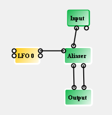
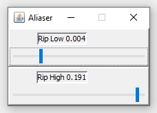
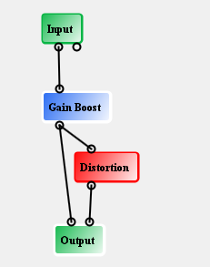
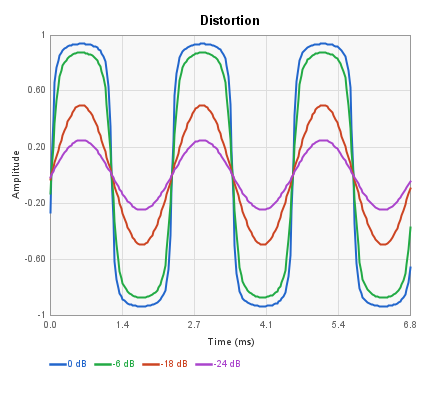
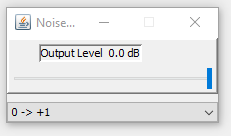
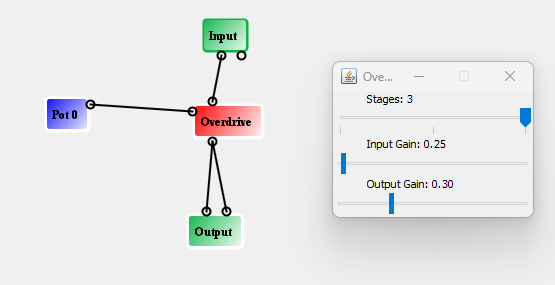
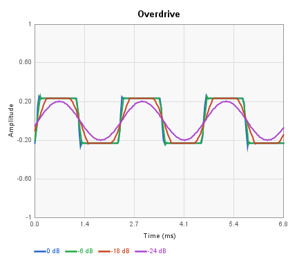
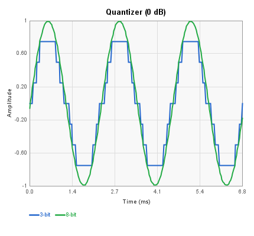

# Wave Shaper Blocks

These blocks apply nonlinear waveshaping to audio signals: soft clipping, hard clipping, fuzz, sample-rate reduction, and bit crushing. Each plot shows a 440 Hz sine wave at three input levels (0 dB, -6 dB, -18 dB).

### Block Index

|                                              |                                                  |                                                |
| -------------------------------------------- | ------------------------------------------------ | ---------------------------------------------- |
| [Aliaser](wave-shaper-blocks.md#aliaser)     | [Cube](wave-shaper-blocks.md#cube)               | [Distortion](wave-shaper-blocks.md#distortion) |
| [Noise AMZ](wave-shaper-blocks.md#noise-amz) | [Octave Fuzz](wave-shaper-blocks.md#octave-fuzz) | [Overdrive](wave-shaper-blocks.md#overdrive)   |
| [Quantizer](wave-shaper-blocks.md#quantizer) | [T/X](wave-shaper-blocks.md#tx)                  |                                                |

***

## Aliaser

Reduces the effective sample rate of the audio signal by sample-and-hold decimation, producing aliasing artifacts that add metallic, lo-fi character. Two outputs are provided: a smoothed version and the raw decimated signal.

| Pin    | Type       | Description                                 |
| ------ | ---------- | ------------------------------------------- |
| Input  | Audio In   | Audio signal                                |
| Rip    | Control In | Decimation amount (0 = subtle, 1 = extreme) |
| Smooth | Audio Out  | Filtered decimated output                   |
| Raw    | Audio Out  | Raw decimated output                        |

**Control panel:**

| Parameter | Range | Default | Description               |
| --------- | ----- | ------- | ------------------------- |
| Rip Low   | 0-1   | 0.004   | Minimum decimation amount |
| Rip High  | 0-1   | 0.191   | Maximum decimation amount |

When the Rip control input is connected, the decimation amount varies between Rip Low and Rip High based on the control value.

 

***

## Cube

Applies a cubic waveshaping function to the input signal. The cubic transfer curve produces soft clipping that adds odd harmonics (3rd, 5th, etc.) while preserving the signal's zero crossings.

| Pin            | Type      | Description  |
| -------------- | --------- | ------------ |
| Audio Input 1  | Audio In  | Audio signal |
| Audio Output 1 | Audio Out | Cubed output |

**Control panel:**

| Parameter   | Range  | Default | Description                                                        |
| ----------- | ------ | ------- | ------------------------------------------------------------------ |
| Wavefolding | 0-100% | 100%    | Controls the strength of the cubic term from gentle to full folding |

The transfer function is `output = 1.5 * (input + C * input³)`, where `C` is a negative coefficient controlled by the Wavefolding slider. This combines a linear pass-through with a phase-inverted cubic term. At low signal levels the linear term dominates and the output closely tracks the input. As the signal approaches 0 dB, the cubic term begins to subtract from the linear term, compressing the peaks.

The Wavefolding slider controls how aggressively the cubic term counteracts the linear term:

- At **0%**, the cubic term is mild. The transfer curve rises smoothly to 1.0 at full-scale input, producing gentle saturation that slightly rounds the peaks and adds a small amount of odd harmonics.
- At **100%**, the cubic term is strong enough to overpower the linear term at high levels. The transfer curve peaks before full-scale input and then folds back downward, inverting the tops of the waveform. This creates pronounced wavefolding with rich odd-harmonic content.

> **Note:** The effect is not noticeable until the signal level is above approximately −6 dB. Below that, the cubic term is too small relative to the linear term to produce audible waveshaping.

_Wavefolding at 0% -- gentle saturation, peaks slightly rounded._

_Wavefolding at 100% -- the waveform folds back at the peaks, adding rich odd harmonics._

***

## Distortion

Hard-clips the audio signal using the FV-1's saturation behavior. Cascaded SOF instructions with a coefficient of -2.0 drive the signal into clipping, producing aggressive square-wave-like distortion rich in odd harmonics. There is no control panel.

| Pin            | Type      | Description      |
| -------------- | --------- | ---------------- |
| Audio Input 1  | Audio In  | Audio signal     |
| Audio Output 1 | Audio Out | Distorted output |

***

## Noise AMZ

A pseudo-random noise generator using a Linear Feedback Shift Register (LFSR) algorithm. Produces white noise suitable for use as a modulation source or audio effect. The output range can be unipolar (0 to +1) or bipolar (-1 to +1).

| Pin          | Type      | Description  |
| ------------ | --------- | ------------ |
| Audio Output | Audio Out | Noise output |

**Control panel:**

| Parameter     | Range          | Default | Description                |
| ------------- | -------------- | ------- | -------------------------- |
| Output Level  | -24 to 0 dB    | 0 dB    | Output gain                |
| Control Range | 0->+1 / -1->+1 | 0->+1   | Unipolar or bipolar output |

***

## Octave Fuzz

Full-wave rectifies the input signal to produce an octave-up effect combined with fuzz distortion. The rectification doubles the fundamental frequency, creating an aggressive octave-up tone.  This also create aliasing so you may wish to try taming that is low pass filtering (or not).

<figure><figcaption></figcaption></figure>

| Pin           | Type      | Description             |
| ------------- | --------- | ----------------------- |
| Input         | Audio In  | Audio signal            |
| Audio\_Output | Audio Out | Fuzzed octave-up output |

There is no control panel.  As the block itself creates a DC offset, it is recommended to follow it with a highpass filter.  The result of highpassing is shown below.

***

## Overdrive

A multi-stage overdrive with adjustable gain and drive depth. Uses cascaded SOF-based clipping stages with post-filtering to tame high-frequency harshness.

| Pin            | Type       | Description                        |
| -------------- | ---------- | ---------------------------------- |
| Audio Input 1  | Audio In   | Audio signal                       |
| Drive          | Control In | Drive amount (overrides gain knob) |
| Audio Output 1 | Audio Out  | Overdriven output                  |

**Control panel parameters:**

| Parameter   | Range | Default | Description               |
| ----------- | ----- | ------- | ------------------------- |
| Stages      | 1-3   | 2       | Number of clipping stages |
| Gain        | 0-1   | 0.25    | Input drive level         |
| Output Gain | 0-1   | 0.3     | Output level              |

When the Drive control pin is connected, the input is multiplied by the control value instead of the fixed gain setting.

***

## Quantizer

Reduces the bit depth of the audio signal, producing stepped quantization noise characteristic of lo-fi digital audio. When the control input is connected, the bit depth varies dynamically with the control signal.

| Pin             | Type       | Description               |
| --------------- | ---------- | ------------------------- |
| Audio Input 1   | Audio In   | Audio signal              |
| Control Input 1 | Control In | Dynamic bit depth control |
| Audio Output 1  | Audio Out  | Quantized output          |

**Control panel parameters:**

| Parameter | Range | Default | Description            |
| --------- | ----- | ------- | ---------------------- |
| Bits      | 1-20  | 3       | Number of bits to keep |

Lower bit values produce more aggressive quantization. When the control input is connected, the number of quantization levels varies between the panel setting and a coarser resolution based on the control value.

***

## T/X

Divides a fixed value by the input signal magnitude, producing an inverse/reciprocal waveshaper. At low input levels the output is large (clipped), and at high input levels the output approaches zero. This creates an unusual compression/expansion characteristic.

| Pin           | Type      | Description       |
| ------------- | --------- | ----------------- |
| Input         | Audio In  | Audio signal      |
| Audio\_Output | Audio Out | T/X shaped output |

There is no control panel.

