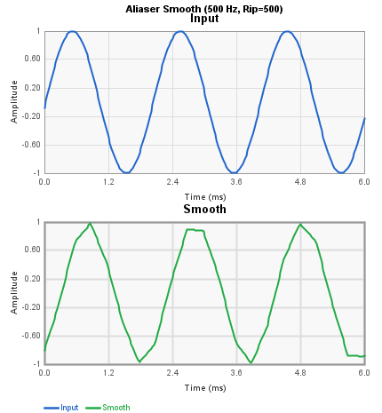
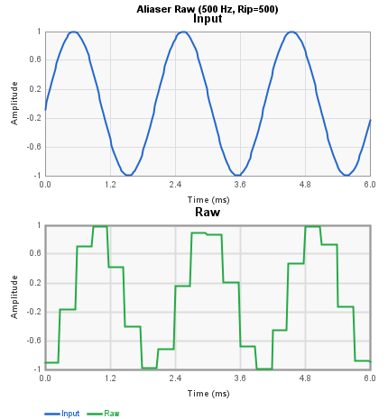
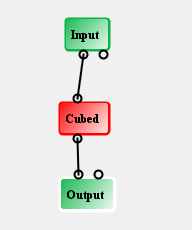
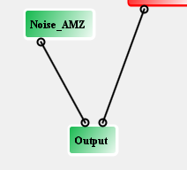
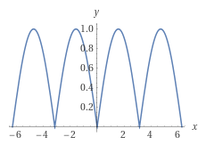
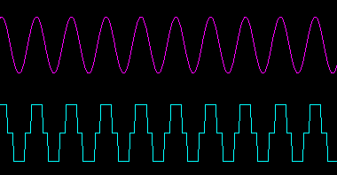
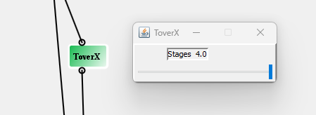

# Wave Shaper Blocks Reference

These blocks apply nonlinear waveshaping to audio signals: soft clipping,
hard clipping, fuzz, sample-rate reduction, and bit crushing. Each plot
shows a 440 Hz sine wave at three input levels (0 dB, -6 dB, -18 dB).

| Block | Description |
|-------|-------------|
| [Aliaser](#aliaser) | Sample-rate reduction / decimation |
| [Cube](#cube) | Cubic soft clipping |
| [Distortion](#distortion) | Hard clipping |
| [Noise AMZ](#noise-amz) | LFSR pseudo-random noise generator |
| [Octave Fuzz](#octave-fuzz) | Full-wave rectifier octave-up fuzz |
| [Overdrive](#overdrive) | Multi-stage soft overdrive |
| [Quantizer](#quantizer) | Bit-depth reduction |
| [T/X](#tx) | Inverse/reciprocal waveshaper |

---

## Aliaser

Reduces the effective sample rate of the audio signal by sample-and-hold
decimation, producing aliasing artifacts that add metallic, lo-fi character.
Two outputs are provided: a smoothed version and the raw decimated signal.

| Pin | Type | Description |
|-----|------|-------------|
| Input | Audio In | Audio signal |
| Rip | Control In | Decimation amount (0 = subtle, 1 = extreme) |
| Smooth | Audio Out | Filtered decimated output |
| Raw | Audio Out | Raw decimated output |

**Control panel:**

| Parameter | Range | Default | Description |
|-----------|-------|---------|-------------|
| Rip Low | 0-1 | 0.004 | Minimum decimation amount |
| Rip High | 0-1 | 0.191 | Maximum decimation amount |

When the Rip control input is connected, the decimation amount varies
between Rip Low and Rip High based on the control value.

---

## Cube

Applies a cubic waveshaping function to the input signal. The cubic
transfer curve produces soft clipping that adds odd harmonics (3rd, 5th, etc.)
while preserving the signal's zero crossings. There is no control panel.

| Pin | Type | Description |
|-----|------|-------------|
| Audio Input 1 | Audio In | Audio signal |
| Audio Output 1 | Audio Out | Cubed output |

Implements: `output = input^3`

At low levels the effect is subtle; at higher levels the signal is
compressed toward the peaks, producing warm saturation.

---

## Distortion

Hard-clips the audio signal using the FV-1's saturation behavior.
Cascaded SOF instructions with a coefficient of -2.0 drive the signal
into clipping, producing aggressive square-wave-like distortion rich
in odd harmonics. There is no control panel.

| Pin | Type | Description |
|-----|------|-------------|
| Audio Input 1 | Audio In | Audio signal |
| Audio Output 1 | Audio Out | Distorted output |

---

## Noise AMZ

A pseudo-random noise generator using a Linear Feedback Shift Register
(LFSR) algorithm. Produces white noise suitable for use as a modulation
source or audio effect. The output range can be unipolar (0 to +1) or
bipolar (-1 to +1).

| Pin | Type | Description |
|-----|------|-------------|
| Audio Output | Audio Out | Noise output |

**Control panel:**

| Parameter | Range | Default | Description |
|-----------|-------|---------|-------------|
| Output Level | -24 to 0 dB | 0 dB | Output gain |
| Control Range | 0->+1 / -1->+1 | 0->+1 | Unipolar or bipolar output |

---

## Octave Fuzz

Full-wave rectifies the input signal to produce an octave-up effect
combined with fuzz distortion. The rectification doubles the fundamental
frequency, creating an aggressive octave-up tone.

| Pin | Type | Description |
|-----|------|-------------|
| Input | Audio In | Audio signal |
| Audio_Output | Audio Out | Fuzzed octave-up output |

There is no control panel.

---

## Overdrive

A multi-stage overdrive with adjustable gain and drive depth. Uses
cascaded SOF-based clipping stages with post-filtering to tame
high-frequency harshness.

| Pin | Type | Description |
|-----|------|-------------|
| Audio Input 1 | Audio In | Audio signal |
| Drive | Control In | Drive amount (overrides gain knob) |
| Audio Output 1 | Audio Out | Overdriven output |

**Control panel parameters:**

| Parameter | Range | Default | Description |
|-----------|-------|---------|-------------|
| Stages | 1-3 | 2 | Number of clipping stages |
| Gain | 0-1 | 0.25 | Input drive level |
| Output Gain | 0-1 | 0.3 | Output level |

When the Drive control pin is connected, the input is multiplied by
the control value instead of the fixed gain setting.

---

## Quantizer

Reduces the bit depth of the audio signal, producing stepped quantization
noise characteristic of lo-fi digital audio. When the control input is
connected, the bit depth varies dynamically with the control signal.

| Pin | Type | Description |
|-----|------|-------------|
| Audio Input 1 | Audio In | Audio signal |
| Control Input 1 | Control In | Dynamic bit depth control |
| Audio Output 1 | Audio Out | Quantized output |

**Control panel parameters:**

| Parameter | Range | Default | Description |
|-----------|-------|---------|-------------|
| Bits | 1-20 | 3 | Number of bits to keep |

Lower bit values produce more aggressive quantization. When the control
input is connected, the number of quantization levels varies between
the panel setting and a coarser resolution based on the control value.

---

## T/X

Divides a fixed value by the input signal magnitude, producing an
inverse/reciprocal waveshaper. At low input levels the output is large
(clipped), and at high input levels the output approaches zero. This
creates an unusual compression/expansion characteristic.

| Pin | Type | Description |
|-----|------|-------------|
| Input | Audio In | Audio signal |
| Audio_Output | Audio Out | T/X shaped output |

There is no control panel.

